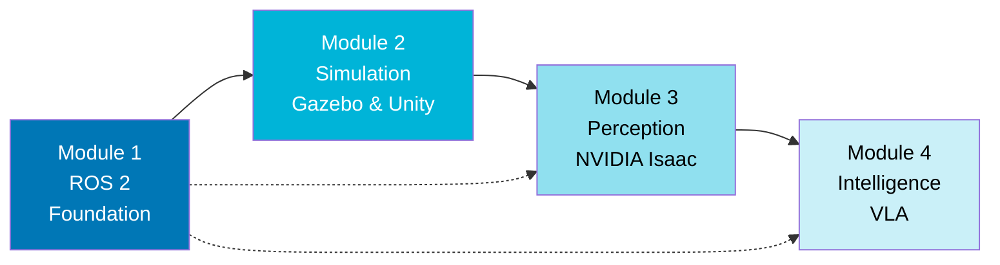

# Physical AI & Humanoid Robotics

Welcome to this comprehensive textbook on Physical AI and Humanoid Robotics. This guide takes you on a journey from foundational robotics concepts to cutting-edge embodied intelligence systems.

## About This Textbook

This textbook is designed for students, educators, and practitioners who want to understand and build intelligent humanoid robots. We cover the complete stack from robot middleware to advanced AI integration.

## Textbook Structure

The content is organized into four progressive modules, each building upon concepts from previous modules:

| Module | Title | Focus Area |
|--------|-------|------------|
| **[1](./module-1)** | [The Robotic Nervous System](./module-1) | ROS 2 fundamentals and robot control |
| **[2](./module-2)** | [The Digital Twin](./module-2) | Simulation with Gazebo and Unity |
| **[3](./module-3)** | [The AI-Robot Brain](./module-3) | NVIDIA Isaac platform and perception |
| **[4](./module-4)** | [Vision-Language-Action](./module-4) | VLA and embodied intelligence |

## Learning Path

The modules build upon each other in a progressive learning journey:

**Solid arrows** indicate direct prerequisites. **Dashed arrows** show foundational concepts that are referenced throughout.

## Who Should Read This

- **Students** seeking a structured introduction to humanoid robotics
- **Educators** looking for comprehensive course material
- **Practitioners** wanting to understand the modern robotics stack
- **Researchers** exploring the intersection of AI and physical systems

## Prerequisites

- Basic programming familiarity (Python recommended)
- Interest in robotics and AI systems
- No prior robotics-specific knowledge required

## How to Use This Textbook

1. **Sequential Learning**: Follow modules in order for comprehensive understanding
2. **Reference Guide**: Jump to specific topics as needed
3. **Hands-on Practice**: Examples and concepts are designed for practical application

## Getting Started

Begin with [Module 1: The Robotic Nervous System](/docs/module-1) to learn about ROS 2 and robot fundamentals.

---

*This textbook is under active development. Content will be expanded in future iterations.*
