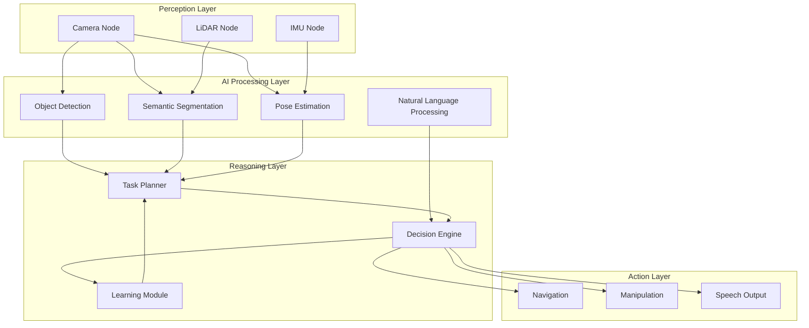
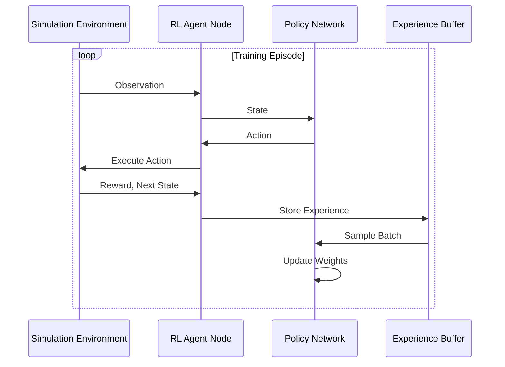

# AI Agent and ROS 2 Integration

## The Convergence of AI and Robotics

The integration of AI agents with ROS 2 represents a paradigm shift in robotics—moving from pre-programmed behaviors to adaptive, intelligent systems that can perceive, reason, and act in complex environments.

:::info Why AI + ROS 2?
Traditional robotics relied on explicit programming for every scenario. AI integration enables robots to learn from experience, generalize to new situations, and make decisions under uncertainty.
:::

## AI Agent Architecture in ROS 2



## Integrating Machine Learning Models

### Model Deployment Patterns

| Pattern | Use Case | Latency | Complexity |
|---------|----------|---------|------------|
| **On-device** | Real-time perception | Under 10ms | Low |
| **Edge compute** | Complex inference | 10-50ms | Medium |
| **Cloud offload** | Training, heavy models | 100ms+ | High |
| **Hybrid** | Adaptive workloads | Variable | High |

### ROS 2 Node with TensorFlow/PyTorch

```python
import rclpy
from rclpy.node import Node
from sensor_msgs.msg import Image
from vision_msgs.msg import Detection2DArray, Detection2D
from cv_bridge import CvBridge
import torch
import numpy as np


class AIDetectionNode(Node):
    """AI-powered object detection node using PyTorch."""

    def __init__(self):
        super().__init__('ai_detection_node')

        # Load pre-trained model
        self.model = torch.hub.load('ultralytics/yolov5', 'yolov5s')
        self.model.eval()

        # Move to GPU if available
        self.device = torch.device('cuda' if torch.cuda.is_available() else 'cpu')
        self.model.to(self.device)

        self.bridge = CvBridge()

        # Subscribers and publishers
        self.image_sub = self.create_subscription(
            Image,
            '/camera/image_raw',
            self.image_callback,
            10
        )

        self.detection_pub = self.create_publisher(
            Detection2DArray,
            '/detections',
            10
        )

        self.get_logger().info(f'AI Detection Node started on {self.device}')

    def image_callback(self, msg: Image):
        # Convert ROS image to OpenCV
        cv_image = self.bridge.imgmsg_to_cv2(msg, 'bgr8')

        # Run inference
        with torch.no_grad():
            results = self.model(cv_image)

        # Convert to ROS message
        detections = Detection2DArray()
        detections.header = msg.header

        for *box, conf, cls in results.xyxy[0].cpu().numpy():
            detection = Detection2D()
            detection.bbox.center.position.x = (box[0] + box[2]) / 2
            detection.bbox.center.position.y = (box[1] + box[3]) / 2
            detection.bbox.size_x = box[2] - box[0]
            detection.bbox.size_y = box[3] - box[1]

            # Add to array
            detections.detections.append(detection)

        self.detection_pub.publish(detections)


def main(args=None):
    rclpy.init(args=args)
    node = AIDetectionNode()
    rclpy.spin(node)
    node.destroy_node()
    rclpy.shutdown()
```

## Large Language Model Integration

### LLM as Task Planner

LLMs can serve as high-level task planners, translating natural language commands into actionable robot behaviors.

```python
import rclpy
from rclpy.node import Node
from std_msgs.msg import String
from geometry_msgs.msg import PoseStamped
import openai
import json


class LLMPlannerNode(Node):
    """LLM-based task planning node."""

    def __init__(self):
        super().__init__('llm_planner_node')

        # System prompt for robotics context
        self.system_prompt = """You are a robot task planner. Given a natural language
        command, output a JSON plan with sequential actions. Available actions:
        - navigate_to(location): Move to a named location
        - pick_up(object): Grasp an object
        - place_at(location): Place held object
        - speak(message): Say something
        - wait(seconds): Pause execution

        Output format: {"actions": [{"type": "action_name", "params": {...}}]}"""

        self.command_sub = self.create_subscription(
            String,
            '/voice_command',
            self.command_callback,
            10
        )

        self.plan_pub = self.create_publisher(
            String,
            '/task_plan',
            10
        )

    def command_callback(self, msg: String):
        command = msg.data
        self.get_logger().info(f'Received command: {command}')

        # Query LLM for plan
        response = openai.ChatCompletion.create(
            model="gpt-4",
            messages=[
                {"role": "system", "content": self.system_prompt},
                {"role": "user", "content": command}
            ],
            temperature=0.1
        )

        plan_json = response.choices[0].message.content

        # Validate and publish
        try:
            plan = json.loads(plan_json)
            plan_msg = String()
            plan_msg.data = json.dumps(plan)
            self.plan_pub.publish(plan_msg)
            self.get_logger().info(f'Published plan with {len(plan["actions"])} actions')
        except json.JSONDecodeError:
            self.get_logger().error('Failed to parse LLM response as JSON')
```

## Reinforcement Learning in ROS 2

### Training Loop Architecture



### Gymnasium-ROS 2 Integration

```python
import gymnasium as gym
import rclpy
from rclpy.node import Node
from geometry_msgs.msg import Twist
from sensor_msgs.msg import LaserScan
from nav_msgs.msg import Odometry
import numpy as np


class ROS2GymEnv(gym.Env):
    """Custom Gymnasium environment wrapping ROS 2."""

    def __init__(self):
        super().__init__()

        # Initialize ROS 2
        rclpy.init()
        self.node = rclpy.create_node('gym_env_node')

        # Define spaces
        self.action_space = gym.spaces.Box(
            low=np.array([-1.0, -1.0]),
            high=np.array([1.0, 1.0]),
            dtype=np.float32
        )

        self.observation_space = gym.spaces.Box(
            low=-np.inf,
            high=np.inf,
            shape=(362,),  # 360 lidar + 2 velocity
            dtype=np.float32
        )

        # Publishers and subscribers
        self.cmd_pub = self.node.create_publisher(Twist, '/cmd_vel', 10)

        self.latest_scan = None
        self.latest_odom = None

        self.node.create_subscription(
            LaserScan, '/scan', self._scan_callback, 10
        )
        self.node.create_subscription(
            Odometry, '/odom', self._odom_callback, 10
        )

    def _scan_callback(self, msg):
        self.latest_scan = np.array(msg.ranges)

    def _odom_callback(self, msg):
        self.latest_odom = msg

    def step(self, action):
        # Execute action
        cmd = Twist()
        cmd.linear.x = float(action[0])
        cmd.angular.z = float(action[1])
        self.cmd_pub.publish(cmd)

        # Spin to get new observations
        rclpy.spin_once(self.node, timeout_sec=0.1)

        # Get observation
        obs = self._get_observation()

        # Calculate reward
        reward = self._calculate_reward()

        # Check termination
        terminated = self._check_collision()
        truncated = False

        return obs, reward, terminated, truncated, {}

    def reset(self, seed=None):
        # Reset simulation (implementation depends on simulator)
        super().reset(seed=seed)
        return self._get_observation(), {}

    def _get_observation(self):
        scan = self.latest_scan if self.latest_scan is not None else np.zeros(360)
        vel = np.array([0.0, 0.0])
        if self.latest_odom:
            vel[0] = self.latest_odom.twist.twist.linear.x
            vel[1] = self.latest_odom.twist.twist.angular.z
        return np.concatenate([scan, vel])

    def _calculate_reward(self):
        # Example: reward forward motion, penalize collisions
        if self.latest_scan is not None and np.min(self.latest_scan) < 0.3:
            return -10.0
        if self.latest_odom:
            return self.latest_odom.twist.twist.linear.x
        return 0.0

    def _check_collision(self):
        if self.latest_scan is not None:
            return np.min(self.latest_scan) < 0.2
        return False
```

## Behavior Trees with AI

Behavior Trees provide a modular way to integrate AI decision-making with robot behaviors.

```python
import py_trees
from py_trees.common import Status
import rclpy


class AIDecisionNode(py_trees.behaviour.Behaviour):
    """Behavior tree node that uses AI for decision making."""

    def __init__(self, name, ai_service):
        super().__init__(name)
        self.ai_service = ai_service
        self.decision = None

    def setup(self, **kwargs):
        self.node = kwargs.get('node')

    def update(self):
        # Query AI service for decision
        context = self.get_blackboard_context()
        self.decision = self.ai_service.decide(context)

        if self.decision == "success":
            return Status.SUCCESS
        elif self.decision == "running":
            return Status.RUNNING
        else:
            return Status.FAILURE

    def get_blackboard_context(self):
        # Gather context from blackboard
        blackboard = py_trees.blackboard.Blackboard()
        return {
            "objects_detected": blackboard.get("objects"),
            "battery_level": blackboard.get("battery"),
            "current_task": blackboard.get("task")
        }


# Build behavior tree with AI integration
def create_ai_behavior_tree():
    root = py_trees.composites.Selector(name="Root", memory=False)

    # AI-driven task selection
    ai_selector = AIDecisionNode("AI Task Selector", ai_service)

    # Fallback behaviors
    fallback = py_trees.behaviours.Running(name="Idle")

    root.add_children([ai_selector, fallback])
    return root
```

## Edge AI Deployment

### NVIDIA Jetson Integration

```python
import rclpy
from rclpy.node import Node
from sensor_msgs.msg import Image
import tensorrt as trt
import pycuda.driver as cuda
import pycuda.autoinit
import numpy as np


class TensorRTInferenceNode(Node):
    """High-performance inference using TensorRT on Jetson."""

    def __init__(self):
        super().__init__('tensorrt_inference')

        # Load TensorRT engine
        self.engine = self._load_engine('model.trt')
        self.context = self.engine.create_execution_context()

        # Allocate buffers
        self.inputs, self.outputs, self.bindings, self.stream = \
            self._allocate_buffers(self.engine)

        self.image_sub = self.create_subscription(
            Image, '/camera/image_raw', self.inference_callback, 10
        )

    def _load_engine(self, engine_path):
        with open(engine_path, 'rb') as f:
            runtime = trt.Runtime(trt.Logger(trt.Logger.WARNING))
            return runtime.deserialize_cuda_engine(f.read())

    def _allocate_buffers(self, engine):
        inputs, outputs, bindings = [], [], []
        stream = cuda.Stream()

        for binding in engine:
            size = trt.volume(engine.get_binding_shape(binding))
            dtype = trt.nptype(engine.get_binding_dtype(binding))

            # Allocate host and device buffers
            host_mem = cuda.pagelocked_empty(size, dtype)
            device_mem = cuda.mem_alloc(host_mem.nbytes)

            bindings.append(int(device_mem))

            if engine.binding_is_input(binding):
                inputs.append({'host': host_mem, 'device': device_mem})
            else:
                outputs.append({'host': host_mem, 'device': device_mem})

        return inputs, outputs, bindings, stream

    def inference_callback(self, msg):
        # Preprocess image and copy to input buffer
        # ... preprocessing code ...

        # Copy input to GPU
        cuda.memcpy_htod_async(
            self.inputs[0]['device'],
            self.inputs[0]['host'],
            self.stream
        )

        # Execute inference
        self.context.execute_async_v2(
            bindings=self.bindings,
            stream_handle=self.stream.handle
        )

        # Copy output back
        cuda.memcpy_dtoh_async(
            self.outputs[0]['host'],
            self.outputs[0]['device'],
            self.stream
        )

        self.stream.synchronize()

        # Process results
        results = self.outputs[0]['host']
        self.get_logger().info(f'Inference complete: {results.shape}')
```

## Best Practices

### 1. Model Optimization

```python
# Quantization for deployment
import torch

model = torch.load('model.pth')
quantized_model = torch.quantization.quantize_dynamic(
    model,
    {torch.nn.Linear},
    dtype=torch.qint8
)
```

### 2. Graceful Degradation

```python
class RobustAINode(Node):
    """AI node with fallback behaviors."""

    def __init__(self):
        super().__init__('robust_ai_node')
        self.ai_available = True
        self.fallback_mode = False

    def process_with_fallback(self, data):
        try:
            if self.ai_available:
                return self.ai_inference(data)
        except Exception as e:
            self.get_logger().warn(f'AI failed: {e}, using fallback')
            self.fallback_mode = True

        return self.rule_based_fallback(data)
```

### 3. Resource Management

| Resource | Monitoring | Action |
|----------|-----------|--------|
| GPU Memory | nvidia-smi | Batch size adjustment |
| CPU Usage | top/htop | Thread pool sizing |
| Latency | ROS 2 tracing | Pipeline optimization |
| Power | tegrastats | Dynamic frequency scaling |

## Summary

AI integration transforms ROS 2 robots from programmed machines to intelligent agents:

- **Perception**: Deep learning models for vision, audio, and sensor fusion
- **Reasoning**: LLMs for task planning, behavior trees for decision making
- **Learning**: Reinforcement learning for continuous improvement
- **Deployment**: Edge AI for real-time performance

The combination of ROS 2's robust communication infrastructure with modern AI capabilities enables a new generation of humanoid robots that can adapt, learn, and operate safely in human environments.

## Further Reading

- [ROS 2 Machine Learning Guide](https://docs.ros.org/en/rolling/Tutorials/Advanced/ML.html)
- [PyTorch ROS Integration](https://pytorch.org/tutorials/)
- [NVIDIA Isaac ROS](https://developer.nvidia.com/isaac-ros)
- [OpenAI Robotics](https://openai.com/research/robotics)

## Exercises

1. Create a ROS 2 node that uses a pre-trained image classification model
2. Implement a simple LLM-based command parser for robot navigation
3. Build a Gymnasium environment for a simulated robot task
4. Deploy a quantized model on edge hardware and measure latency
5. Create a behavior tree that incorporates AI decision nodes
