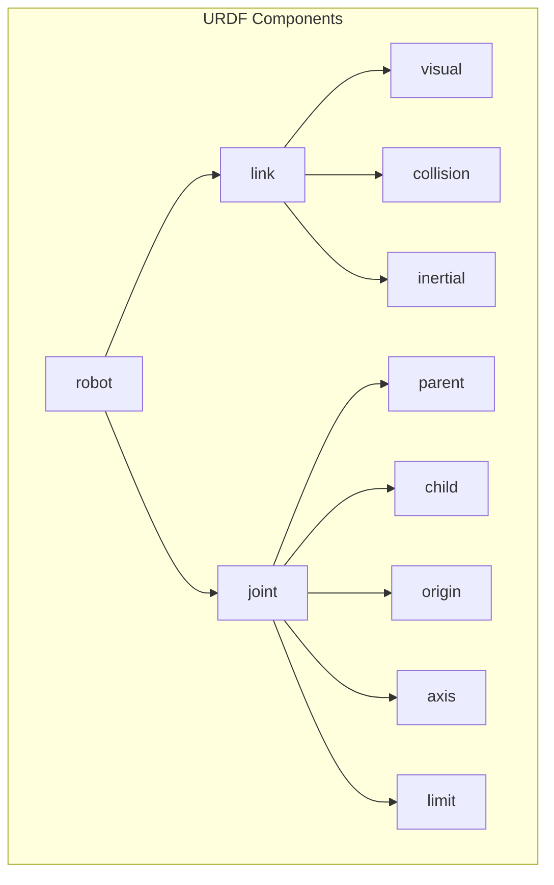
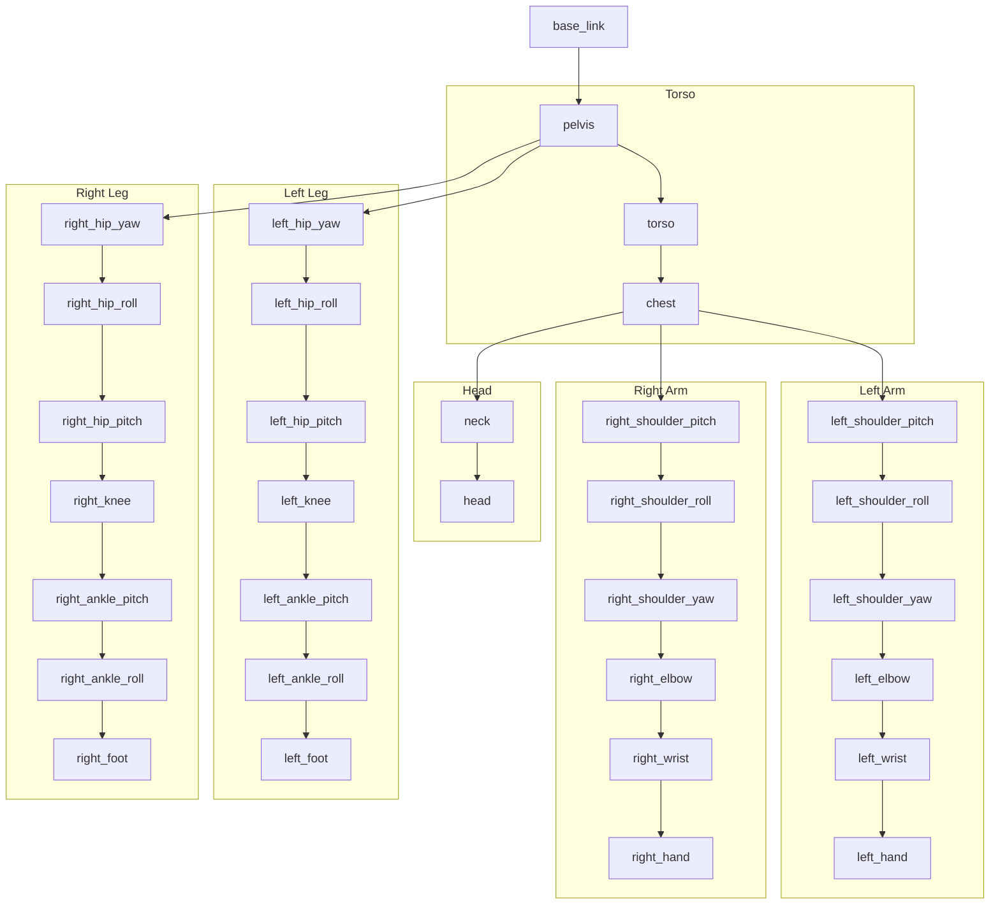

# Humanoid Robot Structure & URDF

## Defining Robot Morphology in Software

Before a humanoid robot can walk, grasp objects, or interact with its environment, it needs a precise mathematical description of its physical structure. The **Unified Robot Description Format (URDF)** provides this description, serving as the blueprint that tells ROS 2 exactly how the robot is built.

:::info What is URDF?
URDF is an XML-based format that describes a robot's physical structure: its links (rigid bodies), joints (connections between links), and their physical properties like mass, inertia, and collision geometry.
:::

## Why URDF Matters for Humanoids

Humanoid robots are among the most complex robotic systems, with characteristics that make accurate modeling essential:

| Characteristic | Typical Value | Why It Matters |
|---------------|---------------|----------------|
| **Degrees of Freedom** | 20-50+ joints | Each joint needs precise limits and dynamics |
| **Kinematic Chains** | Multiple (arms, legs, head) | Parallel chains require careful modeling |
| **Balance Requirements** | Center of mass tracking | Accurate mass/inertia for stability |
| **Collision Avoidance** | Self and environment | Detailed collision geometry |

## URDF Structure Overview



## Core URDF Elements

### Links: The Rigid Bodies

A **link** represents a rigid body in the robot. For humanoids, links include the torso, upper arms, forearms, thighs, shins, feet, and head.

```xml
<link name="left_thigh">
  <!-- Visual: What the robot looks like -->
  <visual>
    <origin xyz="0 0 -0.2" rpy="0 0 0"/>
    <geometry>
      <cylinder radius="0.05" length="0.4"/>
    </geometry>
    <material name="grey">
      <color rgba="0.5 0.5 0.5 1"/>
    </material>
  </visual>

  <!-- Collision: Simplified geometry for physics -->
  <collision>
    <origin xyz="0 0 -0.2" rpy="0 0 0"/>
    <geometry>
      <cylinder radius="0.06" length="0.4"/>
    </geometry>
  </collision>

  <!-- Inertial: Mass and moment of inertia -->
  <inertial>
    <origin xyz="0 0 -0.2" rpy="0 0 0"/>
    <mass value="3.5"/>
    <inertia
      ixx="0.05" ixy="0" ixz="0"
      iyy="0.05" iyz="0"
      izz="0.01"/>
  </inertial>
</link>
```

### Joints: The Connections

A **joint** connects two links and defines how they can move relative to each other.

#### Joint Types

| Type | Motion | Humanoid Use |
|------|--------|--------------|
| **revolute** | Rotation with limits | Elbows, knees, fingers |
| **continuous** | Unlimited rotation | Wheels (not typical for humanoids) |
| **prismatic** | Linear sliding | Telescoping mechanisms |
| **fixed** | No motion | Sensor mounts, rigid assemblies |
| **floating** | 6-DOF free motion | Base link to world |
| **planar** | 2D translation + rotation | Specialized mechanisms |

```xml
<joint name="left_hip_pitch" type="revolute">
  <parent link="pelvis"/>
  <child link="left_thigh"/>

  <!-- Position of joint relative to parent -->
  <origin xyz="0.1 0 0" rpy="0 0 0"/>

  <!-- Axis of rotation (pitch = Y-axis) -->
  <axis xyz="0 1 0"/>

  <!-- Joint limits -->
  <limit
    lower="-1.57"
    upper="0.52"
    effort="150.0"
    velocity="6.28"/>

  <!-- Dynamics (friction and damping) -->
  <dynamics damping="0.5" friction="0.1"/>
</joint>
```

## Humanoid URDF Architecture

A typical humanoid robot URDF follows a tree structure:



## Complete Humanoid URDF Example

Here's a simplified but complete humanoid leg URDF:

```xml
<?xml version="1.0"?>
<robot name="humanoid_robot" xmlns:xacro="http://www.ros.org/wiki/xacro">

  <!-- Materials -->
  <material name="grey">
    <color rgba="0.5 0.5 0.5 1"/>
  </material>
  <material name="blue">
    <color rgba="0.2 0.2 0.8 1"/>
  </material>

  <!-- Base Link (Pelvis) -->
  <link name="base_link">
    <visual>
      <geometry>
        <box size="0.3 0.2 0.15"/>
      </geometry>
      <material name="blue"/>
    </visual>
    <collision>
      <geometry>
        <box size="0.3 0.2 0.15"/>
      </geometry>
    </collision>
    <inertial>
      <mass value="10.0"/>
      <inertia ixx="0.1" ixy="0" ixz="0" iyy="0.1" iyz="0" izz="0.1"/>
    </inertial>
  </link>

  <!-- Left Hip Yaw -->
  <link name="left_hip_yaw_link">
    <visual>
      <origin xyz="0 0 -0.05"/>
      <geometry>
        <cylinder radius="0.04" length="0.1"/>
      </geometry>
      <material name="grey"/>
    </visual>
    <collision>
      <origin xyz="0 0 -0.05"/>
      <geometry>
        <cylinder radius="0.04" length="0.1"/>
      </geometry>
    </collision>
    <inertial>
      <mass value="1.0"/>
      <origin xyz="0 0 -0.05"/>
      <inertia ixx="0.01" ixy="0" ixz="0" iyy="0.01" iyz="0" izz="0.005"/>
    </inertial>
  </link>

  <joint name="left_hip_yaw" type="revolute">
    <parent link="base_link"/>
    <child link="left_hip_yaw_link"/>
    <origin xyz="0.1 0.1 0" rpy="0 0 0"/>
    <axis xyz="0 0 1"/>
    <limit lower="-0.5" upper="0.5" effort="100" velocity="3.14"/>
    <dynamics damping="0.1" friction="0.05"/>
  </joint>

  <!-- Left Hip Roll -->
  <link name="left_hip_roll_link">
    <visual>
      <origin xyz="0 0 -0.05"/>
      <geometry>
        <cylinder radius="0.04" length="0.1"/>
      </geometry>
      <material name="grey"/>
    </visual>
    <collision>
      <origin xyz="0 0 -0.05"/>
      <geometry>
        <cylinder radius="0.04" length="0.1"/>
      </geometry>
    </collision>
    <inertial>
      <mass value="1.0"/>
      <origin xyz="0 0 -0.05"/>
      <inertia ixx="0.01" ixy="0" ixz="0" iyy="0.01" iyz="0" izz="0.005"/>
    </inertial>
  </link>

  <joint name="left_hip_roll" type="revolute">
    <parent link="left_hip_yaw_link"/>
    <child link="left_hip_roll_link"/>
    <origin xyz="0 0 -0.1" rpy="0 0 0"/>
    <axis xyz="1 0 0"/>
    <limit lower="-0.5" upper="0.5" effort="100" velocity="3.14"/>
    <dynamics damping="0.1" friction="0.05"/>
  </joint>

  <!-- Left Hip Pitch -->
  <link name="left_hip_pitch_link">
    <visual>
      <origin xyz="0 0 -0.2"/>
      <geometry>
        <cylinder radius="0.05" length="0.4"/>
      </geometry>
      <material name="grey"/>
    </visual>
    <collision>
      <origin xyz="0 0 -0.2"/>
      <geometry>
        <cylinder radius="0.05" length="0.4"/>
      </geometry>
    </collision>
    <inertial>
      <mass value="3.5"/>
      <origin xyz="0 0 -0.2"/>
      <inertia ixx="0.05" ixy="0" ixz="0" iyy="0.05" iyz="0" izz="0.01"/>
    </inertial>
  </link>

  <joint name="left_hip_pitch" type="revolute">
    <parent link="left_hip_roll_link"/>
    <child link="left_hip_pitch_link"/>
    <origin xyz="0 0 -0.1" rpy="0 0 0"/>
    <axis xyz="0 1 0"/>
    <limit lower="-1.57" upper="0.52" effort="150" velocity="6.28"/>
    <dynamics damping="0.5" friction="0.1"/>
  </joint>

  <!-- Left Knee -->
  <link name="left_knee_link">
    <visual>
      <origin xyz="0 0 -0.2"/>
      <geometry>
        <cylinder radius="0.045" length="0.4"/>
      </geometry>
      <material name="grey"/>
    </visual>
    <collision>
      <origin xyz="0 0 -0.2"/>
      <geometry>
        <cylinder radius="0.045" length="0.4"/>
      </geometry>
    </collision>
    <inertial>
      <mass value="3.0"/>
      <origin xyz="0 0 -0.2"/>
      <inertia ixx="0.04" ixy="0" ixz="0" iyy="0.04" iyz="0" izz="0.008"/>
    </inertial>
  </link>

  <joint name="left_knee" type="revolute">
    <parent link="left_hip_pitch_link"/>
    <child link="left_knee_link"/>
    <origin xyz="0 0 -0.4" rpy="0 0 0"/>
    <axis xyz="0 1 0"/>
    <limit lower="0" upper="2.6" effort="150" velocity="6.28"/>
    <dynamics damping="0.5" friction="0.1"/>
  </joint>

  <!-- Left Ankle Pitch -->
  <link name="left_ankle_pitch_link">
    <visual>
      <geometry>
        <cylinder radius="0.03" length="0.05"/>
      </geometry>
      <material name="grey"/>
    </visual>
    <collision>
      <geometry>
        <cylinder radius="0.03" length="0.05"/>
      </geometry>
    </collision>
    <inertial>
      <mass value="0.5"/>
      <inertia ixx="0.001" ixy="0" ixz="0" iyy="0.001" iyz="0" izz="0.0005"/>
    </inertial>
  </link>

  <joint name="left_ankle_pitch" type="revolute">
    <parent link="left_knee_link"/>
    <child link="left_ankle_pitch_link"/>
    <origin xyz="0 0 -0.4" rpy="0 0 0"/>
    <axis xyz="0 1 0"/>
    <limit lower="-0.87" upper="0.52" effort="80" velocity="6.28"/>
    <dynamics damping="0.3" friction="0.05"/>
  </joint>

  <!-- Left Foot -->
  <link name="left_foot">
    <visual>
      <origin xyz="0.05 0 -0.02"/>
      <geometry>
        <box size="0.2 0.1 0.04"/>
      </geometry>
      <material name="blue"/>
    </visual>
    <collision>
      <origin xyz="0.05 0 -0.02"/>
      <geometry>
        <box size="0.2 0.1 0.04"/>
      </geometry>
    </collision>
    <inertial>
      <mass value="1.0"/>
      <origin xyz="0.05 0 -0.02"/>
      <inertia ixx="0.002" ixy="0" ixz="0" iyy="0.005" iyz="0" izz="0.005"/>
    </inertial>
  </link>

  <joint name="left_ankle_roll" type="revolute">
    <parent link="left_ankle_pitch_link"/>
    <child link="left_foot"/>
    <origin xyz="0 0 -0.025" rpy="0 0 0"/>
    <axis xyz="1 0 0"/>
    <limit lower="-0.4" upper="0.4" effort="80" velocity="6.28"/>
    <dynamics damping="0.3" friction="0.05"/>
  </joint>

</robot>
```

## Using Xacro for Modular URDFs

Real humanoid URDFs use **xacro** (XML Macros) to avoid repetition:

```xml
<?xml version="1.0"?>
<robot xmlns:xacro="http://www.ros.org/wiki/xacro" name="humanoid">

  <!-- Properties -->
  <xacro:property name="thigh_length" value="0.4"/>
  <xacro:property name="shin_length" value="0.4"/>
  <xacro:property name="thigh_mass" value="3.5"/>

  <!-- Leg Macro -->
  <xacro:macro name="leg" params="prefix reflect">

    <link name="${prefix}_thigh">
      <visual>
        <origin xyz="0 0 ${-thigh_length/2}"/>
        <geometry>
          <cylinder radius="0.05" length="${thigh_length}"/>
        </geometry>
      </visual>
      <inertial>
        <mass value="${thigh_mass}"/>
        <origin xyz="0 0 ${-thigh_length/2}"/>
        <inertia ixx="0.05" ixy="0" ixz="0" iyy="0.05" iyz="0" izz="0.01"/>
      </inertial>
    </link>

    <joint name="${prefix}_hip_pitch" type="revolute">
      <parent link="pelvis"/>
      <child link="${prefix}_thigh"/>
      <origin xyz="${reflect * 0.1} 0 0"/>
      <axis xyz="0 1 0"/>
      <limit lower="-1.57" upper="0.52" effort="150" velocity="6.28"/>
    </joint>

    <!-- More links and joints... -->

  </xacro:macro>

  <!-- Instantiate both legs -->
  <xacro:leg prefix="left" reflect="1"/>
  <xacro:leg prefix="right" reflect="-1"/>

</robot>
```

Process xacro to URDF:

```bash
xacro humanoid.urdf.xacro > humanoid.urdf
```

## Loading URDF in ROS 2

### Publishing Robot State

```python
import rclpy
from rclpy.node import Node
from sensor_msgs.msg import JointState
from tf2_ros import TransformBroadcaster
from geometry_msgs.msg import TransformStamped


class RobotStatePublisher(Node):
    """Publishes robot joint states and transforms."""

    def __init__(self):
        super().__init__('robot_state_publisher')

        # Joint state publisher
        self.joint_pub = self.create_publisher(
            JointState,
            '/joint_states',
            10
        )

        # TF broadcaster
        self.tf_broadcaster = TransformBroadcaster(self)

        # Timer for publishing
        self.timer = self.create_timer(0.02, self.publish_state)  # 50 Hz

        # Joint names matching URDF
        self.joint_names = [
            'left_hip_yaw', 'left_hip_roll', 'left_hip_pitch',
            'left_knee', 'left_ankle_pitch', 'left_ankle_roll',
        ]

        # Current joint positions
        self.joint_positions = [0.0] * len(self.joint_names)

    def publish_state(self):
        # Publish joint states
        msg = JointState()
        msg.header.stamp = self.get_clock().now().to_msg()
        msg.name = self.joint_names
        msg.position = self.joint_positions

        self.joint_pub.publish(msg)

        # Publish base transform
        t = TransformStamped()
        t.header.stamp = self.get_clock().now().to_msg()
        t.header.frame_id = 'world'
        t.child_frame_id = 'base_link'
        t.transform.translation.z = 0.9  # Standing height

        self.tf_broadcaster.sendTransform(t)
```

### Launch File for Visualization

```python
# launch/display.launch.py
from launch import LaunchDescription
from launch_ros.actions import Node
from launch.substitutions import Command
from ament_index_python.packages import get_package_share_directory
import os


def generate_launch_description():
    pkg_path = get_package_share_directory('humanoid_description')
    urdf_path = os.path.join(pkg_path, 'urdf', 'humanoid.urdf.xacro')

    return LaunchDescription([
        # Robot state publisher
        Node(
            package='robot_state_publisher',
            executable='robot_state_publisher',
            parameters=[{
                'robot_description': Command(['xacro ', urdf_path])
            }]
        ),

        # Joint state publisher GUI
        Node(
            package='joint_state_publisher_gui',
            executable='joint_state_publisher_gui',
        ),

        # RViz
        Node(
            package='rviz2',
            executable='rviz2',
            arguments=['-d', os.path.join(pkg_path, 'rviz', 'display.rviz')]
        ),
    ])
```

## Validating Your URDF

### Check URDF Syntax

```bash
# Install check tool
sudo apt install liburdfdom-tools

# Validate URDF
check_urdf humanoid.urdf

# Visualize structure
urdf_to_graphiz humanoid.urdf
```

### Common URDF Errors

| Error | Cause | Solution |
|-------|-------|----------|
| "Link not found" | Misspelled link name in joint | Check parent/child names |
| "Multiple root links" | Links not connected | Ensure all links have parent joints |
| "Inertia not positive definite" | Invalid inertia values | Check mass and inertia calculations |
| "Joint limit violation" | Lower > upper limit | Swap limit values |

## Best Practices for Humanoid URDF

### 1. Use Consistent Naming Conventions

```
{side}_{body_part}_{motion_type}
Examples:
- left_hip_pitch
- right_shoulder_roll
- left_ankle_yaw
```

### 2. Set Realistic Physical Properties

```xml
<!-- Calculate inertia for a cylinder -->
<!-- Ixx = Iyy = (1/12) * m * (3r² + h²) -->
<!-- Izz = (1/2) * m * r² -->

<inertial>
  <mass value="3.5"/>
  <inertia
    ixx="0.05" ixy="0" ixz="0"
    iyy="0.05" iyz="0"
    izz="0.01"/>
</inertial>
```

### 3. Add Safety Limits

```xml
<joint name="left_knee" type="revolute">
  <!-- Mechanical limits -->
  <limit lower="0" upper="2.6" effort="150" velocity="6.28"/>

  <!-- Software safety limits (more restrictive) -->
  <safety_controller
    soft_lower_limit="0.1"
    soft_upper_limit="2.5"
    k_position="100"
    k_velocity="10"/>
</joint>
```

## Summary

URDF provides the foundation for humanoid robot software:

- **Links** define the rigid bodies with visual, collision, and inertial properties
- **Joints** connect links and define motion constraints
- **Xacro** enables modular, maintainable robot descriptions
- Accurate physical properties are essential for simulation and control
- Proper validation prevents runtime errors

With a well-defined URDF, your humanoid robot can be visualized in RViz, simulated in Gazebo, and controlled through ROS 2's standard interfaces.

## Further Reading

- [URDF Specification](http://wiki.ros.org/urdf/XML)
- [Xacro Documentation](http://wiki.ros.org/xacro)
- [ROS 2 Robot State Publisher](https://github.com/ros/robot_state_publisher)
- [MoveIt 2 Setup Assistant](https://moveit.picknik.ai/main/doc/examples/setup_assistant/setup_assistant_tutorial.html)

## Exercises

1. Create a URDF for a simple 2-DOF arm (shoulder and elbow)
2. Add collision geometry and visualize it in RViz
3. Convert the arm URDF to use xacro macros for left and right arms
4. Calculate and add realistic inertial properties based on link dimensions
5. Create a launch file that displays the robot with joint sliders
