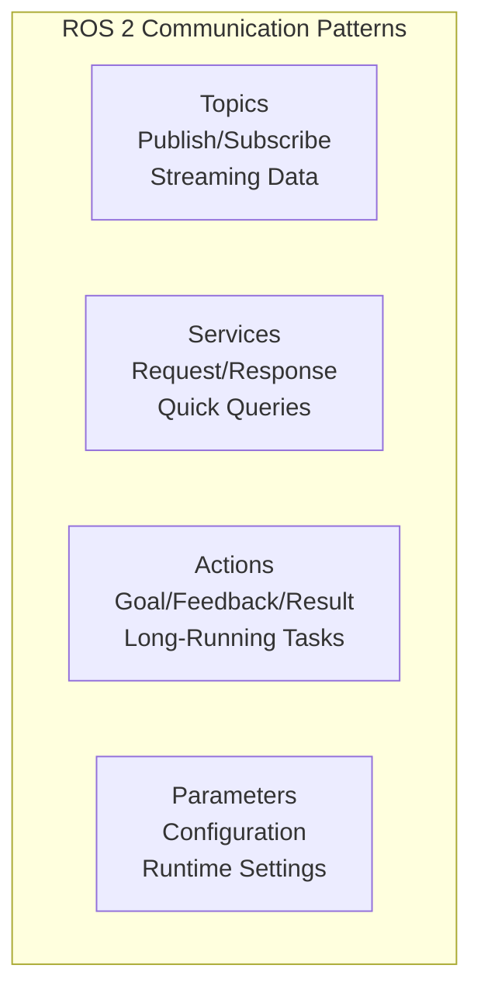
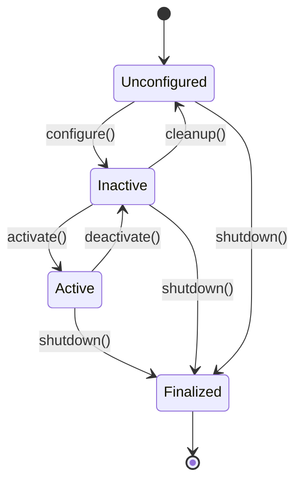
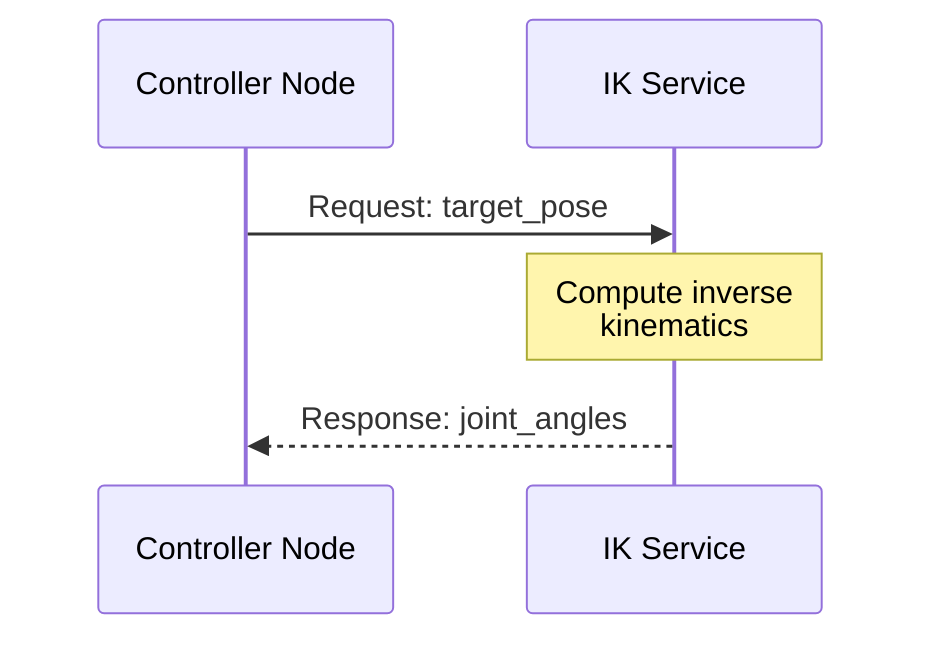
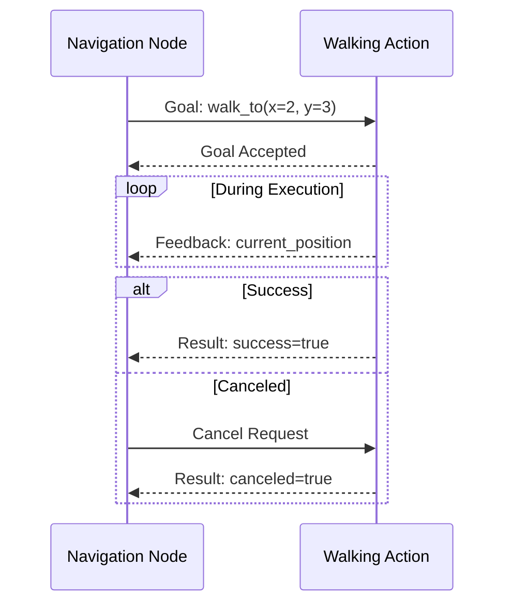

# Nodes, Topics, Services, and Actions

## The Four Communication Primitives

ROS 2 provides four fundamental communication patterns that form the backbone of any robotic system. Understanding when and how to use each pattern is essential for building effective humanoid robot applications.



## Nodes: The Building Blocks

### What is a Node?

A **node** is a single-purpose process that performs a specific computation. In the nervous system analogy, nodes are like specialized neurons—each has a specific function, but together they create complex behaviors.

:::info Design Principle
Each node should do **one thing well**. A camera node captures images. A perception node processes them. A planning node decides actions. This separation enables modularity and easier debugging.
:::

### Node Characteristics

| Characteristic | Description |
|---------------|-------------|
| **Single Responsibility** | Each node handles one specific task |
| **Independent Lifecycle** | Nodes can start, stop, and restart independently |
| **Discoverable** | Nodes automatically announce themselves on the network |
| **Configurable** | Nodes accept parameters for runtime configuration |

### Creating a Basic Node

```python
import rclpy
from rclpy.node import Node

class HumanoidSensorNode(Node):
    """A node that reads and publishes sensor data."""

    def __init__(self):
        super().__init__('humanoid_sensor_node')
        self.get_logger().info('Sensor node initialized')

        # Create a timer that fires every 100ms (10 Hz)
        self.timer = self.create_timer(0.1, self.timer_callback)

    def timer_callback(self):
        # Read sensor data and publish
        self.get_logger().debug('Reading sensors...')

def main(args=None):
    rclpy.init(args=args)
    node = HumanoidSensorNode()

    try:
        rclpy.spin(node)  # Keep the node running
    except KeyboardInterrupt:
        pass
    finally:
        node.destroy_node()
        rclpy.shutdown()

if __name__ == '__main__':
    main()
```

### Node Lifecycle (Managed Nodes)

ROS 2 introduces **managed nodes** with explicit lifecycle states, critical for safety-critical humanoid applications:



| State | Description | Humanoid Example |
|-------|-------------|------------------|
| **Unconfigured** | Node exists but isn't set up | Motor driver loaded but not configured |
| **Inactive** | Configured but not processing | Robot powered but in standby |
| **Active** | Fully operational | Robot walking and responding |
| **Finalized** | Shutting down | Safe power-off sequence |

---

## Topics: Streaming Data

### What is a Topic?

A **topic** is a named channel for streaming data using the publish-subscribe pattern. Publishers send messages to a topic; subscribers receive them. This is the most common communication pattern in ROS 2.

### When to Use Topics

- **Continuous sensor data** (camera images, IMU readings, joint states)
- **Regular status updates** (battery level, temperature)
- **Commands that flow continuously** (velocity commands)
- **Any data where multiple nodes need the same information**

### Topic Architecture

```mermaid
graph LR
    subgraph Publishers
        CAM[Camera Node]
        IMU[IMU Node]
    end

    subgraph Topics
        IMG[/camera/image]
        ORIENT[/imu/orientation]
    end

    subgraph Subscribers
        PERC[Perception Node]
        BAL[Balance Node]
        LOG[Logger Node]
    end

    CAM -->|publish| IMG
    IMU -->|publish| ORIENT
    IMG -->|subscribe| PERC
    IMG -->|subscribe| LOG
    ORIENT -->|subscribe| BAL
    ORIENT -->|subscribe| LOG
```

### Publisher Example

```python
from rclpy.node import Node
from sensor_msgs.msg import JointState
from std_msgs.msg import Header

class JointStatePublisher(Node):
    """Publishes current joint positions of the humanoid."""

    def __init__(self):
        super().__init__('joint_state_publisher')

        # Create publisher with queue size of 10
        self.publisher = self.create_publisher(
            JointState,
            '/joint_states',
            10
        )

        # Publish at 100 Hz for smooth control
        self.timer = self.create_timer(0.01, self.publish_joint_states)

        # Joint names for a humanoid robot
        self.joint_names = [
            'left_hip_yaw', 'left_hip_roll', 'left_hip_pitch',
            'left_knee', 'left_ankle_pitch', 'left_ankle_roll',
            'right_hip_yaw', 'right_hip_roll', 'right_hip_pitch',
            'right_knee', 'right_ankle_pitch', 'right_ankle_roll',
        ]

    def publish_joint_states(self):
        msg = JointState()
        msg.header = Header()
        msg.header.stamp = self.get_clock().now().to_msg()
        msg.name = self.joint_names
        msg.position = self.read_joint_positions()  # From hardware
        msg.velocity = self.read_joint_velocities()
        msg.effort = self.read_joint_efforts()

        self.publisher.publish(msg)
```

### Subscriber Example

```python
from rclpy.node import Node
from sensor_msgs.msg import JointState

class BalanceController(Node):
    """Subscribes to joint states and computes balance corrections."""

    def __init__(self):
        super().__init__('balance_controller')

        self.subscription = self.create_subscription(
            JointState,
            '/joint_states',
            self.joint_state_callback,
            10
        )

        self.current_positions = {}

    def joint_state_callback(self, msg: JointState):
        # Update internal state
        for name, position in zip(msg.name, msg.position):
            self.current_positions[name] = position

        # Compute balance corrections
        self.compute_balance_correction()
```

---

## Services: Request-Response

### What is a Service?

A **service** provides a request-response pattern for synchronous communication. The client sends a request, waits for processing, and receives a response.

### When to Use Services

- **One-time queries** (get current pose, check battery level)
- **Configuration changes** (set operating mode, calibrate sensor)
- **Quick computations** (inverse kinematics for a single pose)
- **State changes that need confirmation** (enable motors, start recording)

:::warning Important
Services are **blocking** by default. Don't use them for long-running operations or you'll freeze your node. Use Actions instead.
:::

### Service Architecture



### Defining a Custom Service

First, define the service interface in a `.srv` file:

```
# srv/ComputeIK.srv
# Request
geometry_msgs/Pose target_pose
string end_effector_name
---
# Response
bool success
float64[] joint_positions
string message
```

### Service Server Implementation

```python
from rclpy.node import Node
from your_package.srv import ComputeIK

class InverseKinematicsService(Node):
    """Provides inverse kinematics computation as a service."""

    def __init__(self):
        super().__init__('ik_service')

        self.srv = self.create_service(
            ComputeIK,
            '/compute_ik',
            self.compute_ik_callback
        )

        self.get_logger().info('IK service ready')

    def compute_ik_callback(self, request, response):
        self.get_logger().info(
            f'Computing IK for {request.end_effector_name}'
        )

        try:
            # Perform IK computation
            joint_positions = self.solve_ik(
                request.target_pose,
                request.end_effector_name
            )

            response.success = True
            response.joint_positions = joint_positions
            response.message = 'IK solution found'

        except Exception as e:
            response.success = False
            response.joint_positions = []
            response.message = f'IK failed: {str(e)}'

        return response
```

### Service Client Implementation

```python
from rclpy.node import Node
from your_package.srv import ComputeIK

class ArmController(Node):
    """Uses IK service to move the arm to target positions."""

    def __init__(self):
        super().__init__('arm_controller')

        self.ik_client = self.create_client(
            ComputeIK,
            '/compute_ik'
        )

        # Wait for service to be available
        while not self.ik_client.wait_for_service(timeout_sec=1.0):
            self.get_logger().info('Waiting for IK service...')

    async def move_to_pose(self, target_pose, end_effector):
        request = ComputeIK.Request()
        request.target_pose = target_pose
        request.end_effector_name = end_effector

        # Async call - doesn't block
        future = self.ik_client.call_async(request)
        response = await future

        if response.success:
            self.execute_trajectory(response.joint_positions)
        else:
            self.get_logger().error(response.message)
```

---

## Actions: Long-Running Tasks

### What is an Action?

An **action** is designed for long-running tasks that need feedback during execution and can be canceled. It combines the goal-oriented nature of services with the streaming capability of topics.

### When to Use Actions

- **Motion execution** (walk to a location, pick up an object)
- **Behavior sequences** (stand up, wave, sit down)
- **Tasks with progress** (calibration routines, scanning)
- **Cancelable operations** (stop walking if obstacle detected)

### Action Architecture



### Defining a Custom Action

Define the action interface in a `.action` file:

```
# action/Walk.action
# Goal
geometry_msgs/Pose2D target_pose
float32 speed
---
# Result
bool success
float32 distance_traveled
string message
---
# Feedback
geometry_msgs/Pose2D current_pose
float32 distance_remaining
float32 estimated_time_remaining
```

### Action Server Implementation

```python
import rclpy
from rclpy.action import ActionServer
from rclpy.node import Node
from your_package.action import Walk

class WalkingActionServer(Node):
    """Executes walking commands as an action."""

    def __init__(self):
        super().__init__('walking_action_server')

        self._action_server = ActionServer(
            self,
            Walk,
            '/walk',
            self.execute_callback
        )

    async def execute_callback(self, goal_handle):
        self.get_logger().info('Starting walk action')

        target = goal_handle.request.target_pose
        speed = goal_handle.request.speed

        feedback_msg = Walk.Feedback()

        while not self.reached_target(target):
            # Check if canceled
            if goal_handle.is_cancel_requested:
                goal_handle.canceled()
                return Walk.Result(
                    success=False,
                    message='Walk canceled'
                )

            # Execute one step
            self.execute_step(target, speed)

            # Send feedback
            feedback_msg.current_pose = self.get_current_pose()
            feedback_msg.distance_remaining = self.distance_to(target)
            feedback_msg.estimated_time_remaining = (
                feedback_msg.distance_remaining / speed
            )
            goal_handle.publish_feedback(feedback_msg)

            await asyncio.sleep(0.1)  # 10 Hz feedback

        # Task completed
        goal_handle.succeed()
        return Walk.Result(
            success=True,
            distance_traveled=self.total_distance,
            message='Reached target'
        )
```

### Action Client Implementation

```python
from rclpy.action import ActionClient
from rclpy.node import Node
from your_package.action import Walk

class NavigationController(Node):
    """High-level navigation using walking action."""

    def __init__(self):
        super().__init__('navigation_controller')

        self._action_client = ActionClient(
            self,
            Walk,
            '/walk'
        )

    def walk_to(self, x, y, theta, speed=0.5):
        goal_msg = Walk.Goal()
        goal_msg.target_pose.x = x
        goal_msg.target_pose.y = y
        goal_msg.target_pose.theta = theta
        goal_msg.speed = speed

        self._action_client.wait_for_server()

        self._send_goal_future = self._action_client.send_goal_async(
            goal_msg,
            feedback_callback=self.feedback_callback
        )
        self._send_goal_future.add_done_callback(
            self.goal_response_callback
        )

    def feedback_callback(self, feedback_msg):
        feedback = feedback_msg.feedback
        self.get_logger().info(
            f'Distance remaining: {feedback.distance_remaining:.2f}m'
        )

    def goal_response_callback(self, future):
        goal_handle = future.result()
        if not goal_handle.accepted:
            self.get_logger().error('Goal rejected')
            return

        self.get_logger().info('Goal accepted')
        self._get_result_future = goal_handle.get_result_async()
        self._get_result_future.add_done_callback(
            self.get_result_callback
        )
```

---

## Choosing the Right Pattern

| Scenario | Pattern | Reason |
|----------|---------|--------|
| Stream camera images | **Topic** | Continuous data, multiple subscribers |
| Get robot's current pose | **Service** | One-time query, quick response |
| Walk to location | **Action** | Long-running, needs feedback, cancelable |
| Publish joint commands | **Topic** | Continuous control at high frequency |
| Calibrate sensors | **Action** | Takes time, want progress updates |
| Toggle motor power | **Service** | Discrete state change |
| Stream IMU data | **Topic** | High-frequency sensor data |
| Execute manipulation | **Action** | Multi-step, may need to cancel |

## Summary

The four ROS 2 communication patterns each serve distinct purposes:

- **Nodes** are single-purpose processes that form the building blocks
- **Topics** enable publish-subscribe streaming for continuous data
- **Services** provide request-response for quick, synchronous queries
- **Actions** handle long-running tasks with feedback and cancellation

For humanoid robots, you'll typically use:
- Topics for sensor data and motor commands
- Services for configuration and quick computations
- Actions for locomotion and manipulation behaviors

Understanding these patterns is fundamental to building robust, responsive humanoid robot systems.

## Exercises

1. Create a node that publishes simulated IMU data at 100 Hz
2. Implement a service that computes the center of mass for given joint positions
3. Design an action for a "wave hello" gesture with progress feedback
4. Connect multiple nodes using topics to create a simple perception pipeline
