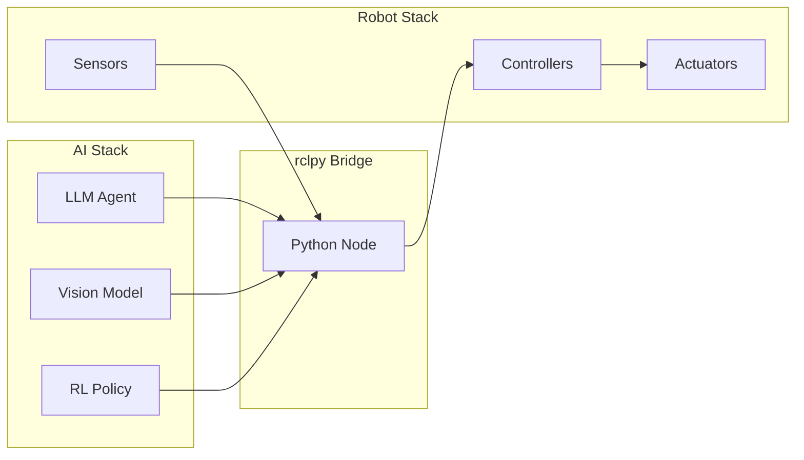
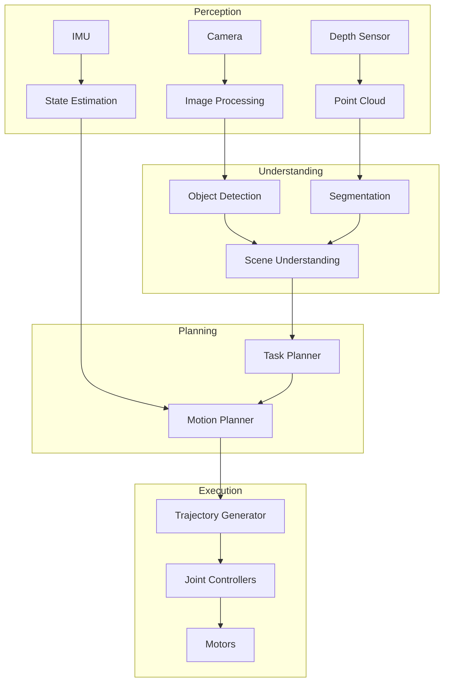

# Python-based Control Pipelines

## Bridging Python AI Agents to ROS 2

One of the most powerful aspects of modern humanoid robotics is the ability to combine sophisticated AI systems—often written in Python—with real-time robot control. The **rclpy** library serves as the bridge between Python-based AI agents and the ROS 2 ecosystem.

:::tip Why Python for Robotics?
Python dominates AI and machine learning. By using rclpy, you can directly integrate PyTorch models, TensorFlow networks, and LLM-based agents into your robot control systems without language barriers.
:::

## The rclpy Client Library

**rclpy** (ROS Client Library for Python) provides a Pythonic interface to all ROS 2 functionality. It enables you to:

- Create nodes that integrate with Python ML frameworks
- Process sensor data using NumPy and OpenCV
- Run inference with PyTorch or TensorFlow models
- Connect LLM-based planners to robot actuators



## Building a Control Pipeline

A typical humanoid robot control pipeline consists of several stages, each potentially running as a separate ROS 2 node:

### Pipeline Architecture



## Creating a Python ROS 2 Package

### Package Structure

```
humanoid_control/
├── humanoid_control/
│   ├── __init__.py
│   ├── perception_node.py
│   ├── planning_node.py
│   ├── control_node.py
│   └── utils/
│       ├── __init__.py
│       └── transforms.py
├── launch/
│   └── full_pipeline.launch.py
├── config/
│   └── controller_params.yaml
├── package.xml
├── setup.py
└── setup.cfg
```

### setup.py Configuration

```python
from setuptools import setup

package_name = 'humanoid_control'

setup(
    name=package_name,
    version='0.1.0',
    packages=[package_name, f'{package_name}.utils'],
    data_files=[
        ('share/ament_index/resource_index/packages',
            ['resource/' + package_name]),
        ('share/' + package_name, ['package.xml']),
        ('share/' + package_name + '/launch', ['launch/full_pipeline.launch.py']),
        ('share/' + package_name + '/config', ['config/controller_params.yaml']),
    ],
    install_requires=['setuptools'],
    zip_safe=True,
    entry_points={
        'console_scripts': [
            'perception_node = humanoid_control.perception_node:main',
            'planning_node = humanoid_control.planning_node:main',
            'control_node = humanoid_control.control_node:main',
        ],
    },
)
```

## Perception Pipeline Node

This node processes camera images and publishes detected objects:

```python
import rclpy
from rclpy.node import Node
from sensor_msgs.msg import Image
from vision_msgs.msg import Detection2DArray, Detection2D
from cv_bridge import CvBridge
import numpy as np

# AI imports
import torch
from ultralytics import YOLO


class PerceptionNode(Node):
    """Processes camera images using a YOLO model for object detection."""

    def __init__(self):
        super().__init__('perception_node')

        # Parameters
        self.declare_parameter('model_path', 'yolov8n.pt')
        self.declare_parameter('confidence_threshold', 0.5)

        model_path = self.get_parameter('model_path').value
        self.conf_threshold = self.get_parameter('confidence_threshold').value

        # Load YOLO model
        self.get_logger().info(f'Loading model: {model_path}')
        self.model = YOLO(model_path)

        # CV Bridge for image conversion
        self.bridge = CvBridge()

        # Subscribers
        self.image_sub = self.create_subscription(
            Image,
            '/camera/color/image_raw',
            self.image_callback,
            10
        )

        # Publishers
        self.detection_pub = self.create_publisher(
            Detection2DArray,
            '/detections',
            10
        )

        self.get_logger().info('Perception node initialized')

    def image_callback(self, msg: Image):
        """Process incoming image and publish detections."""
        # Convert ROS Image to OpenCV format
        cv_image = self.bridge.imgmsg_to_cv2(msg, 'bgr8')

        # Run inference
        results = self.model(cv_image, conf=self.conf_threshold)

        # Convert to ROS message
        detection_array = Detection2DArray()
        detection_array.header = msg.header

        for result in results:
            for box in result.boxes:
                detection = Detection2D()

                # Bounding box
                x1, y1, x2, y2 = box.xyxy[0].cpu().numpy()
                detection.bbox.center.position.x = (x1 + x2) / 2
                detection.bbox.center.position.y = (y1 + y2) / 2
                detection.bbox.size_x = float(x2 - x1)
                detection.bbox.size_y = float(y2 - y1)

                # Classification
                detection.results[0].hypothesis.class_id = str(int(box.cls))
                detection.results[0].hypothesis.score = float(box.conf)

                detection_array.detections.append(detection)

        self.detection_pub.publish(detection_array)
        self.get_logger().debug(
            f'Published {len(detection_array.detections)} detections'
        )


def main(args=None):
    rclpy.init(args=args)
    node = PerceptionNode()

    try:
        rclpy.spin(node)
    except KeyboardInterrupt:
        pass
    finally:
        node.destroy_node()
        rclpy.shutdown()


if __name__ == '__main__':
    main()
```

## Motion Planning Node

This node plans motions based on detected objects and current state:

```python
import rclpy
from rclpy.node import Node
from geometry_msgs.msg import PoseStamped
from sensor_msgs.msg import JointState
from vision_msgs.msg import Detection2DArray
from trajectory_msgs.msg import JointTrajectory, JointTrajectoryPoint
import numpy as np


class MotionPlanningNode(Node):
    """Plans robot motions based on perception and task goals."""

    def __init__(self):
        super().__init__('motion_planning_node')

        # Current state
        self.current_joint_state = None
        self.current_detections = []

        # Subscribers
        self.joint_state_sub = self.create_subscription(
            JointState,
            '/joint_states',
            self.joint_state_callback,
            10
        )

        self.detection_sub = self.create_subscription(
            Detection2DArray,
            '/detections',
            self.detection_callback,
            10
        )

        self.goal_sub = self.create_subscription(
            PoseStamped,
            '/goal_pose',
            self.goal_callback,
            10
        )

        # Publishers
        self.trajectory_pub = self.create_publisher(
            JointTrajectory,
            '/planned_trajectory',
            10
        )

        self.get_logger().info('Motion planning node initialized')

    def joint_state_callback(self, msg: JointState):
        """Update current joint state."""
        self.current_joint_state = msg

    def detection_callback(self, msg: Detection2DArray):
        """Update detected objects for collision avoidance."""
        self.current_detections = msg.detections

    def goal_callback(self, msg: PoseStamped):
        """Plan trajectory to goal pose."""
        if self.current_joint_state is None:
            self.get_logger().warn('No joint state available')
            return

        # Compute trajectory (simplified example)
        trajectory = self.plan_trajectory(
            current_joints=self.current_joint_state,
            goal_pose=msg,
            obstacles=self.current_detections
        )

        if trajectory is not None:
            self.trajectory_pub.publish(trajectory)
            self.get_logger().info('Published trajectory')

    def plan_trajectory(self, current_joints, goal_pose, obstacles):
        """
        Plan collision-free trajectory to goal.

        In a real implementation, this would use a motion planning
        library like MoveIt 2 or OMPL.
        """
        trajectory = JointTrajectory()
        trajectory.header.stamp = self.get_clock().now().to_msg()
        trajectory.joint_names = current_joints.name

        # Simple linear interpolation (replace with real planner)
        num_points = 10
        duration = 2.0  # seconds

        goal_joints = self.inverse_kinematics(goal_pose)

        for i in range(num_points + 1):
            point = JointTrajectoryPoint()
            alpha = i / num_points

            # Interpolate joint positions
            point.positions = [
                (1 - alpha) * curr + alpha * goal
                for curr, goal in zip(
                    current_joints.position,
                    goal_joints
                )
            ]

            point.time_from_start.sec = int(alpha * duration)
            point.time_from_start.nanosec = int(
                (alpha * duration % 1) * 1e9
            )

            trajectory.points.append(point)

        return trajectory

    def inverse_kinematics(self, pose):
        """
        Compute joint angles for target pose.

        In practice, use a proper IK solver like KDL or IKFast.
        """
        # Placeholder - return current position
        if self.current_joint_state:
            return list(self.current_joint_state.position)
        return [0.0] * 12  # Default for 12-DOF humanoid legs


def main(args=None):
    rclpy.init(args=args)
    node = MotionPlanningNode()

    try:
        rclpy.spin(node)
    except KeyboardInterrupt:
        pass
    finally:
        node.destroy_node()
        rclpy.shutdown()
```

## Integrating LLM-Based Agents

Modern humanoid robots can use Large Language Models (LLMs) for high-level task planning:

```python
import rclpy
from rclpy.node import Node
from std_msgs.msg import String
from geometry_msgs.msg import PoseStamped
import json

# LLM imports
from openai import OpenAI


class LLMPlannerNode(Node):
    """Uses an LLM to convert natural language commands to robot actions."""

    def __init__(self):
        super().__init__('llm_planner_node')

        # Parameters
        self.declare_parameter('model', 'gpt-4')
        self.model = self.get_parameter('model').value

        # Initialize OpenAI client
        self.client = OpenAI()

        # System prompt for the LLM
        self.system_prompt = """You are a robot task planner. Given a natural
        language command, output a JSON list of actions the robot should take.

        Available actions:
        - move_to: {x, y, z} - Move end effector to position
        - grasp: {} - Close gripper
        - release: {} - Open gripper
        - look_at: {x, y, z} - Point camera at position
        - speak: {text} - Say something

        Respond only with valid JSON."""

        # Subscribers
        self.command_sub = self.create_subscription(
            String,
            '/voice_command',
            self.command_callback,
            10
        )

        # Publishers
        self.action_pub = self.create_publisher(
            String,
            '/planned_actions',
            10
        )

        self.get_logger().info('LLM planner node initialized')

    def command_callback(self, msg: String):
        """Process natural language command through LLM."""
        command = msg.data
        self.get_logger().info(f'Received command: {command}')

        try:
            # Query LLM for action plan
            response = self.client.chat.completions.create(
                model=self.model,
                messages=[
                    {"role": "system", "content": self.system_prompt},
                    {"role": "user", "content": command}
                ],
                temperature=0.1  # Low temperature for deterministic output
            )

            # Parse response
            action_plan = response.choices[0].message.content
            actions = json.loads(action_plan)

            # Publish action plan
            action_msg = String()
            action_msg.data = json.dumps(actions)
            self.action_pub.publish(action_msg)

            self.get_logger().info(f'Planned {len(actions)} actions')

        except Exception as e:
            self.get_logger().error(f'LLM planning failed: {e}')


def main(args=None):
    rclpy.init(args=args)
    node = LLMPlannerNode()

    try:
        rclpy.spin(node)
    except KeyboardInterrupt:
        pass
    finally:
        node.destroy_node()
        rclpy.shutdown()
```

## Asynchronous Execution

For AI workloads that may take time (like LLM inference), use async patterns:

```python
import rclpy
from rclpy.node import Node
from rclpy.callback_groups import ReentrantCallbackGroup
from rclpy.executors import MultiThreadedExecutor
import asyncio


class AsyncAINode(Node):
    """Node that handles async AI inference without blocking."""

    def __init__(self):
        super().__init__('async_ai_node')

        # Use reentrant callback group for async operations
        self.callback_group = ReentrantCallbackGroup()

        self.subscription = self.create_subscription(
            Image,
            '/camera/image',
            self.image_callback,
            10,
            callback_group=self.callback_group
        )

        self.publisher = self.create_publisher(
            Detection2DArray,
            '/detections',
            10
        )

    async def run_inference_async(self, image):
        """Run AI inference asynchronously."""
        loop = asyncio.get_event_loop()

        # Run CPU-bound inference in thread pool
        result = await loop.run_in_executor(
            None,  # Uses default executor
            self.model.predict,
            image
        )

        return result

    def image_callback(self, msg):
        """Handle incoming images with async inference."""
        # Create async task for inference
        asyncio.create_task(self.process_image(msg))

    async def process_image(self, msg):
        """Process image asynchronously."""
        image = self.bridge.imgmsg_to_cv2(msg)
        detections = await self.run_inference_async(image)
        self.publisher.publish(detections)


def main(args=None):
    rclpy.init(args=args)
    node = AsyncAINode()

    # Use multi-threaded executor for async support
    executor = MultiThreadedExecutor()
    executor.add_node(node)

    try:
        executor.spin()
    except KeyboardInterrupt:
        pass
    finally:
        node.destroy_node()
        rclpy.shutdown()
```

## Launch Files for Pipelines

Coordinate multiple nodes with a launch file:

```python
# launch/full_pipeline.launch.py
from launch import LaunchDescription
from launch_ros.actions import Node
from launch.actions import DeclareLaunchArgument
from launch.substitutions import LaunchConfiguration


def generate_launch_description():
    return LaunchDescription([
        # Arguments
        DeclareLaunchArgument(
            'model_path',
            default_value='yolov8n.pt',
            description='Path to perception model'
        ),

        # Perception node
        Node(
            package='humanoid_control',
            executable='perception_node',
            name='perception',
            parameters=[{
                'model_path': LaunchConfiguration('model_path'),
                'confidence_threshold': 0.5,
            }],
            output='screen',
        ),

        # Motion planning node
        Node(
            package='humanoid_control',
            executable='planning_node',
            name='planning',
            output='screen',
        ),

        # Control node
        Node(
            package='humanoid_control',
            executable='control_node',
            name='control',
            parameters=[{
                'control_rate': 100.0,
            }],
            output='screen',
        ),
    ])
```

Launch the pipeline:

```bash
ros2 launch humanoid_control full_pipeline.launch.py model_path:=yolov8m.pt
```

## Best Practices

### 1. Separate Concerns

| Node Type | Responsibility | Update Rate |
|-----------|---------------|-------------|
| Perception | Sensor processing, ML inference | 10-30 Hz |
| Planning | Decision making, trajectory planning | 1-10 Hz |
| Control | Joint-level control, safety | 100-1000 Hz |

### 2. Use Appropriate QoS

```python
from rclpy.qos import QoSProfile, ReliabilityPolicy, HistoryPolicy

# For sensor data - best effort, keep last
sensor_qos = QoSProfile(
    reliability=ReliabilityPolicy.BEST_EFFORT,
    history=HistoryPolicy.KEEP_LAST,
    depth=1
)

# For commands - reliable delivery
command_qos = QoSProfile(
    reliability=ReliabilityPolicy.RELIABLE,
    history=HistoryPolicy.KEEP_LAST,
    depth=10
)
```

### 3. Handle Timing Correctly

```python
class TimeSyncNode(Node):
    """Example of proper time handling."""

    def __init__(self):
        super().__init__('time_sync_node')

        # Use ROS time, not system time
        self.current_time = self.get_clock().now()

        # Create timer with proper duration
        self.timer = self.create_timer(
            0.01,  # 100 Hz
            self.control_callback
        )

    def control_callback(self):
        now = self.get_clock().now()
        dt = (now - self.current_time).nanoseconds / 1e9
        self.current_time = now

        # Use dt for time-dependent calculations
        self.integrate_state(dt)
```

## Summary

Python-based control pipelines in ROS 2 enable powerful integration between AI systems and robot hardware:

- **rclpy** provides full ROS 2 functionality in Python
- **Perception nodes** process sensor data using ML models
- **Planning nodes** make decisions based on understanding
- **Control nodes** execute planned motions safely
- **LLM integration** enables natural language robot control
- **Async patterns** prevent blocking during inference

The ability to seamlessly combine PyTorch, TensorFlow, and LLM APIs with real-time robot control makes ROS 2 and Python an ideal combination for modern humanoid robotics.

## Exercises

1. Create a perception node that uses a pre-trained pose estimation model
2. Implement a planning node that avoids detected obstacles
3. Build an LLM-based node that converts voice commands to robot actions
4. Design a complete pipeline that picks up objects based on verbal instructions
