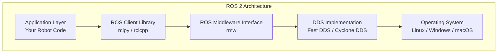
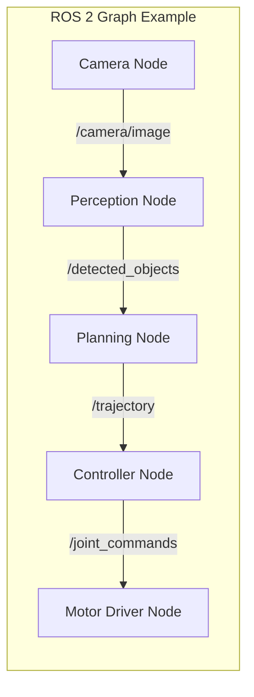
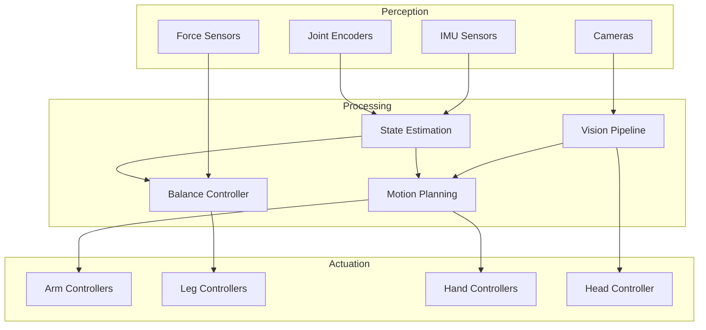

# What is ROS 2?

## The Nervous System of Humanoid Robots

Just as the human nervous system serves as the body's communication network—transmitting signals between the brain, spinal cord, and every muscle and sensor—**ROS 2 (Robot Operating System 2)** functions as the nervous system of a humanoid robot. It provides the essential infrastructure that allows all robot components to communicate, coordinate, and respond to their environment in real-time.

:::tip Key Insight
ROS 2 is not an operating system in the traditional sense (like Linux or Windows). Instead, it's a **middleware framework** that sits on top of your operating system and provides tools, libraries, and conventions for building robot applications.
:::

## Why ROS 2 for Humanoid Robotics?

Humanoid robots present unique challenges that ROS 2 is specifically designed to address:

### 1. Complex Coordination Requirements

A humanoid robot has dozens of joints, multiple sensors, and various actuators that must work in perfect synchronization. Consider walking: it requires coordinating hip, knee, and ankle joints on both legs while maintaining balance through continuous sensor feedback. ROS 2's publish-subscribe architecture enables this coordination without creating tightly coupled systems.

### 2. Real-Time Performance

When a humanoid robot is walking and detects an obstacle, it cannot afford milliseconds of delay. ROS 2 is built on **DDS (Data Distribution Service)**, an industry-standard real-time communication protocol that guarantees message delivery with predictable latency.

### 3. Distributed Computing

Modern humanoid robots often distribute processing across multiple computers:
- An edge computer for real-time motor control
- A more powerful system for perception and planning
- Cloud connectivity for AI inference

ROS 2 handles this distribution transparently, making it appear as if all components are running on a single system.

## ROS 2 Architecture Overview



### Layer Breakdown

| Layer | Purpose | Example |
|-------|---------|---------|
| **Application** | Your robot logic | Walking controller, perception pipeline |
| **Client Library** | Language-specific API | `rclpy` for Python, `rclcpp` for C++ |
| **Middleware Interface** | Abstraction layer | Allows swapping DDS implementations |
| **DDS** | Communication backbone | Handles message serialization and transport |
| **OS** | System resources | Process scheduling, networking |

## Core Concepts

### The ROS 2 Graph

The **ROS 2 graph** is the network of all active ROS 2 elements (nodes) and their connections. Think of it as a living diagram of your robot's nervous system at any moment.



### Discovery and Dynamic Connectivity

Unlike traditional client-server systems, ROS 2 uses **automatic discovery**. When a node starts, it announces its presence and automatically finds other nodes it needs to communicate with. This is analogous to how neurons form connections during development.

```python
# When this node starts, it automatically discovers
# any nodes publishing to /joint_states
import rclpy
from rclpy.node import Node
from sensor_msgs.msg import JointState

class JointMonitor(Node):
    def __init__(self):
        super().__init__('joint_monitor')
        # Subscription is automatically connected to any
        # publisher on this topic
        self.subscription = self.create_subscription(
            JointState,
            '/joint_states',
            self.joint_callback,
            10
        )

    def joint_callback(self, msg):
        self.get_logger().info(f'Received joint states: {msg.name}')
```

## Quality of Service (QoS)

ROS 2 introduces **Quality of Service** policies that let you tune communication behavior based on your needs:

| QoS Policy | Options | Use Case |
|------------|---------|----------|
| **Reliability** | Reliable / Best Effort | Use reliable for commands, best effort for streaming |
| **Durability** | Transient Local / Volatile | Transient local for late-joining subscribers |
| **History** | Keep Last N / Keep All | Keep last for real-time, keep all for logging |
| **Deadline** | Time duration | Ensure periodic messages arrive on schedule |

### Example: Configuring QoS for Motor Commands

```python
from rclpy.qos import QoSProfile, ReliabilityPolicy, DurabilityPolicy

# Motor commands must be reliable - we can't afford to lose them
motor_qos = QoSProfile(
    reliability=ReliabilityPolicy.RELIABLE,
    durability=DurabilityPolicy.VOLATILE,
    depth=10
)

self.motor_publisher = self.create_publisher(
    JointCommand,
    '/motor_commands',
    motor_qos
)
```

## ROS 2 vs ROS 1

If you're familiar with the original ROS, here are the key improvements in ROS 2:

| Feature | ROS 1 | ROS 2 |
|---------|-------|-------|
| **Communication** | Custom protocol | Industry-standard DDS |
| **Real-time** | Not supported | First-class support |
| **Security** | Limited | Built-in encryption and access control |
| **Multi-robot** | Workarounds needed | Native support via namespaces |
| **Platforms** | Linux only | Linux, Windows, macOS |
| **Lifecycle** | Unmanaged | Managed node lifecycle |

## The Humanoid Robot as a ROS 2 System

When we map a humanoid robot to ROS 2 concepts, we get a clear architecture:



## Getting Started with ROS 2

### Installation

For Ubuntu 22.04 (recommended for robotics development):

```bash
# Set locale
sudo apt update && sudo apt install locales
sudo locale-gen en_US en_US.UTF-8
sudo update-locale LC_ALL=en_US.UTF-8 LANG=en_US.UTF-8

# Setup sources
sudo apt install software-properties-common
sudo add-apt-repository universe
sudo apt update && sudo apt install curl -y
sudo curl -sSL https://raw.githubusercontent.com/ros/rosdistro/master/ros.key -o /usr/share/keyrings/ros-archive-keyring.gpg
echo "deb [arch=$(dpkg --print-architecture) signed-by=/usr/share/keyrings/ros-archive-keyring.gpg] http://packages.ros.org/ros2/ubuntu $(. /etc/os-release && echo $UBUNTU_CODENAME) main" | sudo tee /etc/apt/sources.list.d/ros2.list > /dev/null

# Install ROS 2 Humble
sudo apt update
sudo apt install ros-humble-desktop
```

### Your First ROS 2 Command

```bash
# Source the ROS 2 environment
source /opt/ros/humble/setup.bash

# Run the demo talker and listener
ros2 run demo_nodes_cpp talker &
ros2 run demo_nodes_py listener
```

## Summary

ROS 2 serves as the nervous system of humanoid robots by providing:

- **Standardized communication** between all robot components
- **Real-time guarantees** for time-critical operations
- **Distributed architecture** for scalable systems
- **Quality of Service** policies for reliable message delivery
- **Automatic discovery** for dynamic system configuration

In the next section, we'll dive deeper into the four fundamental communication patterns in ROS 2: Nodes, Topics, Services, and Actions.

## Further Reading

- [ROS 2 Documentation](https://docs.ros.org/en/humble/)
- [DDS Specification](https://www.omg.org/spec/DDS/)
- [ROS 2 Design Articles](https://design.ros2.org/)
