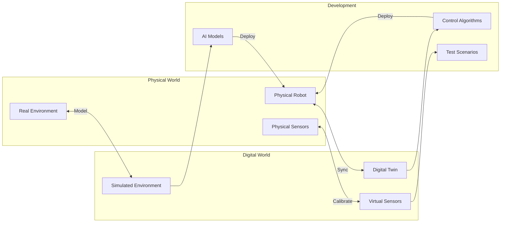
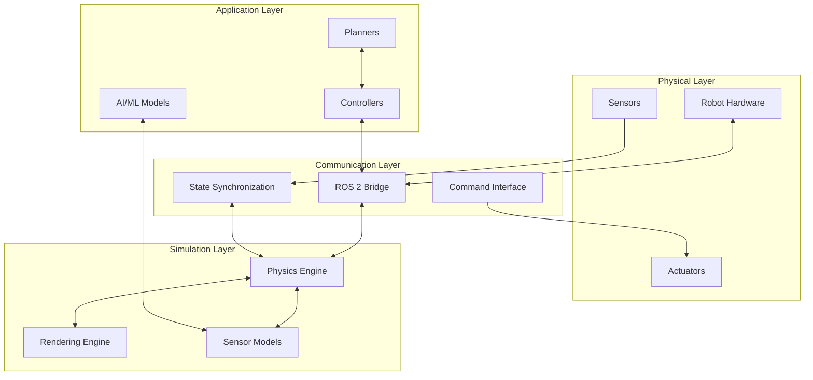
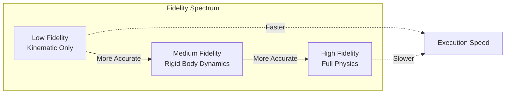
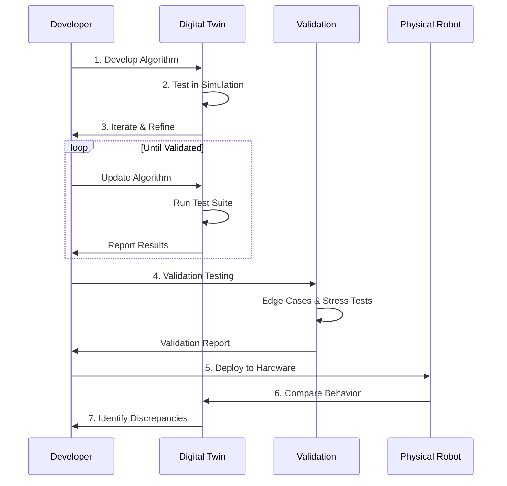

# Digital Twins: Concept & Purpose

## What is a Digital Twin?

A **digital twin** is a high-fidelity virtual representation of a physical system that mirrors its real-world counterpart in real-time. For humanoid robotics, the digital twin encompasses not just the robot itself, but also its environment, sensors, and interactions with the physical world.

:::tip Core Definition
A digital twin is more than a 3D model—it's a dynamic, data-connected virtual entity that reflects the state, behavior, and physics of its physical counterpart throughout its lifecycle.
:::

## The Goal of Digital Twins in Humanoid Robotics

The primary goal of digital twin technology in humanoid robotics is to create a **safe, cost-effective development environment** where algorithms can be tested, validated, and refined before deployment on physical hardware.



### Key Goals

| Goal | Description | Benefit |
|------|-------------|---------|
| **Risk Mitigation** | Test dangerous scenarios virtually | Prevent hardware damage and safety incidents |
| **Rapid Iteration** | Modify and retest in seconds | Accelerate development cycles |
| **Cost Reduction** | Minimize physical prototyping | Lower development expenses |
| **Data Generation** | Create synthetic training data | Enable AI/ML model development |
| **Validation** | Verify algorithms before deployment | Ensure reliable real-world performance |

## Digital Twin Architecture

A complete digital twin system for humanoid robotics consists of several interconnected layers:



## Types of Digital Twins

### 1. Offline Simulation Twin

Used for development and testing without a physical robot present.

```python
# Example: Launching an offline digital twin
import subprocess

# Start Gazebo simulation
subprocess.Popen([
    'ros2', 'launch', 'humanoid_gazebo', 'simulation.launch.py',
    'use_sim_time:=true'
])

# The digital twin runs independently of physical hardware
# Perfect for algorithm development and testing
```

**Use Cases:**
- Algorithm development
- Training data generation
- Scenario exploration
- Performance benchmarking

### 2. Shadow Twin (Real-Time Mirror)

Mirrors the physical robot's state in real-time for monitoring and analysis.

```python
import rclpy
from rclpy.node import Node
from sensor_msgs.msg import JointState

class ShadowTwinNode(Node):
    """Mirrors physical robot state in simulation."""

    def __init__(self):
        super().__init__('shadow_twin')

        # Subscribe to physical robot state
        self.physical_sub = self.create_subscription(
            JointState,
            '/physical_robot/joint_states',
            self.sync_callback,
            10
        )

        # Publish to simulation
        self.sim_pub = self.create_publisher(
            JointState,
            '/simulation/joint_commands',
            10
        )

    def sync_callback(self, msg):
        """Mirror physical state to digital twin."""
        # Transform and publish to simulation
        self.sim_pub.publish(msg)
        self.get_logger().debug('State synchronized')
```

**Use Cases:**
- Real-time monitoring
- Anomaly detection
- Predictive maintenance
- Operator training

### 3. Predictive Twin

Uses the digital twin to predict future states and outcomes.

```python
class PredictiveTwin:
    """Predicts future robot states using simulation."""

    def __init__(self, physics_engine):
        self.physics = physics_engine
        self.prediction_horizon = 1.0  # seconds

    def predict_trajectory(self, current_state, planned_actions):
        """
        Simulate planned actions to predict outcome.

        Args:
            current_state: Current robot configuration
            planned_actions: Sequence of planned commands

        Returns:
            Predicted trajectory and potential collisions
        """
        # Set simulation to current state
        self.physics.set_state(current_state)

        trajectory = []
        collisions = []

        for action in planned_actions:
            # Step simulation forward
            self.physics.apply_action(action)
            self.physics.step()

            # Record predicted state
            trajectory.append(self.physics.get_state())

            # Check for collisions
            if self.physics.check_collision():
                collisions.append({
                    'time': self.physics.time,
                    'bodies': self.physics.get_collision_info()
                })

        return trajectory, collisions
```

**Use Cases:**
- Motion planning validation
- Collision avoidance
- What-if analysis
- Safety verification

## Fidelity Levels

Digital twins can operate at different fidelity levels depending on the use case:

### Low Fidelity (Kinematic)
- Joint positions and velocities
- No physics simulation
- Fast execution
- Good for path planning

### Medium Fidelity (Dynamic)
- Full rigid body dynamics
- Contact and friction
- Moderate computation
- Good for control development

### High Fidelity (Physics-Accurate)
- Deformable bodies
- Fluid dynamics
- Accurate sensor models
- Good for validation



## The Sim-to-Real Gap

One of the biggest challenges in digital twin development is the **sim-to-real gap**—the difference between simulated and real-world behavior.

### Sources of the Gap

| Source | Description | Mitigation |
|--------|-------------|------------|
| **Model Inaccuracy** | Simplified physics models | System identification, parameter tuning |
| **Sensor Noise** | Idealized sensor models | Add realistic noise models |
| **Actuator Dynamics** | Missing motor dynamics | Include actuator models |
| **Environment** | Simplified terrain/objects | High-fidelity environment modeling |
| **Unmodeled Effects** | Cable forces, thermal effects | Domain randomization |

### Domain Randomization

A key technique for bridging the sim-to-real gap:

```python
import numpy as np

class DomainRandomizer:
    """Randomizes simulation parameters to improve transfer."""

    def __init__(self):
        self.randomization_ranges = {
            'friction': (0.5, 1.5),      # Friction coefficient multiplier
            'mass': (0.9, 1.1),          # Mass variation
            'motor_strength': (0.8, 1.2), # Actuator strength
            'sensor_noise': (0.0, 0.05),  # Noise standard deviation
            'latency': (0.0, 0.02),       # Communication delay
        }

    def randomize_environment(self, simulation):
        """Apply random variations to simulation parameters."""
        for param, (low, high) in self.randomization_ranges.items():
            value = np.random.uniform(low, high)
            simulation.set_parameter(param, value)

    def train_with_randomization(self, agent, episodes=1000):
        """Train agent with domain randomization."""
        for episode in range(episodes):
            # Randomize at start of each episode
            self.randomize_environment(self.simulation)

            # Run episode
            state = self.simulation.reset()
            done = False

            while not done:
                action = agent.act(state)
                state, reward, done, _ = self.simulation.step(action)
                agent.learn(state, reward, done)
```

## Digital Twin Workflow

A typical development workflow using digital twins:



## Benefits for Humanoid Development

### 1. Safety Testing

```python
# Test dangerous scenarios safely
scenarios = [
    'fall_recovery',
    'obstacle_collision',
    'joint_limit_violation',
    'power_failure',
    'sensor_failure'
]

for scenario in scenarios:
    result = digital_twin.run_scenario(scenario)
    assert result.robot_safe, f"Safety issue in {scenario}"
```

### 2. Parallel Development

Multiple team members can work simultaneously:
- One team develops walking algorithms
- Another works on manipulation
- A third focuses on perception
- All using the same digital twin

### 3. Continuous Integration

```yaml
# CI/CD pipeline with digital twin testing
name: Robot Algorithm CI

on: [push, pull_request]

jobs:
  simulation_test:
    runs-on: ubuntu-latest
    steps:
      - uses: actions/checkout@v3

      - name: Setup ROS 2 and Gazebo
        run: |
          sudo apt-get update
          sudo apt-get install -y ros-humble-desktop gazebo

      - name: Run Simulation Tests
        run: |
          source /opt/ros/humble/setup.bash
          ros2 launch humanoid_tests simulation_tests.launch.py

      - name: Check Test Results
        run: |
          python scripts/analyze_test_results.py
```

## Summary

Digital twins are essential infrastructure for humanoid robot development:

- **Definition**: High-fidelity virtual representations connected to physical systems
- **Goal**: Safe, efficient development and validation environment
- **Types**: Offline, Shadow (real-time), and Predictive twins
- **Challenge**: Bridging the sim-to-real gap through careful modeling and domain randomization
- **Benefits**: Safety, speed, cost reduction, and parallel development

The following sections will explore the specific technologies—physics simulation, Gazebo, Unity, and sensor modeling—that make digital twins possible.

## Further Reading

- [Digital Twin Consortium](https://www.digitaltwinconsortium.org/)
- [Sim-to-Real Transfer in Robotics](https://arxiv.org/abs/2009.13303)
- [Domain Randomization for Sim-to-Real Transfer](https://arxiv.org/abs/1703.06907)
