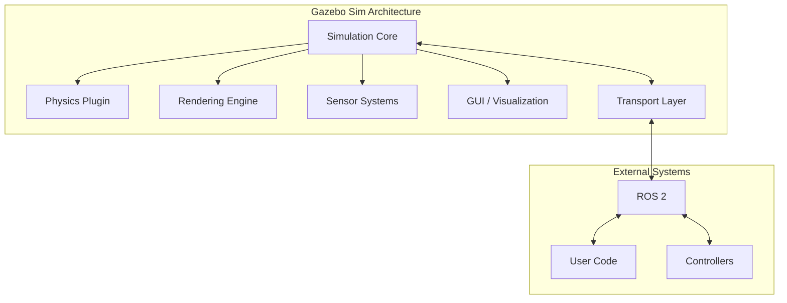

# Gazebo for Robot Simulation

## Introduction to Gazebo

**Gazebo** is the industry-standard robotics simulation platform, providing physics-accurate simulation tightly integrated with ROS 2. For humanoid robotics development, Gazebo enables testing of walking algorithms, manipulation tasks, and sensor processing without risking expensive hardware.

:::info Gazebo Versions
- **Gazebo Classic** (gazebo11): Legacy version, stable and widely used
- **Gazebo Sim** (formerly Ignition): Modern rewrite with improved architecture
- This chapter covers both, with emphasis on Gazebo Sim for new projects
:::

## Gazebo Architecture



## Setting Up Gazebo for Humanoid Simulation

### Installation (Ubuntu 22.04)

```bash
# Install Gazebo Harmonic (recommended for ROS 2 Humble)
sudo apt-get update
sudo apt-get install ros-humble-ros-gz

# Or install Gazebo Sim standalone
sudo apt-get install gz-harmonic

# Verify installation
gz sim --version
```

### Project Structure

```
humanoid_simulation/
├── models/
│   └── humanoid_robot/
│       ├── model.config
│       ├── model.sdf
│       └── meshes/
│           ├── torso.dae
│           ├── leg.dae
│           └── ...
├── worlds/
│   ├── empty.sdf
│   ├── indoor.sdf
│   └── outdoor.sdf
├── launch/
│   ├── gazebo.launch.py
│   └── spawn_robot.launch.py
├── config/
│   └── controllers.yaml
└── package.xml
```

## Creating a Gazebo World

A world file defines the simulation environment including ground, lighting, physics settings, and objects:

```xml
<?xml version="1.0" ?>
<sdf version="1.8">
  <world name="humanoid_world">

    <!-- Physics Configuration -->
    <physics name="humanoid_physics" type="dart">
      <max_step_size>0.001</max_step_size>
      <real_time_factor>1.0</real_time_factor>
      <dart>
        <collision_detector>bullet</collision_detector>
      </dart>
    </physics>

    <!-- Lighting -->
    <light type="directional" name="sun">
      <cast_shadows>true</cast_shadows>
      <pose>0 0 10 0 0 0</pose>
      <diffuse>0.8 0.8 0.8 1</diffuse>
      <specular>0.2 0.2 0.2 1</specular>
      <direction>-0.5 0.1 -0.9</direction>
    </light>

    <!-- Ground Plane -->
    <model name="ground_plane">
      <static>true</static>
      <link name="link">
        <collision name="collision">
          <geometry>
            <plane>
              <normal>0 0 1</normal>
              <size>100 100</size>
            </plane>
          </geometry>
          <surface>
            <friction>
              <ode>
                <mu>1.0</mu>
                <mu2>1.0</mu2>
              </ode>
            </friction>
          </surface>
        </collision>
        <visual name="visual">
          <geometry>
            <plane>
              <normal>0 0 1</normal>
              <size>100 100</size>
            </plane>
          </geometry>
          <material>
            <ambient>0.8 0.8 0.8 1</ambient>
            <diffuse>0.8 0.8 0.8 1</diffuse>
          </material>
        </visual>
      </link>
    </model>

    <!-- Gravity -->
    <gravity>0 0 -9.81</gravity>

    <!-- Scene Configuration -->
    <scene>
      <ambient>0.4 0.4 0.4 1</ambient>
      <background>0.7 0.7 0.7 1</background>
      <shadows>true</shadows>
    </scene>

  </world>
</sdf>
```

## Humanoid Robot Model in SDF

The robot model defines links, joints, sensors, and plugins:

```xml
<?xml version="1.0" ?>
<sdf version="1.8">
  <model name="humanoid_robot">
    <pose>0 0 0.9 0 0 0</pose>

    <!-- Pelvis (Base Link) -->
    <link name="pelvis">
      <pose>0 0 0 0 0 0</pose>
      <inertial>
        <mass>10.0</mass>
        <inertia>
          <ixx>0.1</ixx><ixy>0</ixy><ixz>0</ixz>
          <iyy>0.1</iyy><iyz>0</iyz>
          <izz>0.1</izz>
        </inertia>
      </inertial>
      <collision name="collision">
        <geometry>
          <box><size>0.3 0.2 0.15</size></box>
        </geometry>
      </collision>
      <visual name="visual">
        <geometry>
          <box><size>0.3 0.2 0.15</size></box>
        </geometry>
        <material>
          <ambient>0.2 0.2 0.8 1</ambient>
          <diffuse>0.2 0.2 0.8 1</diffuse>
        </material>
      </visual>
    </link>

    <!-- Left Thigh -->
    <link name="left_thigh">
      <pose relative_to="left_hip_pitch">0 0 -0.2 0 0 0</pose>
      <inertial>
        <mass>3.5</mass>
        <pose>0 0 -0.2 0 0 0</pose>
        <inertia>
          <ixx>0.05</ixx><ixy>0</ixy><ixz>0</ixz>
          <iyy>0.05</iyy><iyz>0</iyz>
          <izz>0.01</izz>
        </inertia>
      </inertial>
      <collision name="collision">
        <pose>0 0 -0.2 0 0 0</pose>
        <geometry>
          <cylinder><radius>0.05</radius><length>0.4</length></cylinder>
        </geometry>
      </collision>
      <visual name="visual">
        <pose>0 0 -0.2 0 0 0</pose>
        <geometry>
          <cylinder><radius>0.05</radius><length>0.4</length></cylinder>
        </geometry>
        <material>
          <ambient>0.5 0.5 0.5 1</ambient>
        </material>
      </visual>
    </link>

    <!-- Left Hip Joint -->
    <joint name="left_hip_pitch" type="revolute">
      <parent>pelvis</parent>
      <child>left_thigh</child>
      <pose relative_to="pelvis">0.1 0.1 0 0 0 0</pose>
      <axis>
        <xyz>0 1 0</xyz>
        <limit>
          <lower>-1.57</lower>
          <upper>0.52</upper>
          <effort>150</effort>
          <velocity>6.28</velocity>
        </limit>
        <dynamics>
          <damping>0.5</damping>
          <friction>0.1</friction>
        </dynamics>
      </axis>
    </joint>

    <!-- Continue with remaining links and joints... -->

    <!-- Joint State Publisher Plugin -->
    <plugin
      filename="gz-sim-joint-state-publisher-system"
      name="gz::sim::systems::JointStatePublisher">
      <topic>joint_states</topic>
    </plugin>

    <!-- Joint Position Controller Plugin -->
    <plugin
      filename="gz-sim-joint-position-controller-system"
      name="gz::sim::systems::JointPositionController">
      <joint_name>left_hip_pitch</joint_name>
      <topic>left_hip_pitch/cmd</topic>
      <p_gain>100</p_gain>
      <i_gain>0.1</i_gain>
      <d_gain>10</d_gain>
    </plugin>

  </model>
</sdf>
```

## ROS 2 Integration

### Launch File

```python
# launch/gazebo.launch.py
from launch import LaunchDescription
from launch.actions import IncludeLaunchDescription, DeclareLaunchArgument
from launch.launch_description_sources import PythonLaunchDescriptionSource
from launch.substitutions import LaunchConfiguration, PathJoinSubstitution
from launch_ros.actions import Node
from launch_ros.substitutions import FindPackageShare


def generate_launch_description():
    pkg_humanoid_sim = FindPackageShare('humanoid_simulation')

    # World file argument
    world_arg = DeclareLaunchArgument(
        'world',
        default_value='indoor.sdf',
        description='World file to load'
    )

    # Launch Gazebo
    gazebo = IncludeLaunchDescription(
        PythonLaunchDescriptionSource([
            FindPackageShare('ros_gz_sim'), '/launch/gz_sim.launch.py'
        ]),
        launch_arguments={
            'gz_args': [
                PathJoinSubstitution([
                    pkg_humanoid_sim, 'worlds',
                    LaunchConfiguration('world')
                ]),
                ' -r'  # Run immediately
            ]
        }.items()
    )

    # Spawn robot
    spawn_robot = Node(
        package='ros_gz_sim',
        executable='create',
        arguments=[
            '-name', 'humanoid',
            '-file', PathJoinSubstitution([
                pkg_humanoid_sim, 'models', 'humanoid_robot', 'model.sdf'
            ]),
            '-x', '0', '-y', '0', '-z', '0.9'
        ],
        output='screen'
    )

    # Bridge Gazebo topics to ROS 2
    bridge = Node(
        package='ros_gz_bridge',
        executable='parameter_bridge',
        arguments=[
            '/joint_states@sensor_msgs/msg/JointState@gz.msgs.Model',
            '/cmd_vel@geometry_msgs/msg/Twist@gz.msgs.Twist',
            '/clock@rosgraph_msgs/msg/Clock@gz.msgs.Clock',
        ],
        output='screen'
    )

    return LaunchDescription([
        world_arg,
        gazebo,
        spawn_robot,
        bridge,
    ])
```

### ros_gz_bridge Configuration

```yaml
# config/bridge.yaml
- ros_topic_name: "joint_states"
  gz_topic_name: "joint_states"
  ros_type_name: "sensor_msgs/msg/JointState"
  gz_type_name: "gz.msgs.Model"
  direction: GZ_TO_ROS

- ros_topic_name: "cmd_vel"
  gz_topic_name: "cmd_vel"
  ros_type_name: "geometry_msgs/msg/Twist"
  gz_type_name: "gz.msgs.Twist"
  direction: ROS_TO_GZ

- ros_topic_name: "camera/image"
  gz_topic_name: "camera"
  ros_type_name: "sensor_msgs/msg/Image"
  gz_type_name: "gz.msgs.Image"
  direction: GZ_TO_ROS
```

## Controllers with ros2_control

### Controller Configuration

```yaml
# config/controllers.yaml
controller_manager:
  ros__parameters:
    update_rate: 1000  # Hz

    joint_state_broadcaster:
      type: joint_state_broadcaster/JointStateBroadcaster

    leg_controller:
      type: effort_controllers/JointGroupEffortController

leg_controller:
  ros__parameters:
    joints:
      - left_hip_yaw
      - left_hip_roll
      - left_hip_pitch
      - left_knee
      - left_ankle_pitch
      - left_ankle_roll
      - right_hip_yaw
      - right_hip_roll
      - right_hip_pitch
      - right_knee
      - right_ankle_pitch
      - right_ankle_roll
```

### Controller Spawner

```python
# In launch file
controller_spawner = Node(
    package='controller_manager',
    executable='spawner',
    arguments=[
        'joint_state_broadcaster',
        'leg_controller',
        '--controller-manager', '/controller_manager'
    ],
)
```

## Controlling the Humanoid

### Python Control Node

```python
import rclpy
from rclpy.node import Node
from std_msgs.msg import Float64MultiArray
from sensor_msgs.msg import JointState
import numpy as np


class HumanoidController(Node):
    """Basic humanoid controller for Gazebo simulation."""

    def __init__(self):
        super().__init__('humanoid_controller')

        # Joint names (must match URDF/SDF)
        self.joint_names = [
            'left_hip_yaw', 'left_hip_roll', 'left_hip_pitch',
            'left_knee', 'left_ankle_pitch', 'left_ankle_roll',
            'right_hip_yaw', 'right_hip_roll', 'right_hip_pitch',
            'right_knee', 'right_ankle_pitch', 'right_ankle_roll',
        ]

        # Current state
        self.joint_positions = np.zeros(len(self.joint_names))
        self.joint_velocities = np.zeros(len(self.joint_names))

        # Subscribe to joint states
        self.joint_sub = self.create_subscription(
            JointState,
            '/joint_states',
            self.joint_state_callback,
            10
        )

        # Publish joint commands
        self.cmd_pub = self.create_publisher(
            Float64MultiArray,
            '/leg_controller/commands',
            10
        )

        # Control loop timer (100 Hz)
        self.timer = self.create_timer(0.01, self.control_loop)

        # Target pose (standing)
        self.target_positions = np.array([
            0.0, 0.0, -0.3,   # Left hip
            0.6, -0.3, 0.0,   # Left knee/ankle
            0.0, 0.0, -0.3,   # Right hip
            0.6, -0.3, 0.0,   # Right knee/ankle
        ])

        self.get_logger().info('Humanoid controller initialized')

    def joint_state_callback(self, msg):
        """Update current joint state."""
        for i, name in enumerate(msg.name):
            if name in self.joint_names:
                idx = self.joint_names.index(name)
                self.joint_positions[idx] = msg.position[i]
                if len(msg.velocity) > i:
                    self.joint_velocities[idx] = msg.velocity[i]

    def control_loop(self):
        """Execute control step."""
        # Simple PD control
        kp = 100.0
        kd = 10.0

        position_error = self.target_positions - self.joint_positions
        velocity_error = -self.joint_velocities

        torques = kp * position_error + kd * velocity_error

        # Publish command
        cmd = Float64MultiArray()
        cmd.data = torques.tolist()
        self.cmd_pub.publish(cmd)

    def set_target_pose(self, pose_name):
        """Set target joint positions for predefined poses."""
        poses = {
            'standing': np.array([
                0.0, 0.0, -0.3, 0.6, -0.3, 0.0,
                0.0, 0.0, -0.3, 0.6, -0.3, 0.0,
            ]),
            'crouching': np.array([
                0.0, 0.0, -0.8, 1.2, -0.4, 0.0,
                0.0, 0.0, -0.8, 1.2, -0.4, 0.0,
            ]),
        }

        if pose_name in poses:
            self.target_positions = poses[pose_name]
            self.get_logger().info(f'Target pose set to: {pose_name}')


def main(args=None):
    rclpy.init(args=args)
    controller = HumanoidController()

    try:
        rclpy.spin(controller)
    except KeyboardInterrupt:
        pass
    finally:
        controller.destroy_node()
        rclpy.shutdown()


if __name__ == '__main__':
    main()
```

## Useful Gazebo Commands

```bash
# Launch Gazebo with a world
gz sim worlds/indoor.sdf

# Spawn a model
gz service -s /world/humanoid_world/create \
  --reqtype gz.msgs.EntityFactory \
  --reptype gz.msgs.Boolean \
  --timeout 1000 \
  --req 'sdf_filename: "model.sdf", name: "humanoid"'

# List topics
gz topic -l

# Echo a topic
gz topic -e -t /joint_states

# Pause/unpause simulation
gz service -s /world/humanoid_world/control \
  --reqtype gz.msgs.WorldControl \
  --reptype gz.msgs.Boolean \
  --req 'pause: true'

# Step simulation
gz service -s /world/humanoid_world/control \
  --reqtype gz.msgs.WorldControl \
  --reptype gz.msgs.Boolean \
  --req 'multi_step: 100'
```

## Performance Tuning

### Physics Settings for Humanoids

```xml
<physics name="humanoid_physics" type="dart">
  <!-- Small time step for stability -->
  <max_step_size>0.001</max_step_size>

  <!-- Real-time factor (1.0 = real-time) -->
  <real_time_factor>1.0</real_time_factor>

  <dart>
    <!-- Use Bullet for collision detection (faster) -->
    <collision_detector>bullet</collision_detector>

    <!-- Solver settings -->
    <solver>
      <solver_type>dantzig</solver_type>
    </solver>
  </dart>
</physics>
```

### Debugging Tips

| Issue | Symptom | Solution |
|-------|---------|----------|
| Robot falls through ground | Passes through floor | Decrease max_step_size |
| Jittery contacts | Vibrating feet | Increase solver iterations |
| Slow simulation | RTF < 1.0 | Simplify collision meshes |
| Unstable joints | Explosive motion | Add joint damping |
| Drifting pose | Robot slowly moves | Check friction coefficients |

## Summary

Gazebo provides a comprehensive simulation environment for humanoid robots:

- **Physics-accurate simulation** with multiple engine options (DART, ODE, Bullet)
- **Tight ROS 2 integration** via ros_gz_bridge
- **Sensor simulation** for cameras, IMUs, and more
- **Controller support** through ros2_control
- **Scalable architecture** for complex scenarios

With proper configuration, Gazebo enables development and testing of walking algorithms, manipulation skills, and perception systems before deployment to physical hardware.

## Exercises

1. Create a world with stairs and test humanoid climbing
2. Implement a balance controller that keeps the robot standing
3. Add a camera sensor and visualize the output in RViz
4. Configure different friction surfaces and observe walking behavior
5. Set up headless simulation for CI/CD testing

## Further Reading

- [Gazebo Sim Documentation](https://gazebosim.org/docs)
- [ros_gz Repository](https://github.com/gazebosim/ros_gz)
- [ros2_control Documentation](https://control.ros.org/)
