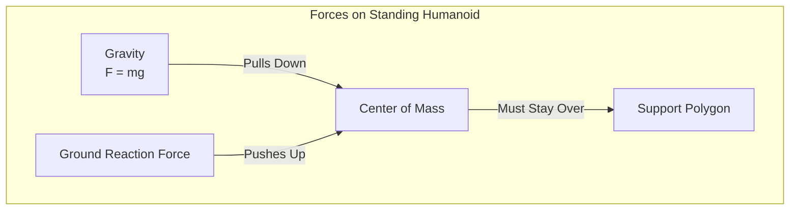
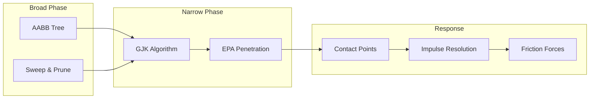
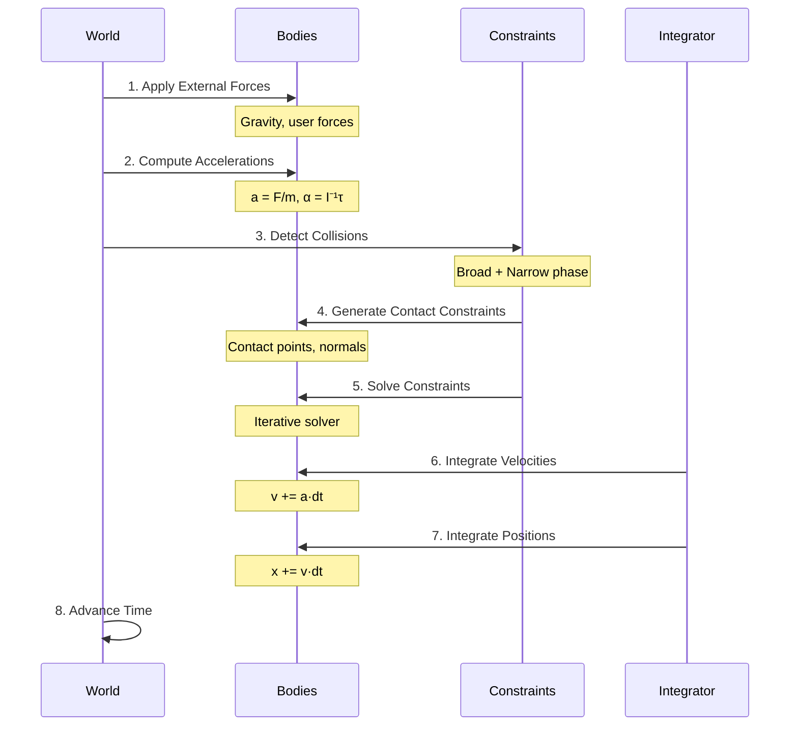

# Physics Simulation Fundamentals

## Why Physics Matters for Humanoid Robots

Humanoid robots exist in a world governed by physical laws. Unlike wheeled robots that maintain constant ground contact, humanoids must actively manage **gravity**, **balance**, **collisions**, and **contact forces** just to remain upright. Physics simulation provides the mathematical framework to model these interactions accurately.

:::info The Physics Challenge
A standing humanoid robot experiences approximately 10 m/s² of gravitational acceleration. Every joint must generate precisely calibrated torques to counteract gravity while executing movements. A physics engine calculates these interactions thousands of times per second.
:::

## Core Physics Concepts

### Gravity and Its Effects

Gravity is the constant force that every humanoid must overcome:



**Key gravitational considerations:**

| Aspect | Description | Simulation Requirement |
|--------|-------------|----------------------|
| **Weight Distribution** | Mass of each link | Accurate mass properties in URDF |
| **Center of Mass** | Combined COM location | Real-time COM calculation |
| **Gravitational Torques** | Torque at each joint | Inverse dynamics computation |
| **Balance** | COM over support polygon | Stability monitoring |

### Simulating Gravity in Physics Engines

```python
# Gazebo world file excerpt showing gravity configuration
"""
<world name="humanoid_world">
  <physics type="ode">
    <gravity>0 0 -9.81</gravity>
    <ode>
      <solver>
        <type>quick</type>
        <iters>50</iters>
        <sor>1.3</sor>
      </solver>
    </ode>
  </physics>
</world>
"""

# Python: Computing gravitational compensation torques
import numpy as np

def compute_gravity_compensation(robot_model, joint_positions):
    """
    Compute joint torques needed to counteract gravity.

    Args:
        robot_model: Robot kinematic/dynamic model
        joint_positions: Current joint angles (radians)

    Returns:
        Array of compensating torques for each joint
    """
    # Get mass and COM for each link
    gravity = np.array([0, 0, -9.81])
    torques = np.zeros(len(joint_positions))

    for i, link in enumerate(robot_model.links):
        # Transform COM to world frame
        com_world = robot_model.forward_kinematics(
            joint_positions, link.com_local
        )

        # Gravitational force on this link
        f_gravity = link.mass * gravity

        # Torque contribution to all parent joints
        for j in range(i + 1):
            joint_pos = robot_model.get_joint_position(j, joint_positions)
            moment_arm = com_world - joint_pos
            torques[j] += np.cross(moment_arm, f_gravity)

    return torques
```

## Collision Detection and Response

Collisions are fundamental to humanoid simulation—the robot must contact the ground to walk and contact objects to manipulate them.

### Collision Detection Pipeline



### Collision Geometry Types

| Geometry | Speed | Accuracy | Use Case |
|----------|-------|----------|----------|
| **Sphere** | Fastest | Low | Quick proximity checks |
| **Box** | Fast | Medium | Bounding volumes |
| **Cylinder** | Fast | Medium | Limb segments |
| **Convex Mesh** | Medium | High | Detailed parts |
| **Triangle Mesh** | Slow | Highest | Complex environments |

### Configuring Collision Properties

```xml
<!-- URDF collision configuration -->
<link name="left_foot">
  <collision>
    <origin xyz="0.05 0 -0.02" rpy="0 0 0"/>
    <geometry>
      <box size="0.2 0.1 0.04"/>
    </geometry>
  </collision>
</link>

<!-- Gazebo-specific collision properties -->
<gazebo reference="left_foot">
  <collision>
    <surface>
      <friction>
        <ode>
          <mu>1.0</mu>      <!-- Static friction coefficient -->
          <mu2>1.0</mu2>    <!-- Dynamic friction coefficient -->
        </ode>
      </friction>
      <contact>
        <ode>
          <kp>1e6</kp>      <!-- Contact stiffness -->
          <kd>100</kd>      <!-- Contact damping -->
          <max_vel>0.1</max_vel>
          <min_depth>0.001</min_depth>
        </ode>
      </contact>
    </surface>
  </collision>
</gazebo>
```

## Rigid Body Dynamics

Physics engines solve the equations of motion for rigid bodies at each simulation step.

### Newton-Euler Equations

For each rigid body in the simulation:

```
Linear:   F = ma
Angular:  τ = Iα + ω × (Iω)

Where:
- F: Total force on body
- m: Mass
- a: Linear acceleration
- τ: Total torque
- I: Inertia tensor
- α: Angular acceleration
- ω: Angular velocity
```

### Simulation Step Process



### Physics Engine Comparison

| Engine | Used In | Strengths | Humanoid Suitability |
|--------|---------|-----------|---------------------|
| **ODE** | Gazebo Classic | Mature, stable | Good for walking |
| **Bullet** | PyBullet | Fast, GPU support | Excellent for ML |
| **DART** | Gazebo, custom | Accurate dynamics | Best for control |
| **MuJoCo** | DeepMind | Fast, differentiable | Excellent for RL |
| **PhysX** | Isaac Sim, Unity | GPU accelerated | Great for scale |

## Contact and Friction Models

### Contact Force Model

When the humanoid's foot contacts the ground, the physics engine must compute appropriate reaction forces:

```python
def compute_contact_force(penetration, velocity, params):
    """
    Spring-damper contact model.

    Args:
        penetration: How far bodies interpenetrate (m)
        velocity: Relative velocity at contact (m/s)
        params: Contact parameters (kp, kd)

    Returns:
        Contact force magnitude (N)
    """
    # Spring force (pushes bodies apart)
    f_spring = params.kp * max(0, penetration)

    # Damping force (resists relative motion)
    f_damping = params.kd * velocity

    # Total normal force
    f_normal = f_spring - f_damping

    return max(0, f_normal)  # Can only push, not pull
```

### Friction Model (Coulomb)

```mermaid
graph LR
    subgraph "Friction Cone"
        N[Normal Force N]
        F[Friction Force F]
        MU[μ = tan(θ)]
    end

    N -->|"F ≤ μN"| F
```

```python
def compute_friction_force(normal_force, tangent_velocity, mu):
    """
    Coulomb friction model.

    Args:
        normal_force: Contact normal force (N)
        tangent_velocity: Velocity tangent to surface (m/s)
        mu: Friction coefficient

    Returns:
        Friction force vector
    """
    max_friction = mu * normal_force
    velocity_magnitude = np.linalg.norm(tangent_velocity)

    if velocity_magnitude < 1e-6:
        # Static friction (can resist up to max_friction)
        return np.zeros(3)  # Handled by constraint solver

    # Dynamic friction (opposes motion)
    friction_direction = -tangent_velocity / velocity_magnitude
    return max_friction * friction_direction
```

### Friction Configuration for Walking

For stable humanoid walking, friction parameters are critical:

```xml
<!-- Ground surface with high friction for walking -->
<model name="ground_plane">
  <link name="ground">
    <collision name="collision">
      <geometry>
        <plane><normal>0 0 1</normal></plane>
      </geometry>
      <surface>
        <friction>
          <ode>
            <mu>1.0</mu>    <!-- High friction for grip -->
            <mu2>1.0</mu2>
          </ode>
        </friction>
      </surface>
    </collision>
  </link>
</model>
```

## Simulation Stability

### Time Step Selection

The simulation time step (`dt`) is crucial for stability:

| Time Step | Stability | Accuracy | Performance |
|-----------|-----------|----------|-------------|
| 0.0001s | Very High | Very High | Slow |
| 0.001s | High | High | Good |
| 0.01s | Medium | Medium | Fast |
| 0.1s | Low | Low | Very Fast |

:::warning Stability Rule
For humanoid robots with stiff contacts, use time steps of 1ms or smaller. Larger steps can cause instability and unrealistic behavior.
:::

```python
# Gazebo physics configuration for humanoids
physics_config = """
<physics type="ode">
  <max_step_size>0.001</max_step_size>  <!-- 1ms time step -->
  <real_time_factor>1.0</real_time_factor>
  <real_time_update_rate>1000</real_time_update_rate>

  <ode>
    <solver>
      <type>quick</type>
      <iters>100</iters>  <!-- More iterations = more stable -->
      <sor>1.3</sor>      <!-- Successive over-relaxation -->
    </solver>
    <constraints>
      <cfm>0.0</cfm>      <!-- Constraint force mixing -->
      <erp>0.2</erp>      <!-- Error reduction parameter -->
    </constraints>
  </ode>
</physics>
"""
```

### Dealing with Numerical Issues

```python
class PhysicsStabilizer:
    """Techniques to improve simulation stability."""

    def __init__(self, max_velocity=100.0, max_force=10000.0):
        self.max_velocity = max_velocity
        self.max_force = max_force

    def clamp_velocities(self, bodies):
        """Prevent unrealistic velocities."""
        for body in bodies:
            speed = np.linalg.norm(body.velocity)
            if speed > self.max_velocity:
                body.velocity *= self.max_velocity / speed

    def clamp_forces(self, forces):
        """Prevent force explosions."""
        for i, force in enumerate(forces):
            magnitude = np.linalg.norm(force)
            if magnitude > self.max_force:
                forces[i] = force * self.max_force / magnitude
        return forces

    def add_joint_damping(self, joint, damping=0.1):
        """Add artificial damping for stability."""
        joint.damping = damping
```

## Real-Time Performance

### Achieving Real-Time Simulation

For humanoid control development, simulation should run at least as fast as real-time:

```python
import time

class RealTimeSimulator:
    """Ensures simulation runs at real-time rate."""

    def __init__(self, physics_engine, dt=0.001):
        self.physics = physics_engine
        self.dt = dt
        self.real_time_factor = 1.0

    def step(self):
        """Execute one simulation step with real-time pacing."""
        start_time = time.perf_counter()

        # Physics computation
        self.physics.step(self.dt)

        # Time taken for physics
        compute_time = time.perf_counter() - start_time

        # Sleep to maintain real-time
        target_time = self.dt / self.real_time_factor
        sleep_time = target_time - compute_time

        if sleep_time > 0:
            time.sleep(sleep_time)
        else:
            # Physics is slower than real-time
            self.log_warning(
                f"Physics running at {compute_time/self.dt:.1%} of real-time"
            )

    def run(self, duration):
        """Run simulation for specified duration."""
        steps = int(duration / self.dt)
        for _ in range(steps):
            self.step()
```

### Performance Optimization

| Technique | Benefit | Trade-off |
|-----------|---------|-----------|
| **Simplified Collision** | Faster detection | Less accurate contacts |
| **Reduced Solver Iterations** | Faster solving | Less stable |
| **Larger Time Steps** | Fewer steps needed | Potential instability |
| **GPU Acceleration** | Parallel computation | Hardware requirement |
| **Multi-threading** | Use all CPU cores | Implementation complexity |

## Summary

Physics simulation provides the foundation for realistic humanoid robot digital twins:

- **Gravity** constantly acts on every link, requiring compensation
- **Collisions** must be detected and resolved for ground contact and manipulation
- **Rigid body dynamics** govern how forces translate to motion
- **Friction models** determine whether the robot can grip surfaces
- **Stability** requires careful time step and solver configuration
- **Performance** must meet real-time requirements for practical development

Understanding these fundamentals enables you to configure simulation environments that accurately predict real-world robot behavior.

## Exercises

1. Calculate the gravitational torque at a humanoid's hip joint when standing on one leg
2. Configure friction parameters for a slippery ice surface vs. rubber mat
3. Experiment with different time steps and observe stability effects
4. Implement a simple contact force visualizer in simulation
5. Compare simulation behavior between ODE and Bullet physics engines

## Further Reading

- [Rigid Body Dynamics Algorithms](https://link.springer.com/book/10.1007/978-1-4899-7560-7) - Featherstone
- [Open Dynamics Engine Manual](http://www.ode.org/wiki/)
- [MuJoCo Documentation](https://mujoco.readthedocs.io/)
