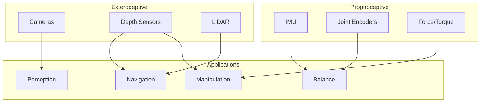
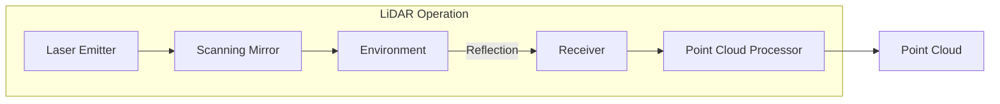
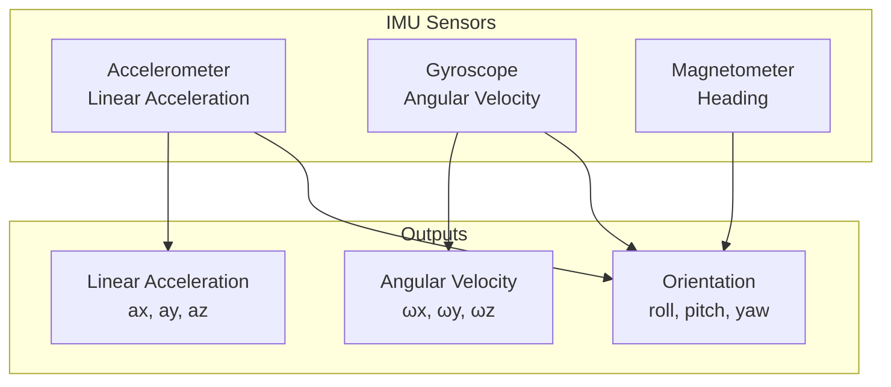

# Sensor Simulation Concepts

## The Importance of Sensor Simulation

Humanoid robots perceive the world through sensors—cameras, LiDAR, depth sensors, IMUs, and force/torque sensors. Accurate sensor simulation is crucial because:

1. **Perception algorithms** depend on realistic sensor data
2. **AI training** requires diverse, labeled sensor outputs
3. **Testing edge cases** is only practical in simulation
4. **Development iteration** is faster with simulated sensors

:::info Sensor Fidelity
The accuracy of your perception pipeline in the real world directly depends on how well your simulated sensors match reality. This includes noise characteristics, latency, and physical limitations.
:::

## Sensor Categories for Humanoids



## LiDAR Simulation

LiDAR (Light Detection and Ranging) provides precise 3D distance measurements essential for navigation and obstacle avoidance.

### LiDAR Working Principle



### Gazebo LiDAR Configuration

```xml
<!-- SDF LiDAR sensor configuration -->
<sensor name="head_lidar" type="gpu_lidar">
  <pose>0 0 0.1 0 0 0</pose>
  <topic>/lidar/points</topic>
  <update_rate>10</update_rate>

  <lidar>
    <scan>
      <horizontal>
        <samples>640</samples>
        <resolution>1</resolution>
        <min_angle>-2.35619</min_angle>  <!-- -135 degrees -->
        <max_angle>2.35619</max_angle>   <!-- +135 degrees -->
      </horizontal>
      <vertical>
        <samples>16</samples>
        <resolution>1</resolution>
        <min_angle>-0.261799</min_angle> <!-- -15 degrees -->
        <max_angle>0.261799</max_angle>  <!-- +15 degrees -->
      </vertical>
    </scan>

    <range>
      <min>0.1</min>
      <max>30.0</max>
      <resolution>0.01</resolution>
    </range>

    <noise>
      <type>gaussian</type>
      <mean>0.0</mean>
      <stddev>0.01</stddev>
    </noise>
  </lidar>

  <visualize>true</visualize>
</sensor>
```

### Processing LiDAR Data in ROS 2

```python
import rclpy
from rclpy.node import Node
from sensor_msgs.msg import PointCloud2
import sensor_msgs_py.point_cloud2 as pc2
import numpy as np


class LidarProcessor(Node):
    """Processes simulated LiDAR point clouds."""

    def __init__(self):
        super().__init__('lidar_processor')

        self.subscription = self.create_subscription(
            PointCloud2,
            '/lidar/points',
            self.pointcloud_callback,
            10
        )

        # Obstacle detection parameters
        self.min_obstacle_height = 0.1  # meters
        self.max_obstacle_distance = 5.0

    def pointcloud_callback(self, msg: PointCloud2):
        """Process incoming point cloud for obstacle detection."""
        # Convert to numpy array
        points = np.array(list(pc2.read_points(
            msg, field_names=("x", "y", "z"), skip_nans=True
        )))

        if len(points) == 0:
            return

        # Filter ground points (simple height threshold)
        obstacles = points[points[:, 2] > self.min_obstacle_height]

        # Find nearest obstacle
        if len(obstacles) > 0:
            distances = np.linalg.norm(obstacles[:, :2], axis=1)
            nearest_distance = np.min(distances)

            if nearest_distance < self.max_obstacle_distance:
                self.get_logger().warn(
                    f'Obstacle detected at {nearest_distance:.2f}m'
                )
```

### LiDAR Noise Models

| Noise Type | Description | Typical Value |
|------------|-------------|---------------|
| **Range Noise** | Gaussian noise on distance | 1-3 cm std dev |
| **Angular Noise** | Beam direction uncertainty | 0.1-0.3 degrees |
| **Missing Returns** | Points lost to absorption | 1-5% of points |
| **Multi-path** | Reflections causing ghost points | Environment dependent |

## Depth Camera Simulation

Depth cameras provide dense 3D information at closer ranges than LiDAR, essential for manipulation tasks.

### Depth Camera Types

| Type | Method | Range | Accuracy | Use Case |
|------|--------|-------|----------|----------|
| **Stereo** | Triangulation | 0.5-10m | ±1-3% | Indoor/Outdoor |
| **Structured Light** | Pattern projection | 0.3-5m | ±1mm | Manipulation |
| **ToF** | Time of flight | 0.5-8m | ±1cm | Indoor |

### Gazebo Depth Camera Configuration

```xml
<!-- RGBD Camera (like Intel RealSense) -->
<sensor name="rgbd_camera" type="rgbd_camera">
  <pose>0.1 0 0.05 0 0 0</pose>
  <topic>/camera</topic>
  <update_rate>30</update_rate>

  <camera>
    <horizontal_fov>1.047</horizontal_fov>  <!-- 60 degrees -->
    <image>
      <width>640</width>
      <height>480</height>
      <format>R8G8B8</format>
    </image>
    <clip>
      <near>0.1</near>
      <far>10.0</far>
    </clip>

    <depth_camera>
      <clip>
        <near>0.3</near>
        <far>5.0</far>
      </clip>
    </depth_camera>

    <noise>
      <type>gaussian</type>
      <mean>0.0</mean>
      <stddev>0.007</stddev>  <!-- Depth-dependent in reality -->
    </noise>
  </camera>

  <visualize>true</visualize>
</sensor>
```

### Depth Image Processing

```python
import rclpy
from rclpy.node import Node
from sensor_msgs.msg import Image, CameraInfo
from cv_bridge import CvBridge
import numpy as np
import cv2


class DepthProcessor(Node):
    """Processes depth images for manipulation tasks."""

    def __init__(self):
        super().__init__('depth_processor')

        self.bridge = CvBridge()
        self.camera_info = None

        # Subscribers
        self.depth_sub = self.create_subscription(
            Image, '/camera/depth/image_raw',
            self.depth_callback, 10
        )
        self.info_sub = self.create_subscription(
            CameraInfo, '/camera/depth/camera_info',
            self.info_callback, 10
        )

    def info_callback(self, msg: CameraInfo):
        """Store camera intrinsics."""
        self.camera_info = msg
        # Extract focal lengths and principal point
        self.fx = msg.k[0]
        self.fy = msg.k[4]
        self.cx = msg.k[2]
        self.cy = msg.k[5]

    def depth_callback(self, msg: Image):
        """Process depth image."""
        if self.camera_info is None:
            return

        # Convert to numpy
        depth_image = self.bridge.imgmsg_to_cv2(
            msg, desired_encoding='32FC1'
        )

        # Find objects on table (example: detect closest point)
        valid_mask = (depth_image > 0.3) & (depth_image < 1.5)
        if np.any(valid_mask):
            min_depth = np.min(depth_image[valid_mask])
            min_idx = np.where(depth_image == min_depth)

            if len(min_idx[0]) > 0:
                v, u = min_idx[0][0], min_idx[1][0]
                # Deproject to 3D
                x = (u - self.cx) * min_depth / self.fx
                y = (v - self.cy) * min_depth / self.fy
                z = min_depth

                self.get_logger().info(
                    f'Nearest point: ({x:.3f}, {y:.3f}, {z:.3f})'
                )

    def depth_to_pointcloud(self, depth_image):
        """Convert depth image to point cloud."""
        h, w = depth_image.shape
        u, v = np.meshgrid(np.arange(w), np.arange(h))

        z = depth_image
        x = (u - self.cx) * z / self.fx
        y = (v - self.cy) * z / self.fy

        points = np.stack([x, y, z], axis=-1)
        valid = z > 0
        return points[valid]
```

### Realistic Depth Noise Model

```python
def add_realistic_depth_noise(depth_image, baseline=0.05, focal_length=500):
    """
    Add realistic structured-light depth camera noise.

    Noise increases quadratically with distance for stereo/structured light.
    """
    # Base noise (quantization)
    noise = np.random.normal(0, 0.001, depth_image.shape)

    # Distance-dependent noise (disparity error)
    # σ_z ∝ z² / (baseline * focal_length)
    distance_noise = (depth_image ** 2) / (baseline * focal_length) * 0.001
    noise += np.random.normal(0, 1, depth_image.shape) * distance_noise

    # Edge artifacts (depth discontinuities)
    edges = cv2.Canny((depth_image * 1000).astype(np.uint8), 50, 150)
    edge_noise = (edges > 0).astype(float) * 0.02
    noise += np.random.normal(0, 1, depth_image.shape) * edge_noise

    # Missing data near edges
    invalid_mask = np.random.random(depth_image.shape) < (edges / 255 * 0.3)
    depth_image[invalid_mask] = 0

    return depth_image + noise
```

## IMU Simulation

The Inertial Measurement Unit (IMU) is critical for balance and state estimation in humanoid robots.

### IMU Components



### Gazebo IMU Configuration

```xml
<!-- IMU sensor in robot torso -->
<sensor name="imu_sensor" type="imu">
  <pose>0 0 0 0 0 0</pose>
  <topic>/imu/data</topic>
  <update_rate>200</update_rate>

  <imu>
    <angular_velocity>
      <x>
        <noise type="gaussian">
          <mean>0.0</mean>
          <stddev>0.0002</stddev>  <!-- rad/s -->
          <bias_mean>0.0001</bias_mean>
          <bias_stddev>0.00001</bias_stddev>
        </noise>
      </x>
      <y>
        <noise type="gaussian">
          <mean>0.0</mean>
          <stddev>0.0002</stddev>
          <bias_mean>0.0001</bias_mean>
          <bias_stddev>0.00001</bias_stddev>
        </noise>
      </y>
      <z>
        <noise type="gaussian">
          <mean>0.0</mean>
          <stddev>0.0002</stddev>
          <bias_mean>0.0001</bias_mean>
          <bias_stddev>0.00001</bias_stddev>
        </noise>
      </z>
    </angular_velocity>

    <linear_acceleration>
      <x>
        <noise type="gaussian">
          <mean>0.0</mean>
          <stddev>0.017</stddev>  <!-- m/s² -->
          <bias_mean>0.01</bias_mean>
          <bias_stddev>0.001</bias_stddev>
        </noise>
      </x>
      <y>
        <noise type="gaussian">
          <mean>0.0</mean>
          <stddev>0.017</stddev>
          <bias_mean>0.01</bias_mean>
          <bias_stddev>0.001</bias_stddev>
        </noise>
      </y>
      <z>
        <noise type="gaussian">
          <mean>0.0</mean>
          <stddev>0.017</stddev>
          <bias_mean>0.01</bias_mean>
          <bias_stddev>0.001</bias_stddev>
        </noise>
      </z>
    </linear_acceleration>
  </imu>

  <always_on>true</always_on>
  <visualize>false</visualize>
</sensor>
```

### IMU Data Processing

```python
import rclpy
from rclpy.node import Node
from sensor_msgs.msg import Imu
import numpy as np
from scipy.spatial.transform import Rotation


class IMUProcessor(Node):
    """Processes IMU data for state estimation."""

    def __init__(self):
        super().__init__('imu_processor')

        self.subscription = self.create_subscription(
            Imu, '/imu/data',
            self.imu_callback, 10
        )

        # State estimation
        self.orientation = np.array([1, 0, 0, 0])  # quaternion
        self.angular_velocity = np.zeros(3)
        self.linear_acceleration = np.zeros(3)

        # Complementary filter parameters
        self.alpha = 0.98  # Gyro trust factor

        self.last_time = None

    def imu_callback(self, msg: Imu):
        """Process IMU measurement."""
        current_time = self.get_clock().now()

        # Extract measurements
        self.angular_velocity = np.array([
            msg.angular_velocity.x,
            msg.angular_velocity.y,
            msg.angular_velocity.z
        ])

        self.linear_acceleration = np.array([
            msg.linear_acceleration.x,
            msg.linear_acceleration.y,
            msg.linear_acceleration.z
        ])

        if self.last_time is not None:
            dt = (current_time - self.last_time).nanoseconds / 1e9
            self.update_orientation(dt)

        self.last_time = current_time

        # Log current orientation
        r = Rotation.from_quat(self.orientation)
        euler = r.as_euler('xyz', degrees=True)
        self.get_logger().debug(
            f'Roll: {euler[0]:.1f}°, Pitch: {euler[1]:.1f}°, '
            f'Yaw: {euler[2]:.1f}°'
        )

    def update_orientation(self, dt):
        """
        Complementary filter for orientation estimation.

        Combines gyroscope (high frequency) with accelerometer (gravity reference).
        """
        # Gyroscope integration
        omega = self.angular_velocity
        theta = np.linalg.norm(omega) * dt

        if theta > 1e-10:
            axis = omega / np.linalg.norm(omega)
            dq = np.array([
                np.cos(theta / 2),
                axis[0] * np.sin(theta / 2),
                axis[1] * np.sin(theta / 2),
                axis[2] * np.sin(theta / 2)
            ])

            # Quaternion multiplication
            self.orientation = self.quaternion_multiply(
                self.orientation, dq
            )

        # Accelerometer correction (gravity reference)
        accel_normalized = self.linear_acceleration / np.linalg.norm(
            self.linear_acceleration
        )

        # Expected gravity in body frame
        r = Rotation.from_quat(self.orientation)
        gravity_body = r.inv().apply([0, 0, 1])

        # Compute correction
        correction = np.cross(accel_normalized, gravity_body)
        correction_angle = np.linalg.norm(correction) * (1 - self.alpha)

        if correction_angle > 1e-10:
            correction_axis = correction / np.linalg.norm(correction)
            dq_correction = np.array([
                np.cos(correction_angle / 2),
                correction_axis[0] * np.sin(correction_angle / 2),
                correction_axis[1] * np.sin(correction_angle / 2),
                correction_axis[2] * np.sin(correction_angle / 2)
            ])
            self.orientation = self.quaternion_multiply(
                dq_correction, self.orientation
            )

        # Normalize quaternion
        self.orientation /= np.linalg.norm(self.orientation)

    @staticmethod
    def quaternion_multiply(q1, q2):
        """Multiply two quaternions."""
        w1, x1, y1, z1 = q1
        w2, x2, y2, z2 = q2
        return np.array([
            w1*w2 - x1*x2 - y1*y2 - z1*z2,
            w1*x2 + x1*w2 + y1*z2 - z1*y2,
            w1*y2 - x1*z2 + y1*w2 + z1*x2,
            w1*z2 + x1*y2 - y1*x2 + z1*w2
        ])
```

### IMU Error Characteristics

| Error Type | Description | Impact |
|------------|-------------|--------|
| **Bias** | Constant offset | Drift over time |
| **Scale Factor** | Gain error | Distance/angle errors |
| **Noise** | Random fluctuations | High-frequency jitter |
| **Bias Instability** | Slowly varying bias | Long-term drift |
| **Temperature Drift** | Bias changes with temp | Requires calibration |

## Force/Torque Sensors

Critical for manipulation and balance:

```xml
<!-- Force/Torque sensor at wrist -->
<sensor name="wrist_ft" type="force_torque">
  <pose>0 0 0 0 0 0</pose>
  <topic>/wrist/ft_sensor</topic>
  <update_rate>500</update_rate>

  <force_torque>
    <frame>child</frame>
    <measure_direction>child_to_parent</measure_direction>

    <force>
      <x>
        <noise type="gaussian">
          <mean>0</mean>
          <stddev>0.1</stddev>
        </noise>
      </x>
      <!-- Similar for y, z -->
    </force>

    <torque>
      <x>
        <noise type="gaussian">
          <mean>0</mean>
          <stddev>0.01</stddev>
        </noise>
      </x>
      <!-- Similar for y, z -->
    </torque>
  </force_torque>
</sensor>
```

## Sensor Fusion

Combining multiple sensors improves accuracy:

```python
import numpy as np
from filterpy.kalman import ExtendedKalmanFilter

class SensorFusion:
    """Fuses IMU, depth, and joint encoder data."""

    def __init__(self):
        # Extended Kalman Filter for state estimation
        self.ekf = ExtendedKalmanFilter(dim_x=12, dim_z=9)

        # State: [x, y, z, vx, vy, vz, roll, pitch, yaw, wx, wy, wz]
        self.ekf.x = np.zeros(12)

        # Process noise
        self.ekf.Q = np.eye(12) * 0.01

        # Measurement noise
        self.ekf.R = np.diag([
            0.1, 0.1, 0.1,     # Position (from depth)
            0.02, 0.02, 0.02,  # Orientation (from IMU)
            0.01, 0.01, 0.01   # Angular velocity (from IMU)
        ])

    def predict(self, dt):
        """Predict next state based on dynamics."""
        # Simple constant velocity model
        F = np.eye(12)
        F[0:3, 3:6] = np.eye(3) * dt
        F[6:9, 9:12] = np.eye(3) * dt

        self.ekf.F = F
        self.ekf.predict()

    def update_imu(self, orientation, angular_velocity):
        """Update with IMU measurement."""
        z = np.concatenate([
            np.zeros(3),  # No position from IMU
            orientation,
            angular_velocity
        ])

        H = np.zeros((9, 12))
        H[3:6, 6:9] = np.eye(3)   # Orientation
        H[6:9, 9:12] = np.eye(3)  # Angular velocity

        self.ekf.update(z, HJacobian=lambda x: H, Hx=lambda x: H @ x)

    def update_depth(self, position):
        """Update with depth camera position estimate."""
        z = np.concatenate([position, np.zeros(6)])

        H = np.zeros((9, 12))
        H[0:3, 0:3] = np.eye(3)  # Position

        self.ekf.update(z, HJacobian=lambda x: H, Hx=lambda x: H @ x)

    def get_state(self):
        """Return current state estimate."""
        return {
            'position': self.ekf.x[0:3],
            'velocity': self.ekf.x[3:6],
            'orientation': self.ekf.x[6:9],
            'angular_velocity': self.ekf.x[9:12]
        }
```

## Summary

Sensor simulation is fundamental to humanoid robot development:

- **LiDAR** provides 3D environment mapping for navigation
- **Depth cameras** enable precise manipulation and close-range perception
- **IMUs** are essential for balance and orientation estimation
- **Force/torque sensors** enable compliant manipulation
- **Sensor fusion** combines multiple sources for robust state estimation

Realistic sensor models including noise characteristics ensure that algorithms developed in simulation transfer effectively to real hardware.

## Exercises

1. Configure a simulated LiDAR and visualize the point cloud in RViz
2. Implement depth-dependent noise for a simulated depth camera
3. Create an IMU calibration routine to estimate bias
4. Build a sensor fusion node combining IMU and visual odometry
5. Simulate force feedback for a grasping task

## Further Reading

- [Probabilistic Robotics](http://www.probabilistic-robotics.org/) - Thrun, Burgard, Fox
- [State Estimation for Robotics](http://asrl.utias.utoronto.ca/~tdb/bib/barfoot_ser17.pdf) - Barfoot
- [Gazebo Sensor Documentation](https://gazebosim.org/docs/harmonic/sensors)
