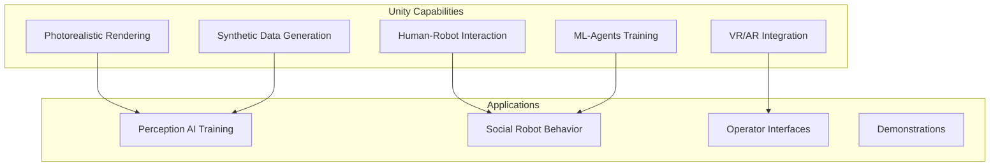
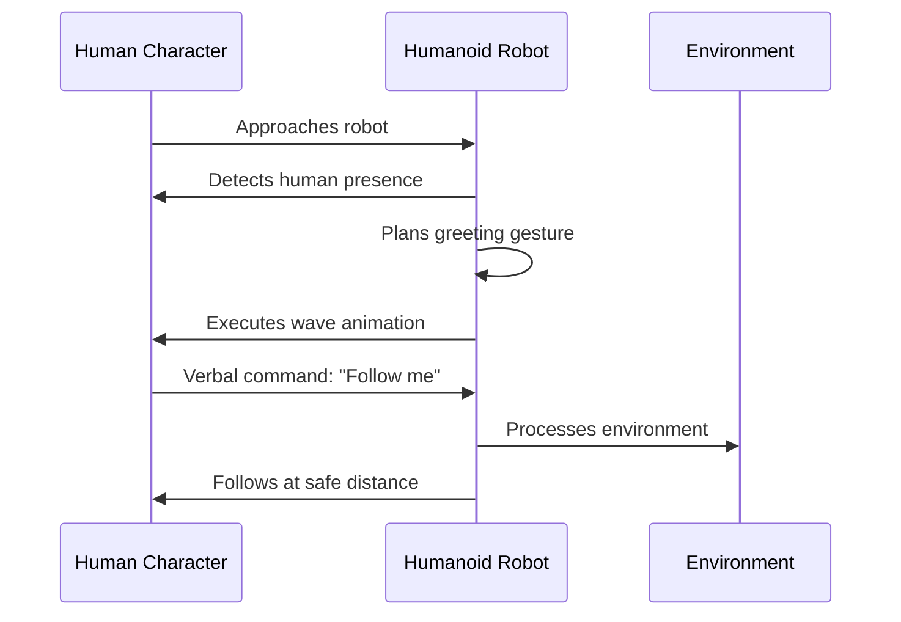

# Unity for Visualization

## Why Unity for Humanoid Robotics?

While Gazebo excels at physics-accurate simulation, **Unity** provides capabilities that are equally important for humanoid robot development: **photorealistic rendering**, **human-robot interaction (HRI) scenarios**, and **synthetic data generation** for AI training.

:::tip Complementary Tools
Gazebo and Unity serve different purposes:
- **Gazebo**: Physics accuracy for control algorithm development
- **Unity**: Visual fidelity for perception training and HRI studies
:::

## Unity's Role in the Digital Twin Ecosystem



## Human-Robot Interaction in Unity

One of Unity's greatest strengths is modeling realistic human characters alongside robots, enabling HRI research:

### HRI Scenario Design



### Setting Up HRI in Unity

```csharp
using UnityEngine;
using Unity.Robotics.ROSTCPConnector;

public class HumanRobotInteraction : MonoBehaviour
{
    [Header("References")]
    public Transform humanTarget;
    public HumanoidRobotController robot;

    [Header("Interaction Parameters")]
    public float personalSpaceRadius = 1.5f;
    public float followDistance = 2.0f;
    public float detectionRange = 5.0f;

    private ROSConnection ros;
    private bool isFollowing = false;

    void Start()
    {
        ros = ROSConnection.GetOrCreateInstance();
        ros.Subscribe<std_msgs.String>("/voice_command", OnVoiceCommand);
    }

    void Update()
    {
        float distanceToHuman = Vector3.Distance(
            transform.position,
            humanTarget.position
        );

        // Detect human approach
        if (distanceToHuman < detectionRange && !isFollowing)
        {
            robot.LookAt(humanTarget.position);

            // Enter personal space triggers greeting
            if (distanceToHuman < personalSpaceRadius)
            {
                robot.PerformGesture("wave");
            }
        }

        // Following behavior
        if (isFollowing)
        {
            FollowHuman();
        }
    }

    void OnVoiceCommand(std_msgs.String msg)
    {
        string command = msg.data.ToLower();

        if (command.Contains("follow me"))
        {
            isFollowing = true;
            robot.SetState(RobotState.Following);
        }
        else if (command.Contains("stop"))
        {
            isFollowing = false;
            robot.SetState(RobotState.Idle);
        }
    }

    void FollowHuman()
    {
        Vector3 targetPosition = humanTarget.position -
            (humanTarget.forward * followDistance);

        robot.NavigateTo(targetPosition);

        // Maintain safe distance
        float distance = Vector3.Distance(
            transform.position,
            humanTarget.position
        );

        if (distance < personalSpaceRadius)
        {
            robot.Stop();
        }
    }
}
```

## ROS 2 Integration with Unity

### Unity Robotics Hub

Unity's ROS-TCP-Connector enables seamless communication with ROS 2:

```csharp
using Unity.Robotics.ROSTCPConnector;
using RosMessageTypes.Sensor;
using RosMessageTypes.Geometry;

public class RobotROSBridge : MonoBehaviour
{
    private ROSConnection ros;

    [Header("ROS Topics")]
    public string jointStateTopic = "/joint_states";
    public string cmdVelTopic = "/cmd_vel";
    public string cameraTopic = "/camera/image_raw";

    [Header("Robot")]
    public ArticulationBody[] joints;
    public Camera robotCamera;

    void Start()
    {
        ros = ROSConnection.GetOrCreateInstance();
        ros.RegisterPublisher<JointStateMsg>(jointStateTopic);
        ros.RegisterPublisher<ImageMsg>(cameraTopic);
        ros.Subscribe<TwistMsg>(cmdVelTopic, OnCmdVel);
    }

    void FixedUpdate()
    {
        PublishJointStates();
    }

    void PublishJointStates()
    {
        var msg = new JointStateMsg();
        msg.header.stamp = ROSTime.Now();

        msg.name = new string[joints.Length];
        msg.position = new double[joints.Length];
        msg.velocity = new double[joints.Length];
        msg.effort = new double[joints.Length];

        for (int i = 0; i < joints.Length; i++)
        {
            msg.name[i] = joints[i].name;
            msg.position[i] = joints[i].jointPosition[0];
            msg.velocity[i] = joints[i].jointVelocity[0];
            msg.effort[i] = joints[i].jointForce[0];
        }

        ros.Publish(jointStateTopic, msg);
    }

    void OnCmdVel(TwistMsg msg)
    {
        // Apply velocity command to robot base
        Vector3 linearVel = new Vector3(
            (float)msg.linear.x,
            0,
            (float)msg.linear.z
        );

        Vector3 angularVel = new Vector3(
            0,
            (float)msg.angular.y,
            0
        );

        // Apply to robot controller
        GetComponent<RobotController>().SetVelocity(linearVel, angularVel);
    }
}
```

### Camera Image Publishing

```csharp
using UnityEngine;
using Unity.Robotics.ROSTCPConnector;
using RosMessageTypes.Sensor;

public class CameraPublisher : MonoBehaviour
{
    public Camera robotCamera;
    public string topic = "/camera/image_raw";
    public int width = 640;
    public int height = 480;
    public float publishRate = 30f;

    private ROSConnection ros;
    private RenderTexture renderTexture;
    private Texture2D texture;
    private float lastPublishTime;

    void Start()
    {
        ros = ROSConnection.GetOrCreateInstance();
        ros.RegisterPublisher<ImageMsg>(topic);

        renderTexture = new RenderTexture(width, height, 24);
        texture = new Texture2D(width, height, TextureFormat.RGB24, false);
        robotCamera.targetTexture = renderTexture;
    }

    void Update()
    {
        if (Time.time - lastPublishTime > 1f / publishRate)
        {
            PublishImage();
            lastPublishTime = Time.time;
        }
    }

    void PublishImage()
    {
        RenderTexture.active = renderTexture;
        texture.ReadPixels(new Rect(0, 0, width, height), 0, 0);
        texture.Apply();
        RenderTexture.active = null;

        var msg = new ImageMsg();
        msg.header.stamp = ROSTime.Now();
        msg.header.frame_id = "camera_link";
        msg.height = (uint)height;
        msg.width = (uint)width;
        msg.encoding = "rgb8";
        msg.is_bigendian = 0;
        msg.step = (uint)(width * 3);
        msg.data = texture.GetRawTextureData();

        ros.Publish(topic, msg);
    }
}
```

## Synthetic Data Generation

Unity excels at generating labeled training data for perception systems:

### Domain Randomization

```csharp
using UnityEngine;
using UnityEngine.Perception.Randomization.Parameters;
using UnityEngine.Perception.Randomization.Randomizers;

[Serializable]
[AddRandomizerMenu("Humanoid/Appearance Randomizer")]
public class HumanoidAppearanceRandomizer : Randomizer
{
    public GameObjectParameter humanoidPrefabs;
    public MaterialParameter skinMaterials;
    public MaterialParameter clothingMaterials;
    public FloatParameter heightVariation;

    protected override void OnIterationStart()
    {
        // Randomize human appearance each iteration
        var humans = tagManager.Query<HumanTag>();

        foreach (var human in humans)
        {
            // Random skin tone
            var skinRenderer = human.GetComponent<SkinnedMeshRenderer>();
            skinRenderer.material = skinMaterials.Sample();

            // Random clothing
            var clothing = human.GetComponentInChildren<ClothingController>();
            clothing.SetMaterial(clothingMaterials.Sample());

            // Random height
            float scale = 1.0f + heightVariation.Sample();
            human.transform.localScale = Vector3.one * scale;
        }
    }
}

[Serializable]
[AddRandomizerMenu("Environment/Lighting Randomizer")]
public class LightingRandomizer : Randomizer
{
    public FloatParameter intensity;
    public ColorHsvaParameter color;
    public Vector3Parameter direction;

    protected override void OnIterationStart()
    {
        var sun = FindObjectOfType<Light>();
        sun.intensity = intensity.Sample();
        sun.color = color.Sample();
        sun.transform.rotation = Quaternion.LookRotation(direction.Sample());
    }
}
```

### Automatic Labeling

```csharp
using UnityEngine;
using UnityEngine.Perception.GroundTruth;

public class HumanoidLabeler : MonoBehaviour
{
    [Header("Perception")]
    public PerceptionCamera perceptionCamera;

    void Start()
    {
        // Add labelers for different perception tasks

        // Semantic segmentation
        var segLabeler = new SemanticSegmentationLabeler(
            new SemanticSegmentationLabelConfig()
        );
        perceptionCamera.AddLabeler(segLabeler);

        // 2D bounding boxes
        var bbox2DLabeler = new BoundingBox2DLabeler(
            new IdLabelConfig()
        );
        perceptionCamera.AddLabeler(bbox2DLabeler);

        // 3D bounding boxes
        var bbox3DLabeler = new BoundingBox3DLabeler(
            new IdLabelConfig()
        );
        perceptionCamera.AddLabeler(bbox3DLabeler);

        // Keypoint labeling (for pose estimation)
        var keypointLabeler = new KeypointLabeler(
            CreateHumanoidKeypointTemplate()
        );
        perceptionCamera.AddLabeler(keypointLabeler);
    }

    KeypointTemplate CreateHumanoidKeypointTemplate()
    {
        var template = ScriptableObject.CreateInstance<KeypointTemplate>();

        template.keypoints = new[]
        {
            new KeypointDefinition { label = "head", color = Color.red },
            new KeypointDefinition { label = "neck", color = Color.orange },
            new KeypointDefinition { label = "left_shoulder", color = Color.yellow },
            new KeypointDefinition { label = "right_shoulder", color = Color.yellow },
            new KeypointDefinition { label = "left_elbow", color = Color.green },
            new KeypointDefinition { label = "right_elbow", color = Color.green },
            new KeypointDefinition { label = "left_wrist", color = Color.blue },
            new KeypointDefinition { label = "right_wrist", color = Color.blue },
            new KeypointDefinition { label = "left_hip", color = Color.cyan },
            new KeypointDefinition { label = "right_hip", color = Color.cyan },
            new KeypointDefinition { label = "left_knee", color = Color.magenta },
            new KeypointDefinition { label = "right_knee", color = Color.magenta },
            new KeypointDefinition { label = "left_ankle", color = Color.white },
            new KeypointDefinition { label = "right_ankle", color = Color.white },
        };

        return template;
    }
}
```

## Humanoid Robot Visualization

### Articulation Body Setup

Unity's Articulation Bodies provide physics-based robot simulation:

```csharp
using UnityEngine;

public class HumanoidRobotSetup : MonoBehaviour
{
    public ArticulationBody rootBody;

    void Start()
    {
        SetupArticulationChain();
    }

    void SetupArticulationChain()
    {
        // Configure root (pelvis)
        rootBody.immovable = false;
        rootBody.useGravity = true;

        // Configure each joint
        foreach (var joint in GetComponentsInChildren<ArticulationBody>())
        {
            if (joint == rootBody) continue;

            // Set joint type based on name
            if (joint.name.Contains("hip") ||
                joint.name.Contains("knee") ||
                joint.name.Contains("ankle"))
            {
                ConfigureRevoluteJoint(joint);
            }
        }
    }

    void ConfigureRevoluteJoint(ArticulationBody joint)
    {
        joint.jointType = ArticulationJointType.RevoluteJoint;

        // Configure drive
        var drive = joint.xDrive;
        drive.stiffness = 10000f;
        drive.damping = 100f;
        drive.forceLimit = 1000f;
        joint.xDrive = drive;

        // Set limits based on joint name
        if (joint.name.Contains("knee"))
        {
            joint.twistLock = ArticulationDofLock.LimitedMotion;
            var limits = joint.xDrive;
            limits.lowerLimit = 0f;
            limits.upperLimit = 150f;
            joint.xDrive = limits;
        }
    }
}
```

### Real-Time Visualization

```csharp
using UnityEngine;
using Unity.Robotics.ROSTCPConnector;
using RosMessageTypes.Sensor;

public class JointStateVisualizer : MonoBehaviour
{
    public ArticulationBody[] joints;
    private Dictionary<string, ArticulationBody> jointMap;

    void Start()
    {
        // Build joint lookup
        jointMap = new Dictionary<string, ArticulationBody>();
        foreach (var joint in joints)
        {
            jointMap[joint.name] = joint;
        }

        // Subscribe to joint states
        var ros = ROSConnection.GetOrCreateInstance();
        ros.Subscribe<JointStateMsg>("/joint_states", OnJointState);
    }

    void OnJointState(JointStateMsg msg)
    {
        for (int i = 0; i < msg.name.Length; i++)
        {
            if (jointMap.TryGetValue(msg.name[i], out var joint))
            {
                // Set joint target
                var drive = joint.xDrive;
                drive.target = (float)msg.position[i] * Mathf.Rad2Deg;
                joint.xDrive = drive;
            }
        }
    }
}
```

## VR/AR Integration

Unity enables immersive operator interfaces:

```csharp
using UnityEngine;
using UnityEngine.XR.Interaction.Toolkit;

public class VRRobotTeleoperation : MonoBehaviour
{
    [Header("VR Controllers")]
    public XRController leftHand;
    public XRController rightHand;

    [Header("Robot")]
    public Transform robotLeftHand;
    public Transform robotRightHand;
    public ArticulationBody[] leftArmJoints;
    public ArticulationBody[] rightArmJoints;

    [Header("Settings")]
    public float positionScale = 1.0f;
    public bool mirrorMotion = true;

    private InverseKinematics leftArmIK;
    private InverseKinematics rightArmIK;

    void Start()
    {
        leftArmIK = new InverseKinematics(leftArmJoints);
        rightArmIK = new InverseKinematics(rightArmJoints);
    }

    void Update()
    {
        // Map VR hand positions to robot end effectors
        Vector3 leftTarget = TransformVRToRobot(
            leftHand.transform.position
        );
        Vector3 rightTarget = TransformVRToRobot(
            rightHand.transform.position
        );

        // Solve IK and apply
        var leftAngles = leftArmIK.Solve(leftTarget);
        var rightAngles = rightArmIK.Solve(rightTarget);

        ApplyJointAngles(leftArmJoints, leftAngles);
        ApplyJointAngles(rightArmJoints, rightAngles);

        // Handle grip
        if (leftHand.selectInteractionState.activatedThisFrame)
        {
            PublishGripCommand("left", true);
        }
        if (rightHand.selectInteractionState.activatedThisFrame)
        {
            PublishGripCommand("right", true);
        }
    }

    Vector3 TransformVRToRobot(Vector3 vrPosition)
    {
        // Transform from VR space to robot workspace
        Vector3 robotPos = vrPosition * positionScale;

        if (mirrorMotion)
        {
            robotPos.x = -robotPos.x;
        }

        return robotPos;
    }
}
```

## Performance Optimization

### Level of Detail (LOD)

```csharp
using UnityEngine;

public class HumanoidLOD : MonoBehaviour
{
    public Mesh highDetailMesh;    // 50k triangles
    public Mesh mediumDetailMesh;  // 10k triangles
    public Mesh lowDetailMesh;     // 2k triangles

    public float highDetailDistance = 5f;
    public float mediumDetailDistance = 15f;

    private MeshFilter meshFilter;
    private Camera mainCamera;

    void Start()
    {
        meshFilter = GetComponent<MeshFilter>();
        mainCamera = Camera.main;
    }

    void Update()
    {
        float distance = Vector3.Distance(
            transform.position,
            mainCamera.transform.position
        );

        if (distance < highDetailDistance)
        {
            meshFilter.mesh = highDetailMesh;
        }
        else if (distance < mediumDetailDistance)
        {
            meshFilter.mesh = mediumDetailMesh;
        }
        else
        {
            meshFilter.mesh = lowDetailMesh;
        }
    }
}
```

## Summary

Unity complements physics-focused simulators by providing:

- **Photorealistic rendering** for perception system training
- **Human-robot interaction** scenarios with realistic human models
- **Synthetic data generation** with automatic labeling
- **ROS 2 integration** via Unity Robotics Hub
- **VR/AR capabilities** for teleoperation and operator training

Together with Gazebo, Unity creates a complete digital twin ecosystem for humanoid robot development.

## Exercises

1. Create a scene with multiple human characters interacting with a robot
2. Implement domain randomization for lighting and textures
3. Generate a synthetic dataset with bounding box labels
4. Build a VR teleoperation interface for robot arm control
5. Create a photorealistic indoor environment for navigation testing

## Further Reading

- [Unity Robotics Hub](https://github.com/Unity-Technologies/Unity-Robotics-Hub)
- [Unity Perception Package](https://github.com/Unity-Technologies/com.unity.perception)
- [ROS-TCP-Connector](https://github.com/Unity-Technologies/ROS-TCP-Connector)
