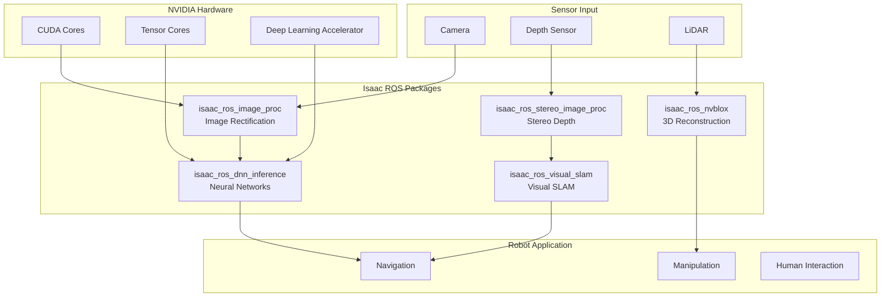

# Isaac ROS: GPU-Accelerated Perception

## Introduction to Isaac ROS

**Isaac ROS** is NVIDIA's collection of GPU-accelerated ROS 2 packages designed to dramatically improve perception performance for robotics applications. For humanoid robots, Isaac ROS provides real-time processing of camera, LiDAR, and depth sensor data—essential for navigation, manipulation, and human interaction.

:::info Performance Advantage
Isaac ROS packages can achieve 10-100x speedup over CPU-based alternatives, enabling real-time perception pipelines that would otherwise be impossible on mobile robot hardware.
:::

## Isaac ROS Architecture



## Key Isaac ROS Packages

### Package Overview

| Package | Function | Speedup | Use Case |
|---------|----------|---------|----------|
| **isaac_ros_image_proc** | Image rectification, resize | 10x | Camera preprocessing |
| **isaac_ros_stereo_image_proc** | Stereo depth estimation | 20x | 3D perception |
| **isaac_ros_dnn_inference** | TensorRT inference | 50x | Object detection, segmentation |
| **isaac_ros_visual_slam** | GPU Visual SLAM | 15x | Localization |
| **isaac_ros_nvblox** | 3D reconstruction | 30x | Obstacle mapping |
| **isaac_ros_apriltag** | AprilTag detection | 8x | Fiducial tracking |

## Installation and Setup

### Prerequisites

```bash
# Check NVIDIA GPU
nvidia-smi

# Install ROS 2 Humble
sudo apt install ros-humble-desktop

# Install NVIDIA Container Toolkit
distribution=$(. /etc/os-release;echo $ID$VERSION_ID)
curl -s -L https://nvidia.github.io/nvidia-docker/gpgkey | sudo apt-key add -
curl -s -L https://nvidia.github.io/nvidia-docker/$distribution/nvidia-docker.list | \
    sudo tee /etc/apt/sources.list.d/nvidia-docker.list

sudo apt-get update
sudo apt-get install -y nvidia-container-toolkit
```

### Docker-based Installation

```bash
# Clone Isaac ROS Common
mkdir -p ~/workspaces/isaac_ros-dev/src
cd ~/workspaces/isaac_ros-dev/src
git clone https://github.com/NVIDIA-ISAAC-ROS/isaac_ros_common.git

# Clone specific packages
git clone https://github.com/NVIDIA-ISAAC-ROS/isaac_ros_image_pipeline.git
git clone https://github.com/NVIDIA-ISAAC-ROS/isaac_ros_dnn_inference.git
git clone https://github.com/NVIDIA-ISAAC-ROS/isaac_ros_visual_slam.git

# Start development container
cd ~/workspaces/isaac_ros-dev/src/isaac_ros_common
./scripts/run_dev.sh

# Inside container: build packages
cd /workspaces/isaac_ros-dev
colcon build --symlink-install
source install/setup.bash
```

## GPU-Accelerated Image Processing

### Image Rectification Pipeline

```python
import rclpy
from rclpy.node import Node
from sensor_msgs.msg import Image, CameraInfo
from cv_bridge import CvBridge

class IsaacROSImagePipeline(Node):
    """GPU-accelerated image processing for humanoid vision."""

    def __init__(self):
        super().__init__('isaac_ros_image_pipeline')

        # Subscribe to raw camera images
        self.image_sub = self.create_subscription(
            Image,
            '/head_camera/image_raw',
            self.image_callback,
            10
        )

        # Subscribe to rectified images (from Isaac ROS)
        self.rectified_sub = self.create_subscription(
            Image,
            '/head_camera/image_rect',
            self.rectified_callback,
            10
        )

        self.bridge = CvBridge()
        self.get_logger().info('Isaac ROS Image Pipeline initialized')

    def image_callback(self, msg):
        """Raw image received - Isaac ROS will rectify on GPU."""
        self.get_logger().debug(
            f'Raw image: {msg.width}x{msg.height}'
        )

    def rectified_callback(self, msg):
        """GPU-rectified image ready for processing."""
        # Convert to OpenCV format for further processing
        cv_image = self.bridge.imgmsg_to_cv2(msg, 'bgr8')
        self.get_logger().info(
            f'Rectified image ready: {cv_image.shape}'
        )
```

### Launch File Configuration

```xml
<!-- isaac_ros_image_proc launch for humanoid head camera -->
<launch>
    <arg name="camera_name" default="head_camera"/>

    <!-- GPU-accelerated image rectification -->
    <node pkg="isaac_ros_image_proc" exec="rectify_node" name="rectify_node">
        <remap from="image_raw" to="$(var camera_name)/image_raw"/>
        <remap from="camera_info" to="$(var camera_name)/camera_info"/>
        <remap from="image_rect" to="$(var camera_name)/image_rect"/>

        <!-- GPU parameters -->
        <param name="output_width" value="1280"/>
        <param name="output_height" value="720"/>
    </node>

    <!-- GPU-accelerated resize -->
    <node pkg="isaac_ros_image_proc" exec="resize_node" name="resize_node">
        <remap from="image" to="$(var camera_name)/image_rect"/>
        <remap from="camera_info" to="$(var camera_name)/camera_info"/>
        <remap from="resize/image" to="$(var camera_name)/image_resized"/>

        <param name="output_width" value="640"/>
        <param name="output_height" value="480"/>
    </node>
</launch>
```

## DNN Inference with TensorRT

### Object Detection Pipeline

```python
import rclpy
from rclpy.node import Node
from sensor_msgs.msg import Image
from vision_msgs.msg import Detection2DArray

class HumanoidObjectDetector(Node):
    """TensorRT-accelerated object detection for humanoid."""

    def __init__(self):
        super().__init__('humanoid_object_detector')

        # Subscribe to detections from Isaac ROS DNN
        self.detection_sub = self.create_subscription(
            Detection2DArray,
            '/detectnet/detections',
            self.detection_callback,
            10
        )

        # Objects of interest for humanoid tasks
        self.target_classes = [
            'person', 'cup', 'bottle', 'chair', 'door'
        ]

    def detection_callback(self, msg):
        """Process detected objects."""
        for detection in msg.detections:
            for result in detection.results:
                class_id = result.hypothesis.class_id
                score = result.hypothesis.score

                if class_id in self.target_classes and score > 0.7:
                    bbox = detection.bbox
                    self.get_logger().info(
                        f'Detected {class_id} at '
                        f'({bbox.center.position.x}, {bbox.center.position.y}) '
                        f'confidence: {score:.2f}'
                    )
```

### TensorRT Model Deployment

```python
# Converting PyTorch model to TensorRT for Isaac ROS
import tensorrt as trt
import torch

class ModelConverter:
    """Convert detection models to TensorRT format."""

    def __init__(self, model_path: str):
        self.model_path = model_path

    def convert_to_onnx(self, output_path: str):
        """Export PyTorch model to ONNX."""
        model = torch.load(self.model_path)
        model.eval()

        # Dummy input for tracing
        dummy_input = torch.randn(1, 3, 480, 640).cuda()

        torch.onnx.export(
            model,
            dummy_input,
            output_path,
            opset_version=13,
            input_names=['input'],
            output_names=['boxes', 'scores', 'classes'],
            dynamic_axes={
                'input': {0: 'batch_size'},
                'boxes': {0: 'batch_size'},
                'scores': {0: 'batch_size'},
                'classes': {0: 'batch_size'}
            }
        )

    def build_tensorrt_engine(self, onnx_path: str, engine_path: str):
        """Build TensorRT engine from ONNX model."""
        logger = trt.Logger(trt.Logger.WARNING)
        builder = trt.Builder(logger)
        network = builder.create_network(
            1 << int(trt.NetworkDefinitionCreationFlag.EXPLICIT_BATCH)
        )
        parser = trt.OnnxParser(network, logger)

        # Parse ONNX model
        with open(onnx_path, 'rb') as f:
            parser.parse(f.read())

        # Build configuration
        config = builder.create_builder_config()
        config.set_memory_pool_limit(trt.MemoryPoolType.WORKSPACE, 1 << 30)

        # Enable FP16 for faster inference
        if builder.platform_has_fast_fp16:
            config.set_flag(trt.BuilderFlag.FP16)

        # Build and save engine
        engine = builder.build_serialized_network(network, config)
        with open(engine_path, 'wb') as f:
            f.write(engine)
```

### Isaac ROS DNN Launch Configuration

```yaml
# config/detectnet_config.yaml
model:
  name: "humanoid_detector"
  engine_file_path: "/models/humanoid_detector.engine"
  input_tensor_names: ["input"]
  input_binding_names: ["input"]
  output_tensor_names: ["boxes", "scores", "classes"]
  output_binding_names: ["boxes", "scores", "classes"]

preprocessing:
  network_image_width: 640
  network_image_height: 480
  network_image_encoding: "rgb8"
  network_normalization_type: "positive_negative"

postprocessing:
  confidence_threshold: 0.5
  nms_threshold: 0.45
```

## Visual SLAM with Isaac ROS

### VSLAM Configuration

```python
import rclpy
from rclpy.node import Node
from nav_msgs.msg import Odometry
from geometry_msgs.msg import PoseStamped
from isaac_ros_visual_slam_interfaces.srv import Reset

class HumanoidVSLAM(Node):
    """Visual SLAM integration for humanoid navigation."""

    def __init__(self):
        super().__init__('humanoid_vslam')

        # Subscribe to VSLAM odometry
        self.odom_sub = self.create_subscription(
            Odometry,
            '/visual_slam/tracking/odometry',
            self.odom_callback,
            10
        )

        # Subscribe to VSLAM pose
        self.pose_sub = self.create_subscription(
            PoseStamped,
            '/visual_slam/tracking/slam_pose',
            self.pose_callback,
            10
        )

        # Service client for VSLAM reset
        self.reset_client = self.create_client(
            Reset,
            '/visual_slam/reset'
        )

        # Current robot pose
        self.current_pose = None
        self.tracking_status = "UNKNOWN"

    def odom_callback(self, msg):
        """Process VSLAM odometry."""
        # Extract position
        position = msg.pose.pose.position
        orientation = msg.pose.pose.orientation

        # Extract velocity
        linear_vel = msg.twist.twist.linear
        angular_vel = msg.twist.twist.angular

        self.get_logger().debug(
            f'VSLAM Odom: pos=({position.x:.2f}, {position.y:.2f}, {position.z:.2f}) '
            f'vel=({linear_vel.x:.2f}, {angular_vel.z:.2f})'
        )

    def pose_callback(self, msg):
        """Process VSLAM pose with loop closure."""
        self.current_pose = msg.pose

    async def reset_vslam(self):
        """Reset VSLAM when robot is relocated."""
        request = Reset.Request()
        future = self.reset_client.call_async(request)
        await future

        if future.result().success:
            self.get_logger().info('VSLAM reset successful')
        else:
            self.get_logger().error('VSLAM reset failed')
```

### VSLAM Launch File

```xml
<!-- Visual SLAM launch for humanoid with stereo cameras -->
<launch>
    <arg name="enable_imu_fusion" default="true"/>
    <arg name="enable_localization" default="true"/>

    <node pkg="isaac_ros_visual_slam" exec="visual_slam_node"
          name="visual_slam" output="screen">
        <!-- Camera configuration -->
        <remap from="visual_slam/image_0" to="/stereo/left/image_rect"/>
        <remap from="visual_slam/camera_info_0" to="/stereo/left/camera_info"/>
        <remap from="visual_slam/image_1" to="/stereo/right/image_rect"/>
        <remap from="visual_slam/camera_info_1" to="/stereo/right/camera_info"/>

        <!-- IMU fusion -->
        <remap from="visual_slam/imu" to="/imu/data"/>

        <!-- Parameters -->
        <param name="enable_imu_fusion" value="$(var enable_imu_fusion)"/>
        <param name="enable_localization_n_mapping" value="$(var enable_localization)"/>
        <param name="map_frame" value="map"/>
        <param name="odom_frame" value="odom"/>
        <param name="base_frame" value="base_link"/>

        <!-- Performance tuning -->
        <param name="enable_debug_mode" value="false"/>
        <param name="enable_slam_visualization" value="true"/>
        <param name="rectified_images" value="true"/>
    </node>
</launch>
```

## 3D Reconstruction with nvblox

### Real-time Obstacle Mapping

```python
import rclpy
from rclpy.node import Node
from sensor_msgs.msg import PointCloud2
from nvblox_msgs.msg import Mesh
from std_srvs.srv import Empty

class HumanoidNvblox(Node):
    """Real-time 3D reconstruction for humanoid obstacle avoidance."""

    def __init__(self):
        super().__init__('humanoid_nvblox')

        # Subscribe to reconstructed mesh
        self.mesh_sub = self.create_subscription(
            Mesh,
            '/nvblox_node/mesh',
            self.mesh_callback,
            10
        )

        # Subscribe to distance map for navigation
        self.esdf_sub = self.create_subscription(
            PointCloud2,
            '/nvblox_node/esdf_pointcloud',
            self.esdf_callback,
            10
        )

        # Service to clear map
        self.clear_srv = self.create_client(
            Empty,
            '/nvblox_node/clear_map'
        )

    def mesh_callback(self, msg):
        """Process reconstructed mesh."""
        num_vertices = len(msg.vertices)
        num_triangles = len(msg.triangles) // 3

        self.get_logger().debug(
            f'Mesh update: {num_vertices} vertices, {num_triangles} triangles'
        )

    def esdf_callback(self, msg):
        """Process Euclidean Signed Distance Field for navigation."""
        # ESDF provides distance to nearest obstacle at each point
        # Use for path planning and collision avoidance
        self.get_logger().debug(
            f'ESDF update: {msg.width * msg.height} points'
        )

    async def clear_map(self):
        """Clear the 3D map (e.g., when entering new area)."""
        await self.clear_srv.call_async(Empty.Request())
```

### nvblox Configuration

```yaml
# config/nvblox_humanoid.yaml
nvblox_node:
  ros__parameters:
    # Voxel resolution
    voxel_size: 0.05  # 5cm voxels for indoor navigation

    # Sensor configuration
    max_depth: 5.0  # Maximum depth range (meters)
    min_depth: 0.1  # Minimum depth range

    # TSDF configuration
    tsdf_voxel_size: 0.05
    tsdf_truncation_distance: 0.15

    # ESDF configuration
    esdf_mode: true
    esdf_slice_height: 0.5  # Height for 2D costmap slice

    # Mesh configuration
    mesh_block_size: 16
    mesh_update_rate: 5.0

    # Performance
    use_cuda: true
    cuda_device: 0

    # Frame configuration
    global_frame: "map"
    pose_frame: "base_link"
```

## Performance Benchmarks

### Comparison: CPU vs GPU Processing

| Task | CPU Time | GPU Time (Isaac ROS) | Speedup |
|------|----------|---------------------|---------|
| Image Rectification (1080p) | 45ms | 3ms | 15x |
| Stereo Depth (VGA) | 120ms | 8ms | 15x |
| Object Detection (YOLOv5) | 200ms | 12ms | 17x |
| Semantic Segmentation | 500ms | 25ms | 20x |
| VSLAM Tracking | 80ms | 6ms | 13x |
| nvblox Update | 100ms | 10ms | 10x |

### Latency Analysis

```mermaid
gantt
    title Isaac ROS Pipeline Latency (Per Frame)
    dateFormat X
    axisFormat %L ms

    section CPU Pipeline
    Image Capture     :0, 5
    Rectification     :5, 50
    Object Detection  :50, 250
    Total             :crit, 0, 250

    section GPU Pipeline (Isaac ROS)
    Image Capture     :0, 5
    Rectification     :5, 8
    Object Detection  :8, 20
    Total             :crit, 0, 20
```



## Integration with Humanoid Control

### Complete Perception Pipeline

```python
import rclpy
from rclpy.node import Node
from rclpy.executors import MultiThreadedExecutor

class HumanoidPerceptionSystem:
    """Integrated perception system using Isaac ROS."""

    def __init__(self):
        rclpy.init()

        # Create perception nodes
        self.image_proc = IsaacROSImagePipeline()
        self.detector = HumanoidObjectDetector()
        self.vslam = HumanoidVSLAM()
        self.nvblox = HumanoidNvblox()

        # Multi-threaded executor for parallel processing
        self.executor = MultiThreadedExecutor(num_threads=4)
        self.executor.add_node(self.image_proc)
        self.executor.add_node(self.detector)
        self.executor.add_node(self.vslam)
        self.executor.add_node(self.nvblox)

    def spin(self):
        """Run all perception nodes."""
        try:
            self.executor.spin()
        finally:
            self.shutdown()

    def shutdown(self):
        """Clean shutdown."""
        self.image_proc.destroy_node()
        self.detector.destroy_node()
        self.vslam.destroy_node()
        self.nvblox.destroy_node()
        rclpy.shutdown()


def main():
    perception = HumanoidPerceptionSystem()
    perception.spin()


if __name__ == '__main__':
    main()
```

## Summary

Isaac ROS provides essential GPU-accelerated perception for humanoid robots:

- **Image Processing**: Real-time rectification and preprocessing
- **DNN Inference**: TensorRT-optimized neural networks for detection and segmentation
- **Visual SLAM**: GPU-accelerated localization and mapping
- **nvblox**: Real-time 3D reconstruction for obstacle avoidance

The performance gains enable complex perception pipelines to run in real-time on robot hardware, supporting the demanding requirements of humanoid navigation and manipulation.

## Exercises

1. Set up Isaac ROS in Docker and run the image processing pipeline
2. Deploy a custom object detection model using TensorRT
3. Configure Visual SLAM with stereo cameras and IMU fusion
4. Integrate nvblox with the ROS 2 navigation stack
5. Benchmark your perception pipeline and identify bottlenecks

## Further Reading

- [Isaac ROS Documentation](https://nvidia-isaac-ros.github.io/)
- [TensorRT Developer Guide](https://docs.nvidia.com/deeplearning/tensorrt/)
- [nvblox Paper](https://arxiv.org/abs/2201.04419)
