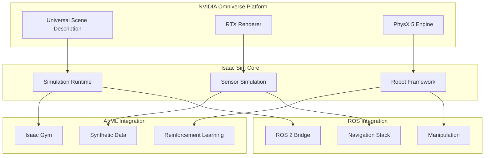
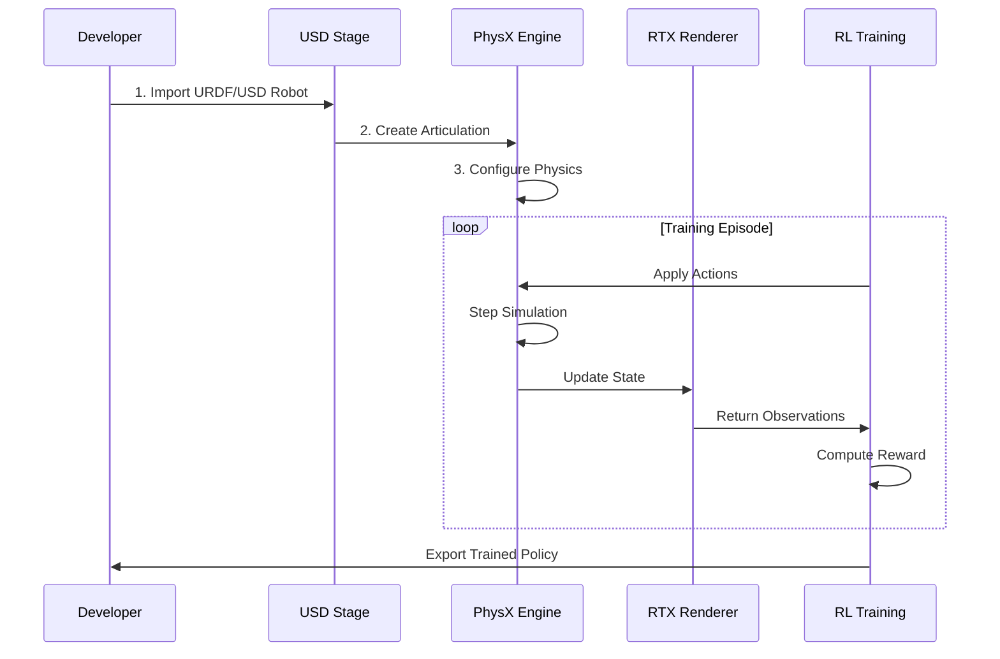

# NVIDIA Isaac Sim Overview

## Introduction to Isaac Sim

**NVIDIA Isaac Sim** is a robotics simulation platform built on NVIDIA Omniverse, providing physically accurate simulation, photorealistic rendering, and seamless integration with AI workflows. For humanoid robotics, Isaac Sim offers unparalleled capabilities for developing and testing complex locomotion, manipulation, and perception algorithms.

:::info Why Isaac Sim for Humanoids?
Isaac Sim combines GPU-accelerated physics with photorealistic rendering and native support for reinforcement learning—making it ideal for training humanoid robots that must perceive and interact with complex real-world environments.
:::

## Isaac Sim Architecture



## Key Features for Humanoid Robotics

### 1. PhysX 5 Physics Engine

Isaac Sim uses NVIDIA PhysX 5, offering GPU-accelerated physics simulation:

| Feature | Benefit for Humanoids |
|---------|----------------------|
| **GPU Rigid Bodies** | Simulate thousands of contacts in parallel |
| **Articulation System** | Optimized for complex kinematic chains |
| **Soft Body Simulation** | Model deformable surfaces and compliant grippers |
| **Fluid Dynamics** | Simulate liquids for manipulation tasks |

```python
# Isaac Sim physics configuration for humanoid
from omni.isaac.core import World
from omni.isaac.core.utils.physics import set_physics_properties

# Create simulation world
world = World(stage_units_in_meters=1.0)

# Configure physics for humanoid simulation
set_physics_properties(
    physics_dt=1/240,           # 240 Hz physics rate
    rendering_dt=1/60,          # 60 Hz rendering
    gravity=[0, 0, -9.81],
    solver_type="TGS",          # Temporal Gauss-Seidel solver
    num_threads=8
)

# Enable GPU dynamics for large-scale simulation
world.get_physics_context().enable_gpu_dynamics(True)
world.get_physics_context().set_gpu_found_lost_pairs_capacity(2**20)
```

### 2. Photorealistic Rendering

RTX-based rendering provides training-quality synthetic data:

```python
from omni.isaac.core.utils.render_product import create_hydra_texture
from omni.isaac.synthetic_utils import SyntheticDataHelper

# Configure RTX renderer for training data
render_config = {
    "renderer": "RayTracedLighting",
    "samples_per_pixel": 64,
    "max_bounces": 4,
    "motion_blur": True,
    "depth_of_field": True
}

# Create synthetic data pipeline
sd_helper = SyntheticDataHelper()
sd_helper.initialize(
    ["rgb", "depth", "semantic_segmentation", "instance_segmentation"]
)
```

### 3. Articulated Robot Support

```python
from omni.isaac.core.articulations import Articulation
from omni.isaac.core.utils.stage import add_reference_to_stage

class HumanoidRobot:
    """Isaac Sim humanoid robot wrapper."""

    def __init__(self, usd_path: str, position: list):
        # Load humanoid USD model
        self.prim_path = "/World/Humanoid"
        add_reference_to_stage(
            usd_path=usd_path,
            prim_path=self.prim_path
        )

        # Create articulation interface
        self.articulation = Articulation(
            prim_path=self.prim_path,
            name="humanoid"
        )

    def initialize(self):
        """Initialize robot after world reset."""
        self.articulation.initialize()

        # Get joint information
        self.num_dof = self.articulation.num_dof
        self.joint_names = self.articulation.dof_names

        print(f"Humanoid initialized with {self.num_dof} DOFs")
        print(f"Joints: {self.joint_names}")

    def set_joint_positions(self, positions):
        """Set target joint positions."""
        self.articulation.set_joint_positions(positions)

    def get_joint_states(self):
        """Get current joint positions and velocities."""
        return {
            "positions": self.articulation.get_joint_positions(),
            "velocities": self.articulation.get_joint_velocities()
        }

    def apply_joint_efforts(self, efforts):
        """Apply torques to joints."""
        self.articulation.set_joint_efforts(efforts)
```

## Setting Up Isaac Sim

### System Requirements

| Component | Minimum | Recommended |
|-----------|---------|-------------|
| **GPU** | RTX 2070 | RTX 4090 / A6000 |
| **VRAM** | 8 GB | 24+ GB |
| **RAM** | 32 GB | 64 GB |
| **Storage** | 50 GB SSD | 100+ GB NVMe |
| **OS** | Ubuntu 20.04/22.04 | Ubuntu 22.04 |

### Installation

```bash
# Download Isaac Sim from NVIDIA Omniverse Launcher
# Or use Docker for reproducible environments

# Pull Isaac Sim Docker image
docker pull nvcr.io/nvidia/isaac-sim:2023.1.1

# Run Isaac Sim container
docker run --name isaac-sim --entrypoint bash -it --gpus all \
    -e "ACCEPT_EULA=Y" \
    -v ~/docker/isaac-sim/cache/kit:/isaac-sim/kit/cache:rw \
    -v ~/docker/isaac-sim/cache/ov:/root/.cache/ov:rw \
    -v ~/docker/isaac-sim/cache/pip:/root/.cache/pip:rw \
    -v ~/docker/isaac-sim/cache/glcache:/root/.cache/nvidia/GLCache:rw \
    -v ~/docker/isaac-sim/logs:/root/.nvidia-omniverse/logs:rw \
    -v ~/docker/isaac-sim/data:/root/.local/share/ov/data:rw \
    -v ~/workspace:/workspace:rw \
    nvcr.io/nvidia/isaac-sim:2023.1.1
```

### Python Environment Setup

```python
# Isaac Sim standalone Python script
from omni.isaac.kit import SimulationApp

# Launch Isaac Sim (headless for training, windowed for development)
config = {
    "headless": False,
    "width": 1280,
    "height": 720,
    "renderer": "RayTracedLighting"
}

simulation_app = SimulationApp(config)

# Now import Isaac Sim modules
from omni.isaac.core import World
from omni.isaac.core.robots import Robot
from omni.isaac.core.utils.stage import add_reference_to_stage

# Create simulation world
world = World()

# Add ground plane
world.scene.add_default_ground_plane()

# Add humanoid robot
humanoid_usd = "omniverse://localhost/NVIDIA/Assets/Robots/Humanoid/humanoid.usd"
add_reference_to_stage(usd_path=humanoid_usd, prim_path="/World/Humanoid")

# Initialize world
world.reset()

# Simulation loop
while simulation_app.is_running():
    world.step(render=True)

simulation_app.close()
```

## Humanoid Simulation Workflow



### Importing Robot Models

```python
from omni.isaac.urdf import _urdf
from omni.isaac.core.utils.extensions import enable_extension

# Enable URDF importer extension
enable_extension("omni.isaac.urdf")

# Import URDF configuration
urdf_interface = _urdf.acquire_urdf_interface()

# URDF import settings for humanoid
import_config = _urdf.ImportConfig()
import_config.merge_fixed_joints = False
import_config.fix_base = False  # Allow floating base
import_config.make_default_prim = True
import_config.create_physics_scene = True
import_config.default_drive_type = _urdf.UrdfJointTargetType.JOINT_DRIVE_POSITION
import_config.default_drive_strength = 1000.0
import_config.default_position_drive_damping = 100.0

# Import humanoid URDF
result = urdf_interface.parse_urdf(
    urdf_path="/path/to/humanoid.urdf",
    import_config=import_config
)

# Create USD from URDF
urdf_interface.import_robot(
    urdf_path="/path/to/humanoid.urdf",
    import_config=import_config,
    dest_path="/World/Humanoid"
)
```

## Sensor Simulation in Isaac Sim

### Camera Sensors

```python
from omni.isaac.sensor import Camera
import numpy as np

class HumanoidVision:
    """Vision system for humanoid robot in Isaac Sim."""

    def __init__(self, robot_prim_path: str):
        # Create head-mounted camera
        self.camera = Camera(
            prim_path=f"{robot_prim_path}/head/camera",
            frequency=30,
            resolution=(640, 480)
        )

        # Enable required data types
        self.camera.add_distance_to_camera_to_frame()
        self.camera.add_semantic_segmentation_to_frame()

    def initialize(self):
        self.camera.initialize()

    def get_observations(self):
        """Get camera observations."""
        return {
            "rgb": self.camera.get_rgba()[:, :, :3],
            "depth": self.camera.get_depth(),
            "segmentation": self.camera.get_semantic_segmentation()
        }
```

### IMU and Contact Sensors

```python
from omni.isaac.sensor import IMUSensor, ContactSensor

class HumanoidSensors:
    """Sensor suite for humanoid robot."""

    def __init__(self, robot_prim_path: str):
        # IMU in torso
        self.imu = IMUSensor(
            prim_path=f"{robot_prim_path}/torso/imu",
            name="torso_imu",
            frequency=200
        )

        # Foot contact sensors
        self.left_foot_contact = ContactSensor(
            prim_path=f"{robot_prim_path}/left_foot/contact",
            name="left_foot_contact",
            min_threshold=0,
            max_threshold=1000000
        )

        self.right_foot_contact = ContactSensor(
            prim_path=f"{robot_prim_path}/right_foot/contact",
            name="right_foot_contact",
            min_threshold=0,
            max_threshold=1000000
        )

    def get_imu_data(self):
        """Get IMU readings."""
        frame = self.imu.get_current_frame()
        return {
            "linear_acceleration": frame["lin_acc"],
            "angular_velocity": frame["ang_vel"],
            "orientation": frame["orientation"]
        }

    def get_foot_contacts(self):
        """Get foot contact states."""
        return {
            "left_foot": self.left_foot_contact.get_current_frame(),
            "right_foot": self.right_foot_contact.get_current_frame()
        }
```

## Domain Randomization

Isaac Sim provides built-in domain randomization for sim-to-real transfer:

```python
from omni.isaac.core.utils.randomization import Randomizer

class HumanoidRandomizer:
    """Domain randomization for humanoid training."""

    def __init__(self):
        self.randomizer = Randomizer()

    def randomize_physics(self, robot):
        """Randomize physical properties."""
        # Mass randomization (±10%)
        for link in robot.get_links():
            original_mass = link.get_mass()
            new_mass = original_mass * np.random.uniform(0.9, 1.1)
            link.set_mass(new_mass)

        # Friction randomization
        for link in robot.get_links():
            friction = np.random.uniform(0.5, 1.5)
            link.set_friction(friction)

        # Joint damping randomization
        for joint in robot.get_joints():
            damping = joint.get_damping() * np.random.uniform(0.8, 1.2)
            joint.set_damping(damping)

    def randomize_lighting(self):
        """Randomize scene lighting."""
        from omni.isaac.core.utils.prims import set_prim_attribute

        # Randomize light intensity
        intensity = np.random.uniform(500, 2000)
        set_prim_attribute("/World/Light", "intensity", intensity)

        # Randomize light color temperature
        temperature = np.random.uniform(4000, 7000)
        set_prim_attribute("/World/Light", "colorTemperature", temperature)

    def randomize_terrain(self):
        """Randomize ground properties."""
        # Random ground friction
        friction = np.random.uniform(0.3, 1.0)
        # Apply to ground plane
```

## Isaac Sim vs Other Simulators

| Feature | Isaac Sim | Gazebo | MuJoCo | PyBullet |
|---------|-----------|--------|--------|----------|
| **Physics Engine** | PhysX 5 (GPU) | ODE/Bullet | Custom | Bullet |
| **Rendering** | RTX Ray Tracing | OGRE | Basic | OpenGL |
| **GPU Acceleration** | Full | Limited | Partial | Limited |
| **Synthetic Data** | Excellent | Basic | None | Basic |
| **ROS Integration** | Native | Native | Community | Community |
| **RL Support** | Isaac Gym | Gym wrappers | Native | Gym wrappers |
| **Scalability** | 1000s parallel | 10s | 1000s | 100s |

## Summary

NVIDIA Isaac Sim provides a comprehensive simulation platform for humanoid robotics:

- **PhysX 5** delivers GPU-accelerated physics for complex articulated systems
- **RTX rendering** enables photorealistic synthetic data generation
- **Isaac Gym integration** supports large-scale reinforcement learning
- **Native ROS 2 bridge** connects simulation to robot software stacks
- **Domain randomization** tools facilitate sim-to-real transfer

The following sections explore specific capabilities: Isaac ROS acceleration, SLAM/navigation, path planning, and synthetic data generation.

## Exercises

1. Import a humanoid URDF into Isaac Sim and configure joint drives
2. Create a camera sensor on the robot's head and capture RGB-D images
3. Implement domain randomization for mass and friction properties
4. Set up parallel environments for reinforcement learning training
5. Export trained policy and test in a different environment

## Further Reading

- [Isaac Sim Documentation](https://docs.omniverse.nvidia.com/app_isaacsim/)
- [Isaac Gym Preview](https://developer.nvidia.com/isaac-gym)
- [Omniverse USD Basics](https://docs.omniverse.nvidia.com/usd/)
