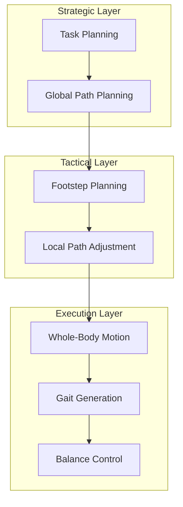

# Path Planning for Humanoids

## The Unique Challenge of Humanoid Path Planning

Path planning for humanoid robots differs fundamentally from wheeled robots. While wheeled robots can follow any continuous path, humanoids must generate **dynamically feasible motion** through discrete footstep placements while maintaining balance.

:::info The Humanoid Planning Problem
Humanoid path planning requires solving multiple interconnected problems: global path finding, footstep placement, whole-body motion, and dynamic balance—all while respecting kinematic and dynamic constraints.
:::

## Planning Hierarchy



## Global Path Planning

### Configuration Space Considerations

```python
import numpy as np
from typing import List, Tuple
from dataclasses import dataclass

@dataclass
class HumanoidConfig:
    """Humanoid configuration for path planning."""
    position: np.ndarray  # (x, y) in world frame
    orientation: float    # Yaw angle
    stance: str          # 'double', 'left', 'right'

class GlobalPathPlanner:
    """Global path planning for humanoid navigation."""

    def __init__(self, costmap, resolution=0.1):
        self.costmap = costmap
        self.resolution = resolution

        # Humanoid-specific parameters
        self.robot_radius = 0.4  # Collision radius
        self.turn_radius = 0.5   # Minimum turning radius

    def plan_a_star(
        self,
        start: HumanoidConfig,
        goal: HumanoidConfig
    ) -> List[HumanoidConfig]:
        """
        A* planning with humanoid motion primitives.

        Returns:
            List of waypoint configurations
        """
        open_set = [(0, start)]
        came_from = {}
        g_score = {self._config_hash(start): 0}
        f_score = {self._config_hash(start): self._heuristic(start, goal)}

        while open_set:
            # Get node with lowest f_score
            _, current = min(open_set, key=lambda x: x[0])
            open_set.remove((f_score[self._config_hash(current)], current))

            if self._is_goal(current, goal):
                return self._reconstruct_path(came_from, current)

            for neighbor in self._get_neighbors(current):
                if self._is_collision(neighbor):
                    continue

                tentative_g = g_score[self._config_hash(current)] + \
                              self._transition_cost(current, neighbor)

                if tentative_g < g_score.get(self._config_hash(neighbor), np.inf):
                    came_from[self._config_hash(neighbor)] = current
                    g_score[self._config_hash(neighbor)] = tentative_g
                    f = tentative_g + self._heuristic(neighbor, goal)
                    f_score[self._config_hash(neighbor)] = f
                    open_set.append((f, neighbor))

        return []  # No path found

    def _get_neighbors(self, config: HumanoidConfig) -> List[HumanoidConfig]:
        """Generate reachable neighbor configurations using motion primitives."""
        neighbors = []

        # Motion primitives: forward, turn left, turn right
        primitives = [
            (0.3, 0),           # Forward
            (0.2, np.pi/6),     # Forward + turn left
            (0.2, -np.pi/6),    # Forward + turn right
            (0.0, np.pi/4),     # Turn in place left
            (0.0, -np.pi/4),    # Turn in place right
            (-0.15, 0),         # Backward
        ]

        for dist, angle in primitives:
            new_yaw = config.orientation + angle
            new_pos = config.position + dist * np.array([
                np.cos(new_yaw),
                np.sin(new_yaw)
            ])

            neighbors.append(HumanoidConfig(
                position=new_pos,
                orientation=new_yaw,
                stance='double'
            ))

        return neighbors

    def _heuristic(self, config: HumanoidConfig, goal: HumanoidConfig) -> float:
        """Estimated cost to goal (Euclidean + orientation)."""
        dist = np.linalg.norm(config.position - goal.position)
        angle_diff = abs(self._normalize_angle(
            config.orientation - goal.orientation
        ))
        return dist + 0.5 * angle_diff

    def _transition_cost(self, from_config: HumanoidConfig,
                         to_config: HumanoidConfig) -> float:
        """Cost of transitioning between configurations."""
        dist = np.linalg.norm(to_config.position - from_config.position)
        angle = abs(self._normalize_angle(
            to_config.orientation - from_config.orientation
        ))

        # Penalize backward motion
        forward_dir = np.array([
            np.cos(from_config.orientation),
            np.sin(from_config.orientation)
        ])
        motion_dir = to_config.position - from_config.position

        if dist > 0:
            forward_component = np.dot(motion_dir, forward_dir) / dist
            if forward_component < 0:
                dist *= 2  # Double cost for backward motion

        return dist + 0.3 * angle

    def _normalize_angle(self, angle: float) -> float:
        """Normalize angle to [-pi, pi]."""
        while angle > np.pi:
            angle -= 2 * np.pi
        while angle < -np.pi:
            angle += 2 * np.pi
        return angle

    def _config_hash(self, config: HumanoidConfig) -> tuple:
        """Create hashable key from configuration."""
        return (
            round(config.position[0] / self.resolution),
            round(config.position[1] / self.resolution),
            round(config.orientation / (np.pi / 18))  # 10-degree bins
        )

    def _is_collision(self, config: HumanoidConfig) -> bool:
        """Check if configuration is in collision."""
        # Check costmap at robot position
        grid_x = int(config.position[0] / self.costmap.resolution)
        grid_y = int(config.position[1] / self.costmap.resolution)

        if not (0 <= grid_x < self.costmap.width and
                0 <= grid_y < self.costmap.height):
            return True

        return self.costmap.data[grid_y, grid_x] > 0.5

    def _is_goal(self, config: HumanoidConfig, goal: HumanoidConfig) -> bool:
        """Check if configuration is at goal."""
        dist = np.linalg.norm(config.position - goal.position)
        angle_diff = abs(self._normalize_angle(
            config.orientation - goal.orientation
        ))
        return dist < 0.2 and angle_diff < 0.2

    def _reconstruct_path(self, came_from, current):
        """Reconstruct path from start to current."""
        path = [current]
        while self._config_hash(current) in came_from:
            current = came_from[self._config_hash(current)]
            path.append(current)
        return list(reversed(path))
```

### Lattice-Based Planning

```python
class LatticePlanner:
    """Lattice-based planning with pre-computed motion primitives."""

    def __init__(self):
        # Pre-computed motion primitives for different orientations
        self.primitives = self._generate_primitives()

    def _generate_primitives(self):
        """Generate state lattice motion primitives."""
        primitives = {}

        # Discretize heading into 16 directions
        num_headings = 16
        for heading_idx in range(num_headings):
            heading = 2 * np.pi * heading_idx / num_headings
            primitives[heading_idx] = []

            # Generate primitives for this heading
            for length in [0.2, 0.3, 0.4]:  # Different step lengths
                for end_heading_delta in [-2, -1, 0, 1, 2]:
                    end_heading_idx = (heading_idx + end_heading_delta) % num_headings

                    # Generate trajectory connecting states
                    traj = self._compute_trajectory(
                        heading, length, end_heading_delta
                    )

                    primitives[heading_idx].append({
                        'trajectory': traj,
                        'end_heading_idx': end_heading_idx,
                        'cost': self._trajectory_cost(traj)
                    })

        return primitives

    def _compute_trajectory(self, start_heading, length, heading_delta):
        """Compute smooth trajectory for motion primitive."""
        num_points = 10
        trajectory = []

        for i in range(num_points + 1):
            t = i / num_points
            # Dubins-like curve
            x = length * t * np.cos(start_heading + heading_delta * t)
            y = length * t * np.sin(start_heading + heading_delta * t)
            theta = start_heading + heading_delta * t
            trajectory.append((x, y, theta))

        return trajectory

    def _trajectory_cost(self, trajectory):
        """Compute cost of trajectory."""
        cost = 0
        for i in range(1, len(trajectory)):
            dx = trajectory[i][0] - trajectory[i-1][0]
            dy = trajectory[i][1] - trajectory[i-1][1]
            cost += np.sqrt(dx*dx + dy*dy)
        return cost
```

## Footstep Planning

### Search-Based Footstep Planner

```python
from enum import Enum
from typing import Optional
import heapq

class Foot(Enum):
    LEFT = 0
    RIGHT = 1

@dataclass
class FootstepState:
    """State in footstep planning search."""
    x: float
    y: float
    theta: float
    foot: Foot

    def __hash__(self):
        return hash((
            round(self.x * 100),
            round(self.y * 100),
            round(self.theta * 18 / np.pi),
            self.foot.value
        ))

    def __eq__(self, other):
        return hash(self) == hash(other)

    def __lt__(self, other):
        return (self.x, self.y) < (other.x, other.y)

class FootstepPlannerAstar:
    """A* footstep planning with kinematic constraints."""

    def __init__(self):
        # Footstep parameters
        self.nominal_step_length = 0.25
        self.nominal_step_width = 0.20
        self.max_step_length = 0.35
        self.max_step_width = 0.30
        self.max_step_theta = np.radians(20)

        # Discretized footstep actions
        self.actions = self._generate_actions()

    def _generate_actions(self):
        """Generate discrete footstep actions."""
        actions = []

        # Step lengths
        for dx in np.linspace(-0.1, self.max_step_length, 5):
            # Step widths (relative to nominal)
            for dy in np.linspace(-0.05, 0.1, 3):
                # Step rotations
                for dtheta in np.linspace(-self.max_step_theta,
                                          self.max_step_theta, 5):
                    actions.append((dx, dy, dtheta))

        return actions

    def plan(
        self,
        start: FootstepState,
        goal: FootstepState,
        obstacles: List[np.ndarray]
    ) -> Optional[List[FootstepState]]:
        """
        Plan footstep sequence from start to goal.

        Args:
            start: Initial footstep state
            goal: Goal footstep state
            obstacles: List of obstacle polygons

        Returns:
            List of footstep states or None if no solution
        """
        open_set = [(0, start)]
        came_from = {}
        g_score = {start: 0}

        while open_set:
            _, current = heapq.heappop(open_set)

            if self._is_goal(current, goal):
                return self._reconstruct_path(came_from, current)

            for successor in self._get_successors(current):
                if self._is_collision(successor, obstacles):
                    continue

                if not self._is_kinematically_feasible(current, successor):
                    continue

                tentative_g = g_score[current] + self._step_cost(current, successor)

                if successor not in g_score or tentative_g < g_score[successor]:
                    came_from[successor] = current
                    g_score[successor] = tentative_g
                    f = tentative_g + self._heuristic(successor, goal)
                    heapq.heappush(open_set, (f, successor))

        return None

    def _get_successors(self, state: FootstepState) -> List[FootstepState]:
        """Generate successor footstep states."""
        successors = []
        next_foot = Foot.RIGHT if state.foot == Foot.LEFT else Foot.LEFT

        for dx, dy, dtheta in self.actions:
            # Transform action to world frame
            cos_t = np.cos(state.theta)
            sin_t = np.sin(state.theta)

            # Flip dy for alternating feet
            if next_foot == Foot.LEFT:
                dy = -dy + self.nominal_step_width
            else:
                dy = dy - self.nominal_step_width

            world_dx = cos_t * dx - sin_t * dy
            world_dy = sin_t * dx + cos_t * dy

            successors.append(FootstepState(
                x=state.x + world_dx,
                y=state.y + world_dy,
                theta=state.theta + dtheta,
                foot=next_foot
            ))

        return successors

    def _is_kinematically_feasible(
        self,
        current: FootstepState,
        next_step: FootstepState
    ) -> bool:
        """Check if step is kinematically feasible."""
        # Transform next step to current foot frame
        dx = next_step.x - current.x
        dy = next_step.y - current.y
        dtheta = next_step.theta - current.theta

        # Rotate to foot frame
        cos_t = np.cos(-current.theta)
        sin_t = np.sin(-current.theta)
        local_dx = cos_t * dx - sin_t * dy
        local_dy = sin_t * dx + cos_t * dy

        # Check constraints
        if abs(local_dx) > self.max_step_length:
            return False
        if abs(local_dy) > self.max_step_width:
            return False
        if abs(dtheta) > self.max_step_theta:
            return False

        # Check for leg crossing (feet shouldn't cross)
        if current.foot == Foot.LEFT and local_dy < 0.1:
            return False
        if current.foot == Foot.RIGHT and local_dy > -0.1:
            return False

        return True

    def _step_cost(self, current: FootstepState, next_step: FootstepState) -> float:
        """Cost of taking a step."""
        dx = next_step.x - current.x
        dy = next_step.y - current.y
        dtheta = abs(next_step.theta - current.theta)

        # Distance cost
        dist = np.sqrt(dx*dx + dy*dy)

        # Deviation from nominal step
        nominal_dist = self.nominal_step_length
        deviation = abs(dist - nominal_dist)

        # Rotation cost
        rotation_cost = dtheta * 2

        return dist + deviation * 0.5 + rotation_cost

    def _heuristic(self, state: FootstepState, goal: FootstepState) -> float:
        """Heuristic estimate to goal."""
        dist = np.sqrt(
            (state.x - goal.x)**2 +
            (state.y - goal.y)**2
        )
        angle_diff = abs(state.theta - goal.theta)

        # Estimate number of steps
        num_steps = dist / self.nominal_step_length

        return dist + angle_diff * 0.5

    def _is_goal(self, state: FootstepState, goal: FootstepState) -> bool:
        """Check if state is at goal."""
        dist = np.sqrt((state.x - goal.x)**2 + (state.y - goal.y)**2)
        angle_diff = abs(state.theta - goal.theta)
        return dist < 0.15 and angle_diff < 0.2

    def _is_collision(self, state: FootstepState, obstacles) -> bool:
        """Check footstep collision with obstacles."""
        foot_polygon = self._get_foot_polygon(state)

        for obstacle in obstacles:
            if self._polygons_intersect(foot_polygon, obstacle):
                return True
        return False

    def _get_foot_polygon(self, state: FootstepState) -> np.ndarray:
        """Get foot polygon in world frame."""
        # Foot dimensions
        foot_length = 0.25
        foot_width = 0.10

        # Local foot corners
        corners = np.array([
            [-foot_length/2, -foot_width/2],
            [foot_length/2, -foot_width/2],
            [foot_length/2, foot_width/2],
            [-foot_length/2, foot_width/2]
        ])

        # Rotate and translate
        cos_t = np.cos(state.theta)
        sin_t = np.sin(state.theta)
        R = np.array([[cos_t, -sin_t], [sin_t, cos_t]])

        world_corners = (R @ corners.T).T + np.array([state.x, state.y])
        return world_corners

    def _polygons_intersect(self, poly1, poly2) -> bool:
        """Check if two polygons intersect using SAT."""
        # Simplified collision check
        return False

    def _reconstruct_path(self, came_from, current):
        """Reconstruct footstep path."""
        path = [current]
        while current in came_from:
            current = came_from[current]
            path.append(current)
        return list(reversed(path))
```

## Whole-Body Motion Planning

### MoveIt Integration

```python
import rclpy
from rclpy.node import Node
from moveit_msgs.msg import MoveItErrorCodes
from moveit_msgs.srv import GetPositionIK, GetMotionPlan

class HumanoidMotionPlanner(Node):
    """MoveIt-based whole-body motion planning for humanoid."""

    def __init__(self):
        super().__init__('humanoid_motion_planner')

        # Service clients
        self.ik_client = self.create_client(
            GetPositionIK,
            '/compute_ik'
        )
        self.motion_plan_client = self.create_client(
            GetMotionPlan,
            '/plan_kinematic_path'
        )

        # Planning groups
        self.groups = {
            'left_arm': 'left_arm',
            'right_arm': 'right_arm',
            'left_leg': 'left_leg',
            'right_leg': 'right_leg',
            'torso': 'torso',
            'whole_body': 'whole_body'
        }

    async def plan_arm_motion(
        self,
        arm: str,
        target_pose,
        start_state=None
    ):
        """
        Plan arm motion to target pose.

        Args:
            arm: 'left' or 'right'
            target_pose: geometry_msgs/Pose
            start_state: Optional start state

        Returns:
            Trajectory or None
        """
        from moveit_msgs.msg import MotionPlanRequest, Constraints
        from moveit_msgs.msg import PositionConstraint, OrientationConstraint

        request = MotionPlanRequest()
        request.group_name = f'{arm}_arm'
        request.num_planning_attempts = 10
        request.allowed_planning_time = 5.0

        if start_state:
            request.start_state = start_state

        # Goal constraints
        goal = Constraints()

        # Position constraint
        pos_constraint = PositionConstraint()
        pos_constraint.header.frame_id = 'base_link'
        pos_constraint.link_name = f'{arm}_hand'
        pos_constraint.target_point_offset.x = 0
        pos_constraint.target_point_offset.y = 0
        pos_constraint.target_point_offset.z = 0

        # Define allowed region (sphere around target)
        from shape_msgs.msg import SolidPrimitive
        sphere = SolidPrimitive()
        sphere.type = SolidPrimitive.SPHERE
        sphere.dimensions = [0.01]  # 1cm tolerance

        pos_constraint.constraint_region.primitives.append(sphere)
        pos_constraint.constraint_region.primitive_poses.append(target_pose)

        goal.position_constraints.append(pos_constraint)

        # Orientation constraint
        orient_constraint = OrientationConstraint()
        orient_constraint.header.frame_id = 'base_link'
        orient_constraint.link_name = f'{arm}_hand'
        orient_constraint.orientation = target_pose.orientation
        orient_constraint.absolute_x_axis_tolerance = 0.1
        orient_constraint.absolute_y_axis_tolerance = 0.1
        orient_constraint.absolute_z_axis_tolerance = 0.1

        goal.orientation_constraints.append(orient_constraint)

        request.goal_constraints.append(goal)

        # Call planning service
        response = await self.motion_plan_client.call_async(request)

        if response.error_code.val == MoveItErrorCodes.SUCCESS:
            return response.trajectory
        else:
            self.get_logger().error(
                f'Motion planning failed: {response.error_code.val}'
            )
            return None
```

### Whole-Body IK

```python
import numpy as np
from scipy.optimize import minimize

class WholeBodyIK:
    """Whole-body inverse kinematics for humanoid."""

    def __init__(self, robot_model):
        self.robot = robot_model

        # Priority weights for different objectives
        self.weights = {
            'end_effector': 1.0,
            'balance': 0.8,
            'posture': 0.3,
            'joint_limits': 0.5
        }

    def solve(
        self,
        tasks: dict,
        current_q: np.ndarray,
        support_foot: str = 'double'
    ) -> np.ndarray:
        """
        Solve whole-body IK with multiple objectives.

        Args:
            tasks: Dict of task specifications
                   {'left_hand': target_pose, 'gaze': target_point, ...}
            current_q: Current joint configuration
            support_foot: 'left', 'right', or 'double'

        Returns:
            Optimal joint configuration
        """
        def objective(q):
            cost = 0

            # End-effector tasks
            for task_name, target in tasks.items():
                error = self._task_error(q, task_name, target)
                cost += self.weights['end_effector'] * np.sum(error**2)

            # Balance constraint
            com = self.robot.compute_com(q)
            support_polygon = self._get_support_polygon(q, support_foot)
            balance_error = self._com_distance_to_support(com, support_polygon)
            cost += self.weights['balance'] * balance_error**2

            # Posture regularization
            posture_error = q - self.robot.default_posture
            cost += self.weights['posture'] * np.sum(posture_error**2)

            # Joint limit penalty
            limit_violation = self._joint_limit_violation(q)
            cost += self.weights['joint_limits'] * np.sum(limit_violation**2)

            return cost

        # Bounds for joint limits
        bounds = [(low, high) for low, high in
                  zip(self.robot.joint_lower_limits,
                      self.robot.joint_upper_limits)]

        # Solve optimization
        result = minimize(
            objective,
            current_q,
            method='SLSQP',
            bounds=bounds,
            options={'maxiter': 100}
        )

        return result.x

    def _task_error(self, q, task_name, target):
        """Compute error for a task."""
        if 'hand' in task_name:
            # End-effector position/orientation error
            current = self.robot.forward_kinematics(q, task_name)
            pos_error = target[:3, 3] - current[:3, 3]
            # Orientation error (simplified)
            orient_error = self._rotation_error(current[:3, :3], target[:3, :3])
            return np.concatenate([pos_error, orient_error])

        elif 'gaze' in task_name:
            # Gaze direction error
            head_pose = self.robot.forward_kinematics(q, 'head')
            gaze_dir = head_pose[:3, 2]  # Z-axis of head
            target_dir = target - head_pose[:3, 3]
            target_dir = target_dir / np.linalg.norm(target_dir)
            return np.cross(gaze_dir, target_dir)

        return np.zeros(6)

    def _rotation_error(self, R_current, R_target):
        """Compute rotation error as axis-angle."""
        R_error = R_target @ R_current.T
        angle = np.arccos(np.clip((np.trace(R_error) - 1) / 2, -1, 1))
        if angle < 1e-6:
            return np.zeros(3)
        axis = np.array([
            R_error[2, 1] - R_error[1, 2],
            R_error[0, 2] - R_error[2, 0],
            R_error[1, 0] - R_error[0, 1]
        ]) / (2 * np.sin(angle))
        return axis * angle

    def _get_support_polygon(self, q, support_foot):
        """Get support polygon from foot positions."""
        if support_foot == 'double':
            left = self.robot.forward_kinematics(q, 'left_foot')
            right = self.robot.forward_kinematics(q, 'right_foot')
            # Combine foot polygons
            return self._combine_foot_polygons(left, right)
        elif support_foot == 'left':
            return self.robot.get_foot_polygon(q, 'left')
        else:
            return self.robot.get_foot_polygon(q, 'right')

    def _com_distance_to_support(self, com, support_polygon):
        """Distance from COM projection to support polygon."""
        com_2d = com[:2]  # Project to ground plane

        # Check if inside polygon
        if self._point_in_polygon(com_2d, support_polygon):
            return 0

        # Find distance to nearest edge
        return self._point_to_polygon_distance(com_2d, support_polygon)

    def _joint_limit_violation(self, q):
        """Compute joint limit violations."""
        lower_violation = np.maximum(0, self.robot.joint_lower_limits - q)
        upper_violation = np.maximum(0, q - self.robot.joint_upper_limits)
        return lower_violation + upper_violation
```

## Summary

Path planning for humanoids requires a hierarchical approach:

- **Global planning** finds collision-free paths considering robot geometry
- **Footstep planning** translates paths into kinematically feasible step sequences
- **Motion planning** generates whole-body trajectories respecting balance constraints
- **Real-time adaptation** handles dynamic obstacles and terrain variations

The integration of these layers enables humanoid robots to navigate complex environments while maintaining stability and executing manipulation tasks.

## Exercises

1. Implement A* path planning with humanoid motion primitives
2. Design a footstep planner that handles sloped terrain
3. Create a whole-body IK solver with balance constraints
4. Integrate footstep and motion planning with Nav2
5. Test path planning with dynamic obstacle avoidance

## Further Reading

- [Search-Based Footstep Planning](https://ieeexplore.ieee.org/document/5509566)
- [MoveIt Motion Planning](https://moveit.ros.org/)
- [Whole-Body Control for Humanoids](https://arxiv.org/abs/1603.04474)
