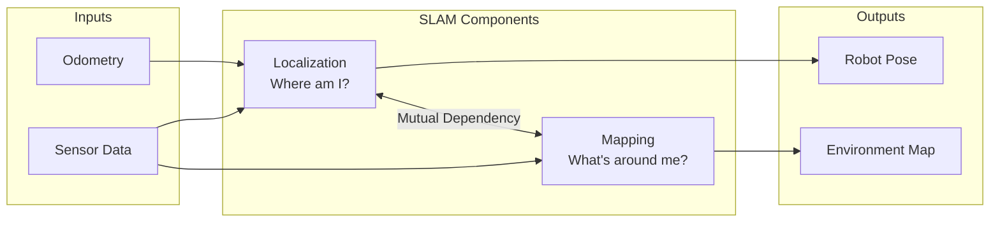
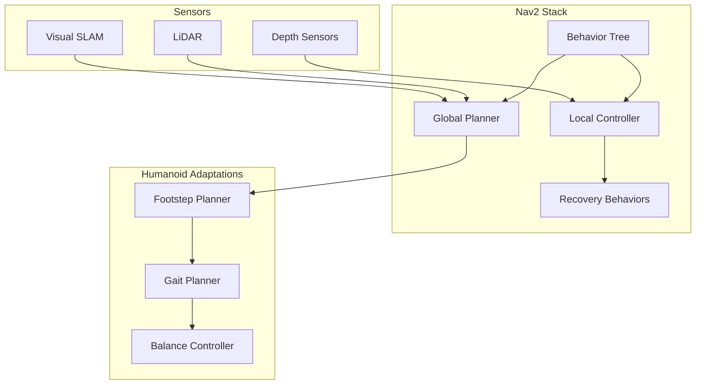

# SLAM, Navigation, and Mapping

## Introduction to Visual SLAM

**Simultaneous Localization and Mapping (SLAM)** is fundamental for autonomous humanoid navigation. Unlike wheeled robots that can rely on wheel odometry, humanoids require **Visual SLAM (VSLAM)** due to their complex locomotion patterns and the need for rich environmental understanding.

:::info Why Visual SLAM for Humanoids?
Humanoid robots experience significant motion during walking—body sway, head movement, and variable foot placement. Visual SLAM provides drift-corrected localization by tracking visual features and performing loop closure detection.
:::

## VSLAM Fundamentals

### The SLAM Problem



### Visual SLAM Pipeline

```mermaid
sequenceDiagram
    participant Cam as Camera
    participant FE as Feature Extraction
    participant Track as Tracking
    participant LM as Local Mapping
    participant LC as Loop Closure
    participant Opt as Optimization

    Cam->>FE: Image Frame
    FE->>Track: Keypoints + Descriptors
    Track->>Track: Match with Previous Frame
    Track->>LM: Camera Pose Estimate

    LM->>LM: Create/Update Map Points
    LM->>LC: Check for Loop Closure

    alt Loop Detected
        LC->>Opt: Trigger Bundle Adjustment
        Opt->>LM: Corrected Map
    end
```

## Feature-Based VSLAM

### ORB-SLAM3 for Humanoids

ORB-SLAM3 is a state-of-the-art visual SLAM system supporting monocular, stereo, and RGB-D cameras with IMU fusion.

```python
import rclpy
from rclpy.node import Node
from sensor_msgs.msg import Image, Imu
from geometry_msgs.msg import PoseStamped
from nav_msgs.msg import Path
import numpy as np

class HumanoidORBSLAM(Node):
    """ORB-SLAM3 integration for humanoid navigation."""

    def __init__(self):
        super().__init__('humanoid_orb_slam')

        # Camera subscriptions (stereo)
        self.left_sub = self.create_subscription(
            Image, '/stereo/left/image_rect', self.left_callback, 10
        )
        self.right_sub = self.create_subscription(
            Image, '/stereo/right/image_rect', self.right_callback, 10
        )

        # IMU subscription for Visual-Inertial SLAM
        self.imu_sub = self.create_subscription(
            Imu, '/imu/data', self.imu_callback, 100
        )

        # Pose output
        self.pose_pub = self.create_publisher(
            PoseStamped, '/slam/pose', 10
        )
        self.path_pub = self.create_publisher(
            Path, '/slam/path', 10
        )

        # Trajectory storage
        self.trajectory = Path()
        self.trajectory.header.frame_id = 'map'

        self.get_logger().info('ORB-SLAM3 node initialized')

    def process_stereo_frame(self, left_img, right_img, timestamp):
        """Process stereo pair through SLAM."""
        # ORB-SLAM3 would process here
        # Returns camera pose in world frame

        pose = PoseStamped()
        pose.header.stamp = timestamp
        pose.header.frame_id = 'map'

        # Pose would come from SLAM system
        # pose.pose = slam_system.get_pose()

        self.pose_pub.publish(pose)

        # Update trajectory
        self.trajectory.poses.append(pose)
        self.path_pub.publish(self.trajectory)

    def imu_callback(self, msg):
        """Feed IMU data for Visual-Inertial fusion."""
        # IMU pre-integration for VIO
        acceleration = np.array([
            msg.linear_acceleration.x,
            msg.linear_acceleration.y,
            msg.linear_acceleration.z
        ])
        angular_velocity = np.array([
            msg.angular_velocity.x,
            msg.angular_velocity.y,
            msg.angular_velocity.z
        ])

        # Pass to SLAM system for IMU pre-integration
        # slam_system.track_imu(acceleration, angular_velocity, msg.header.stamp)
```

### Visual-Inertial Odometry (VIO)

For humanoids, combining visual and inertial measurements is essential:

```python
class VisualInertialOdometry:
    """VIO system for humanoid locomotion."""

    def __init__(self):
        # IMU pre-integration
        self.imu_buffer = []
        self.gravity = np.array([0, 0, -9.81])

        # State: position, velocity, orientation, biases
        self.position = np.zeros(3)
        self.velocity = np.zeros(3)
        self.orientation = np.eye(3)  # Rotation matrix

        # IMU biases (estimated online)
        self.accel_bias = np.zeros(3)
        self.gyro_bias = np.zeros(3)

    def preintegrate_imu(self, imu_measurements, dt):
        """
        Pre-integrate IMU measurements between keyframes.

        Args:
            imu_measurements: List of (accel, gyro, timestamp) tuples
            dt: Time between measurements

        Returns:
            Pre-integrated delta position, velocity, rotation
        """
        delta_p = np.zeros(3)
        delta_v = np.zeros(3)
        delta_R = np.eye(3)

        for accel, gyro, _ in imu_measurements:
            # Remove biases
            accel_corrected = accel - self.accel_bias
            gyro_corrected = gyro - self.gyro_bias

            # Integrate rotation
            omega_skew = self._skew_symmetric(gyro_corrected * dt)
            delta_R = delta_R @ (np.eye(3) + omega_skew)

            # Integrate velocity and position
            accel_world = delta_R @ accel_corrected
            delta_v += accel_world * dt
            delta_p += delta_v * dt + 0.5 * accel_world * dt * dt

        return delta_p, delta_v, delta_R

    def _skew_symmetric(self, v):
        """Create skew-symmetric matrix from vector."""
        return np.array([
            [0, -v[2], v[1]],
            [v[2], 0, -v[0]],
            [-v[1], v[0], 0]
        ])
```

## Dense Mapping

### Depth-Based Reconstruction

```python
import numpy as np
from dataclasses import dataclass

@dataclass
class VoxelGrid:
    """Voxel-based map representation."""
    resolution: float  # Voxel size in meters
    origin: np.ndarray  # Grid origin
    size: tuple  # Grid dimensions (x, y, z)
    data: np.ndarray  # Occupancy values

class DenseMapper:
    """Dense 3D mapping from depth sensors."""

    def __init__(self, resolution=0.05, map_size=(10.0, 10.0, 3.0)):
        self.resolution = resolution

        # Calculate grid dimensions
        self.grid_size = tuple(int(s / resolution) for s in map_size)
        self.origin = np.array([-map_size[0]/2, -map_size[1]/2, 0])

        # Initialize TSDF volume
        self.tsdf = np.ones(self.grid_size) * np.inf
        self.weights = np.zeros(self.grid_size)

        # TSDF parameters
        self.truncation = 0.1  # Truncation distance

    def integrate_depth(self, depth_image, camera_pose, intrinsics):
        """
        Integrate depth image into TSDF volume.

        Args:
            depth_image: HxW depth array (meters)
            camera_pose: 4x4 camera-to-world transform
            intrinsics: Camera intrinsic matrix
        """
        h, w = depth_image.shape
        fx, fy = intrinsics[0, 0], intrinsics[1, 1]
        cx, cy = intrinsics[0, 2], intrinsics[1, 2]

        # For each voxel, compute TSDF update
        for x in range(self.grid_size[0]):
            for y in range(self.grid_size[1]):
                for z in range(self.grid_size[2]):
                    # Voxel center in world frame
                    voxel_world = self.origin + np.array([x, y, z]) * self.resolution

                    # Transform to camera frame
                    voxel_cam = np.linalg.inv(camera_pose) @ np.append(voxel_world, 1)
                    voxel_cam = voxel_cam[:3]

                    if voxel_cam[2] <= 0:
                        continue

                    # Project to image
                    u = int(fx * voxel_cam[0] / voxel_cam[2] + cx)
                    v = int(fy * voxel_cam[1] / voxel_cam[2] + cy)

                    if 0 <= u < w and 0 <= v < h:
                        depth = depth_image[v, u]

                        if depth > 0:
                            # Signed distance
                            sdf = depth - voxel_cam[2]

                            if sdf > -self.truncation:
                                tsdf = min(1.0, sdf / self.truncation)

                                # Weighted running average
                                old_tsdf = self.tsdf[x, y, z]
                                old_weight = self.weights[x, y, z]

                                new_weight = old_weight + 1
                                self.tsdf[x, y, z] = (
                                    old_tsdf * old_weight + tsdf
                                ) / new_weight
                                self.weights[x, y, z] = new_weight

    def extract_mesh(self):
        """Extract triangle mesh using marching cubes."""
        from skimage import measure

        # Find zero-crossing surface
        verts, faces, normals, _ = measure.marching_cubes(
            self.tsdf,
            level=0,
            spacing=(self.resolution,) * 3
        )

        # Transform to world coordinates
        verts = verts + self.origin

        return verts, faces, normals
```

## Navigation Stack Integration

### Nav2 for Humanoids



### Costmap Configuration

```yaml
# nav2_params.yaml for humanoid
global_costmap:
  ros__parameters:
    global_frame: map
    robot_base_frame: base_link
    update_frequency: 5.0
    publish_frequency: 2.0
    resolution: 0.05

    plugins: ["static_layer", "obstacle_layer", "voxel_layer", "inflation_layer"]

    static_layer:
      plugin: "nav2_costmap_2d::StaticLayer"
      map_subscribe_transient_local: True

    obstacle_layer:
      plugin: "nav2_costmap_2d::ObstacleLayer"
      enabled: True
      observation_sources: scan depth
      scan:
        topic: /scan
        sensor_frame: lidar_link
        observation_persistence: 0.0
        inf_is_valid: false
        clearing: True
        marking: True
      depth:
        topic: /depth/points
        sensor_frame: depth_camera_link
        observation_persistence: 0.0
        inf_is_valid: false
        clearing: True
        marking: True

    voxel_layer:
      plugin: "nav2_costmap_2d::VoxelLayer"
      enabled: True
      origin_z: 0.0
      z_resolution: 0.05
      z_voxels: 40
      max_obstacle_height: 2.0
      unknown_threshold: 15
      mark_threshold: 0

    inflation_layer:
      plugin: "nav2_costmap_2d::InflationLayer"
      cost_scaling_factor: 3.0
      inflation_radius: 0.55  # Humanoid width + margin

local_costmap:
  ros__parameters:
    global_frame: odom
    robot_base_frame: base_link
    update_frequency: 10.0
    publish_frequency: 5.0
    resolution: 0.025  # Finer resolution for local planning
    width: 3
    height: 3
    rolling_window: true
```

### Footstep Planning

```python
from dataclasses import dataclass
from typing import List, Tuple
import numpy as np

@dataclass
class Footstep:
    """Single footstep placement."""
    position: np.ndarray  # (x, y, z)
    orientation: float    # Yaw angle
    foot: str            # 'left' or 'right'
    duration: float      # Step duration

class FootstepPlanner:
    """Plan footstep sequence for humanoid navigation."""

    def __init__(self):
        # Humanoid gait parameters
        self.step_length = 0.3     # Maximum step length (m)
        self.step_width = 0.2      # Nominal stance width (m)
        self.step_height = 0.1     # Foot lift height (m)
        self.step_duration = 0.5   # Single step time (s)

        # Kinematic constraints
        self.max_step_angle = np.radians(30)  # Maximum turning per step
        self.min_step_length = 0.05

    def plan_to_goal(
        self,
        current_pose: Tuple[np.ndarray, float],
        goal_pose: Tuple[np.ndarray, float],
        costmap: np.ndarray
    ) -> List[Footstep]:
        """
        Plan footstep sequence from current to goal pose.

        Args:
            current_pose: (position, yaw) of robot
            goal_pose: (position, yaw) of goal
            costmap: 2D occupancy grid

        Returns:
            List of Footstep objects
        """
        footsteps = []
        current_foot = 'left'  # Alternate starting foot

        pos, yaw = current_pose
        goal_pos, goal_yaw = goal_pose

        while np.linalg.norm(pos[:2] - goal_pos[:2]) > self.step_length:
            # Direction to goal
            direction = goal_pos[:2] - pos[:2]
            distance = np.linalg.norm(direction)
            direction = direction / distance

            # Desired heading
            desired_yaw = np.arctan2(direction[1], direction[0])

            # Limit turning per step
            yaw_diff = self._normalize_angle(desired_yaw - yaw)
            yaw_diff = np.clip(yaw_diff, -self.max_step_angle, self.max_step_angle)
            new_yaw = yaw + yaw_diff

            # Step length (reduced near goal)
            step_len = min(self.step_length, distance * 0.5)

            # Foot offset (lateral)
            lateral_offset = self.step_width / 2
            if current_foot == 'left':
                lateral_offset = -lateral_offset

            # Calculate foot position
            forward = np.array([np.cos(new_yaw), np.sin(new_yaw)])
            lateral = np.array([-np.sin(new_yaw), np.cos(new_yaw)])

            foot_pos = pos[:2] + forward * step_len + lateral * lateral_offset
            foot_pos = np.append(foot_pos, 0)  # Ground level

            # Check collision
            if self._check_collision(foot_pos, costmap):
                # Reduce step length or find alternative
                step_len *= 0.5
                continue

            footsteps.append(Footstep(
                position=foot_pos,
                orientation=new_yaw,
                foot=current_foot,
                duration=self.step_duration
            ))

            # Update state
            pos = foot_pos
            yaw = new_yaw
            current_foot = 'right' if current_foot == 'left' else 'left'

        # Final steps to goal
        footsteps.extend(self._plan_final_steps(pos, yaw, goal_pos, goal_yaw))

        return footsteps

    def _normalize_angle(self, angle: float) -> float:
        """Normalize angle to [-pi, pi]."""
        while angle > np.pi:
            angle -= 2 * np.pi
        while angle < -np.pi:
            angle += 2 * np.pi
        return angle

    def _check_collision(self, foot_pos: np.ndarray, costmap: np.ndarray) -> bool:
        """Check if footstep collides with obstacles."""
        # Convert to costmap coordinates
        # Return True if collision detected
        return False

    def _plan_final_steps(self, pos, yaw, goal_pos, goal_yaw):
        """Plan final approach steps."""
        return []
```

## Loop Closure and Map Optimization

### Place Recognition

```python
import numpy as np
from typing import List, Tuple

class PlaceRecognition:
    """Visual place recognition for loop closure."""

    def __init__(self, feature_dim=256):
        self.feature_dim = feature_dim
        self.database = []  # List of (keyframe_id, descriptor)
        self.threshold = 0.8  # Similarity threshold

    def add_keyframe(self, keyframe_id: int, image: np.ndarray):
        """Add keyframe to database."""
        descriptor = self._extract_global_descriptor(image)
        self.database.append((keyframe_id, descriptor))

    def query(self, image: np.ndarray) -> List[Tuple[int, float]]:
        """
        Query database for similar places.

        Returns:
            List of (keyframe_id, similarity_score) above threshold
        """
        query_desc = self._extract_global_descriptor(image)

        matches = []
        for kf_id, db_desc in self.database:
            similarity = self._compute_similarity(query_desc, db_desc)
            if similarity > self.threshold:
                matches.append((kf_id, similarity))

        # Sort by similarity (descending)
        matches.sort(key=lambda x: x[1], reverse=True)
        return matches

    def _extract_global_descriptor(self, image: np.ndarray) -> np.ndarray:
        """Extract global image descriptor (e.g., NetVLAD, DBoW)."""
        # Placeholder - would use trained CNN
        return np.random.randn(self.feature_dim)

    def _compute_similarity(self, desc1: np.ndarray, desc2: np.ndarray) -> float:
        """Compute cosine similarity between descriptors."""
        return np.dot(desc1, desc2) / (
            np.linalg.norm(desc1) * np.linalg.norm(desc2)
        )
```

### Bundle Adjustment

```python
import numpy as np
from scipy.optimize import least_squares

class BundleAdjustment:
    """Optimize camera poses and map points."""

    def __init__(self):
        self.poses = {}      # {pose_id: 4x4 matrix}
        self.points = {}     # {point_id: 3D position}
        self.observations = []  # [(pose_id, point_id, u, v)]

    def optimize(self, max_iterations=100):
        """
        Run bundle adjustment optimization.

        Minimizes reprojection error across all observations.
        """
        # Pack parameters
        x0 = self._pack_parameters()

        # Run optimization
        result = least_squares(
            self._reprojection_error,
            x0,
            method='lm',
            max_nfev=max_iterations
        )

        # Unpack optimized parameters
        self._unpack_parameters(result.x)

        return result.cost

    def _reprojection_error(self, params):
        """Compute reprojection errors for all observations."""
        self._unpack_parameters(params)

        errors = []
        for pose_id, point_id, u_obs, v_obs in self.observations:
            pose = self.poses[pose_id]
            point = self.points[point_id]

            # Project point to image
            point_cam = np.linalg.inv(pose) @ np.append(point, 1)
            point_cam = point_cam[:3]

            if point_cam[2] > 0:
                u_proj = point_cam[0] / point_cam[2]
                v_proj = point_cam[1] / point_cam[2]

                errors.extend([u_proj - u_obs, v_proj - v_obs])

        return np.array(errors)

    def _pack_parameters(self):
        """Pack poses and points into parameter vector."""
        params = []
        for pose in self.poses.values():
            # Convert to axis-angle + translation
            params.extend(self._pose_to_params(pose))
        for point in self.points.values():
            params.extend(point)
        return np.array(params)

    def _unpack_parameters(self, params):
        """Unpack parameter vector to poses and points."""
        idx = 0
        for pose_id in self.poses:
            self.poses[pose_id] = self._params_to_pose(params[idx:idx+6])
            idx += 6
        for point_id in self.points:
            self.points[point_id] = params[idx:idx+3]
            idx += 3
```

## Summary

VSLAM and navigation are essential for autonomous humanoid operation:

- **Visual SLAM** provides drift-corrected localization using cameras and IMU
- **Dense mapping** creates detailed 3D environment representations
- **Footstep planning** translates navigation goals into feasible step sequences
- **Loop closure** maintains map consistency over long trajectories

The integration with ROS 2 Nav2 enables robust autonomous navigation while accounting for the unique constraints of bipedal locomotion.

## Exercises

1. Configure ORB-SLAM3 with stereo cameras on a humanoid robot
2. Implement Visual-Inertial odometry with IMU pre-integration
3. Create a dense TSDF map from depth camera data
4. Design a footstep planner that respects humanoid kinematic constraints
5. Implement place recognition for loop closure detection

## Further Reading

- [ORB-SLAM3 Paper](https://arxiv.org/abs/2007.11898)
- [RTAB-Map Documentation](http://introlab.github.io/rtabmap/)
- [Nav2 Documentation](https://navigation.ros.org/)
- [Visual-Inertial SLAM Survey](https://arxiv.org/abs/1906.02650)
