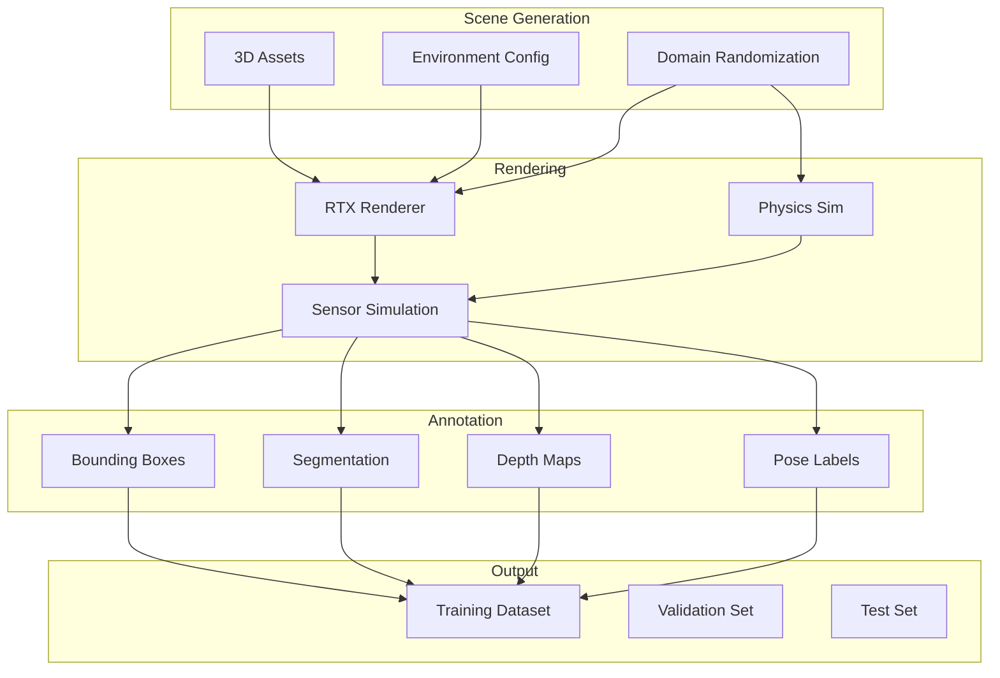
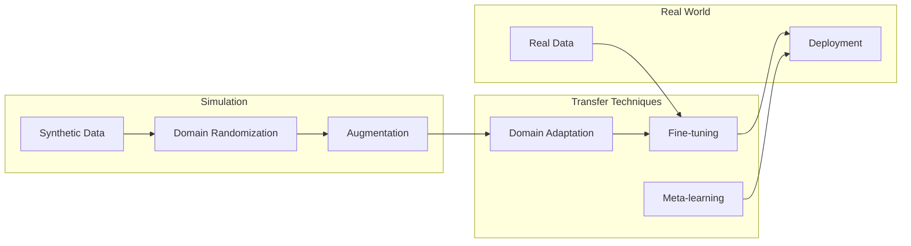

# Synthetic Data Generation

## The Need for Synthetic Data

Training robust perception and control models for humanoid robots requires vast amounts of labeled data. However, collecting and annotating real-world data is expensive, time-consuming, and often dangerous. **Synthetic data generation** offers a solution by creating unlimited, perfectly labeled training data in simulation.

:::info Why Synthetic Data for Humanoids?
Humanoid robots encounter diverse scenarios—object manipulation, human interaction, fall recovery—that are difficult or dangerous to capture in real-world data collection. Synthetic data enables safe training for these edge cases.
:::

## Synthetic Data Pipeline



## Isaac Sim Replicator

NVIDIA Isaac Sim includes **Replicator**, a powerful synthetic data generation framework:

```python
import omni.replicator.core as rep
from omni.isaac.core import World

class HumanoidSyntheticDataGenerator:
    """Generate synthetic training data for humanoid perception."""

    def __init__(self, output_dir: str, num_frames: int = 10000):
        self.output_dir = output_dir
        self.num_frames = num_frames

        # Initialize world
        self.world = World()

    def setup_scene(self):
        """Configure scene for data generation."""
        # Add ground plane with material variation
        with rep.new_layer():
            # Ground with random textures
            ground = rep.create.plane(
                scale=10,
                position=(0, 0, 0)
            )

            # Randomize ground material
            with rep.trigger.on_frame():
                rep.modify.pose(
                    ground,
                    rotation=rep.distribution.uniform(
                        (0, 0, 0),
                        (0, 0, 360)
                    )
                )

    def setup_lighting(self):
        """Configure lighting with randomization."""
        with rep.new_layer():
            # Dome light for ambient illumination
            dome_light = rep.create.light(
                light_type="dome",
                intensity=rep.distribution.uniform(500, 2000),
                temperature=rep.distribution.uniform(4000, 8000)
            )

            # Directional light (sun)
            sun = rep.create.light(
                light_type="distant",
                intensity=rep.distribution.uniform(1000, 5000),
                rotation=rep.distribution.uniform(
                    (-60, -180, 0),
                    (-20, 180, 0)
                )
            )

    def setup_objects(self):
        """Add objects with domain randomization."""
        with rep.new_layer():
            # Common household objects
            object_paths = [
                "omniverse://localhost/NVIDIA/Assets/Objects/cup.usd",
                "omniverse://localhost/NVIDIA/Assets/Objects/bottle.usd",
                "omniverse://localhost/NVIDIA/Assets/Objects/book.usd",
                "omniverse://localhost/NVIDIA/Assets/Objects/bowl.usd",
            ]

            def spawn_objects():
                objects = rep.randomizer.instantiate(
                    object_paths,
                    size=rep.distribution.choice([5, 10, 15]),
                    mode="scene_instance"
                )

                with objects:
                    rep.modify.pose(
                        position=rep.distribution.uniform(
                            (-2, -2, 0.5),
                            (2, 2, 1.5)
                        ),
                        rotation=rep.distribution.uniform(
                            (0, 0, 0),
                            (360, 360, 360)
                        ),
                        scale=rep.distribution.uniform(0.8, 1.2)
                    )

                    # Randomize materials
                    rep.randomizer.materials(
                        objects,
                        materials=rep.distribution.choice([
                            "OmniPBR",
                            "OmniGlass",
                            "OmniSurface"
                        ])
                    )

                return objects

            rep.randomizer.register(spawn_objects)

    def setup_camera(self):
        """Configure camera with humanoid head perspective."""
        camera = rep.create.camera(
            position=(0, 0, 1.6),  # Humanoid eye height
            rotation=(0, 0, 0),
            focal_length=24,
            f_stop=2.8
        )

        # Randomize camera pose (simulating head movement)
        with rep.trigger.on_frame():
            rep.modify.pose(
                camera,
                position=rep.distribution.uniform(
                    (-0.5, -0.5, 1.4),
                    (0.5, 0.5, 1.8)
                ),
                rotation=rep.distribution.uniform(
                    (-30, -45, -10),
                    (30, 45, 10)
                )
            )

        return camera

    def setup_writers(self, camera):
        """Configure output writers for annotations."""
        # Render product
        render_product = rep.create.render_product(camera, (640, 480))

        # Basic RGB writer
        rgb_writer = rep.WriterRegistry.get("BasicWriter")
        rgb_writer.initialize(
            output_dir=f"{self.output_dir}/rgb",
            rgb=True
        )
        rgb_writer.attach(render_product)

        # Semantic segmentation
        seg_writer = rep.WriterRegistry.get("BasicWriter")
        seg_writer.initialize(
            output_dir=f"{self.output_dir}/segmentation",
            semantic_segmentation=True,
            colorize_semantic_segmentation=True
        )
        seg_writer.attach(render_product)

        # Depth
        depth_writer = rep.WriterRegistry.get("BasicWriter")
        depth_writer.initialize(
            output_dir=f"{self.output_dir}/depth",
            distance_to_camera=True,
            distance_to_image_plane=True
        )
        depth_writer.attach(render_product)

        # Bounding boxes
        bbox_writer = rep.WriterRegistry.get("BasicWriter")
        bbox_writer.initialize(
            output_dir=f"{self.output_dir}/bbox",
            bounding_box_2d_tight=True,
            bounding_box_2d_loose=True,
            bounding_box_3d=True
        )
        bbox_writer.attach(render_product)

        # Instance segmentation
        instance_writer = rep.WriterRegistry.get("BasicWriter")
        instance_writer.initialize(
            output_dir=f"{self.output_dir}/instance",
            instance_segmentation=True
        )
        instance_writer.attach(render_product)

    def generate(self):
        """Run data generation."""
        self.setup_scene()
        self.setup_lighting()
        self.setup_objects()
        camera = self.setup_camera()
        self.setup_writers(camera)

        # Run generation
        with rep.trigger.on_frame(num_frames=self.num_frames):
            rep.randomizer.spawn_objects()

        rep.orchestrator.run()
```

## Domain Randomization

### Comprehensive Randomization Strategy

```python
class DomainRandomizer:
    """Domain randomization for sim-to-real transfer."""

    def __init__(self):
        self.randomization_params = {
            # Visual randomization
            "texture": True,
            "lighting": True,
            "camera": True,
            "color": True,

            # Physical randomization
            "mass": True,
            "friction": True,
            "damping": True,

            # Geometric randomization
            "scale": True,
            "position": True,
            "rotation": True
        }

    def randomize_textures(self, objects):
        """Apply random textures to objects."""
        texture_paths = [
            "/textures/wood/*.png",
            "/textures/metal/*.png",
            "/textures/fabric/*.png",
            "/textures/plastic/*.png"
        ]

        with rep.trigger.on_frame():
            for obj in objects:
                # Random texture selection
                texture = rep.distribution.choice(texture_paths)

                # Random UV scale
                uv_scale = rep.distribution.uniform(0.5, 2.0)

                rep.modify.material(
                    obj,
                    diffuse_texture=texture,
                    uv_scale=uv_scale
                )

    def randomize_lighting(self):
        """Randomize scene lighting conditions."""
        configs = {
            "indoor_office": {
                "ambient": (0.3, 0.5),
                "directional": (0.5, 1.0),
                "temperature": (4000, 6500)
            },
            "indoor_home": {
                "ambient": (0.2, 0.4),
                "directional": (0.3, 0.8),
                "temperature": (2700, 4000)
            },
            "outdoor_day": {
                "ambient": (0.5, 0.8),
                "directional": (1.0, 3.0),
                "temperature": (5500, 6500)
            },
            "outdoor_overcast": {
                "ambient": (0.4, 0.6),
                "directional": (0.2, 0.5),
                "temperature": (6000, 7500)
            }
        }

        return rep.distribution.choice(list(configs.values()))

    def randomize_camera_intrinsics(self):
        """Randomize camera parameters."""
        return {
            "focal_length": rep.distribution.uniform(18, 35),
            "f_stop": rep.distribution.uniform(1.4, 8.0),
            "focus_distance": rep.distribution.uniform(0.5, 5.0),
            "sensor_width": rep.distribution.uniform(32, 36),
            "sensor_height": rep.distribution.uniform(18, 24)
        }

    def randomize_physics(self, robot):
        """Randomize physical properties for robust control."""
        # Mass randomization (±15%)
        for link in robot.links:
            original_mass = link.get_mass()
            new_mass = original_mass * np.random.uniform(0.85, 1.15)
            link.set_mass(new_mass)

        # Friction randomization
        for link in robot.links:
            friction = np.random.uniform(0.3, 1.2)
            link.set_friction(friction)

        # Joint damping randomization
        for joint in robot.joints:
            damping = joint.get_damping() * np.random.uniform(0.7, 1.3)
            joint.set_damping(damping)

        # Motor strength randomization
        for joint in robot.joints:
            max_effort = joint.get_max_effort() * np.random.uniform(0.9, 1.1)
            joint.set_max_effort(max_effort)
```

## Annotation Types

### Comprehensive Labeling

```python
from dataclasses import dataclass
from typing import List, Dict, Tuple
import numpy as np

@dataclass
class ObjectAnnotation:
    """Complete annotation for a detected object."""
    class_name: str
    class_id: int
    instance_id: int

    # 2D bounding box [x_min, y_min, x_max, y_max]
    bbox_2d_tight: Tuple[int, int, int, int]
    bbox_2d_loose: Tuple[int, int, int, int]

    # 3D bounding box [center, dimensions, rotation]
    bbox_3d_center: np.ndarray
    bbox_3d_dimensions: np.ndarray
    bbox_3d_rotation: np.ndarray

    # Segmentation mask (binary)
    segmentation_mask: np.ndarray

    # Object pose in world frame
    pose_world: np.ndarray  # 4x4 transform

    # Visibility and occlusion
    visibility: float  # 0-1
    truncation: float  # 0-1
    occlusion_level: int  # 0: fully visible, 3: heavily occluded

@dataclass
class FrameAnnotation:
    """Complete annotation for a single frame."""
    frame_id: int
    timestamp: float

    # Camera information
    camera_intrinsics: np.ndarray  # 3x3 matrix
    camera_extrinsics: np.ndarray  # 4x4 matrix
    camera_distortion: np.ndarray  # Distortion coefficients

    # Image data paths
    rgb_path: str
    depth_path: str
    semantic_path: str
    instance_path: str

    # Object annotations
    objects: List[ObjectAnnotation]

    # Robot state (if applicable)
    robot_joint_positions: np.ndarray
    robot_joint_velocities: np.ndarray
    robot_base_pose: np.ndarray

class AnnotationWriter:
    """Write annotations in various formats."""

    def __init__(self, output_dir: str):
        self.output_dir = output_dir

    def write_coco_format(self, annotations: List[FrameAnnotation]):
        """Write annotations in COCO format."""
        coco_data = {
            "images": [],
            "annotations": [],
            "categories": []
        }

        annotation_id = 0
        categories_seen = set()

        for frame in annotations:
            # Add image entry
            coco_data["images"].append({
                "id": frame.frame_id,
                "file_name": frame.rgb_path,
                "width": 640,  # Adjust as needed
                "height": 480
            })

            for obj in frame.objects:
                # Add category if new
                if obj.class_id not in categories_seen:
                    coco_data["categories"].append({
                        "id": obj.class_id,
                        "name": obj.class_name
                    })
                    categories_seen.add(obj.class_id)

                # Convert bbox to COCO format [x, y, width, height]
                x_min, y_min, x_max, y_max = obj.bbox_2d_tight
                width = x_max - x_min
                height = y_max - y_min

                # Add annotation entry
                coco_data["annotations"].append({
                    "id": annotation_id,
                    "image_id": frame.frame_id,
                    "category_id": obj.class_id,
                    "bbox": [x_min, y_min, width, height],
                    "area": width * height,
                    "iscrowd": 0,
                    "segmentation": self._mask_to_rle(obj.segmentation_mask)
                })
                annotation_id += 1

        # Save to JSON
        import json
        with open(f"{self.output_dir}/annotations.json", 'w') as f:
            json.dump(coco_data, f)

    def write_kitti_format(self, annotations: List[FrameAnnotation]):
        """Write annotations in KITTI format."""
        for frame in annotations:
            label_path = f"{self.output_dir}/labels/{frame.frame_id:06d}.txt"

            with open(label_path, 'w') as f:
                for obj in frame.objects:
                    # KITTI format:
                    # type truncated occluded alpha bbox(4) dimensions(3) location(3) rotation_y
                    line = f"{obj.class_name} "
                    line += f"{obj.truncation:.2f} "
                    line += f"{obj.occlusion_level} "
                    line += f"0.0 "  # Alpha (observation angle)
                    line += f"{obj.bbox_2d_tight[0]} {obj.bbox_2d_tight[1]} "
                    line += f"{obj.bbox_2d_tight[2]} {obj.bbox_2d_tight[3]} "
                    line += f"{obj.bbox_3d_dimensions[0]:.2f} "
                    line += f"{obj.bbox_3d_dimensions[1]:.2f} "
                    line += f"{obj.bbox_3d_dimensions[2]:.2f} "
                    line += f"{obj.bbox_3d_center[0]:.2f} "
                    line += f"{obj.bbox_3d_center[1]:.2f} "
                    line += f"{obj.bbox_3d_center[2]:.2f} "
                    line += f"{obj.bbox_3d_rotation[2]:.2f}\n"

                    f.write(line)

    def _mask_to_rle(self, mask: np.ndarray) -> dict:
        """Convert binary mask to RLE encoding."""
        # Flatten and find run lengths
        pixels = mask.flatten()
        runs = np.where(pixels[1:] != pixels[:-1])[0] + 1
        runs = np.concatenate([[0], runs, [len(pixels)]])
        counts = runs[1:] - runs[:-1]

        return {
            "counts": counts.tolist(),
            "size": list(mask.shape)
        }
```

## Human Pose Data Generation

### Synthetic Human Data for HRI

```python
class HumanPoseGenerator:
    """Generate synthetic human pose data for HRI training."""

    def __init__(self):
        # Human body model (e.g., SMPL)
        self.body_model_paths = [
            "omniverse://localhost/NVIDIA/Assets/Characters/human_male.usd",
            "omniverse://localhost/NVIDIA/Assets/Characters/human_female.usd"
        ]

        # Motion capture data for realistic poses
        self.motion_data_paths = [
            "/data/mocap/walking/",
            "/data/mocap/gesturing/",
            "/data/mocap/sitting/",
            "/data/mocap/reaching/"
        ]

    def setup_human_agents(self, num_humans: int = 3):
        """Setup human agents in scene."""
        with rep.new_layer():
            humans = []

            for i in range(num_humans):
                # Random human model
                human_path = rep.distribution.choice(self.body_model_paths)
                human = rep.create.from_usd(human_path)

                # Random clothing textures
                rep.modify.material(
                    human,
                    diffuse_texture=rep.distribution.choice([
                        "/textures/clothing/casual/*.png",
                        "/textures/clothing/formal/*.png"
                    ])
                )

                humans.append(human)

            return humans

    def animate_humans(self, humans, frame_range: Tuple[int, int]):
        """Apply motion capture animations."""
        for human in humans:
            # Select random motion sequence
            motion_path = rep.distribution.choice(self.motion_data_paths)

            # Apply animation with random offset
            start_frame = rep.distribution.uniform(0, 100)

            rep.modify.animation(
                human,
                animation_path=motion_path,
                start_frame=start_frame,
                loop=True
            )

    def get_skeleton_annotations(self, human) -> Dict:
        """Extract skeleton keypoint annotations."""
        # Standard body keypoints
        keypoint_names = [
            "nose", "left_eye", "right_eye",
            "left_ear", "right_ear",
            "left_shoulder", "right_shoulder",
            "left_elbow", "right_elbow",
            "left_wrist", "right_wrist",
            "left_hip", "right_hip",
            "left_knee", "right_knee",
            "left_ankle", "right_ankle"
        ]

        keypoints = {}
        for name in keypoint_names:
            # Get world position of keypoint
            joint = human.get_joint(name)
            pos_3d = joint.get_world_position()

            # Project to image coordinates
            pos_2d = self.project_to_image(pos_3d)

            # Visibility (0: not visible, 1: occluded, 2: visible)
            visibility = self.compute_visibility(joint)

            keypoints[name] = {
                "position_3d": pos_3d,
                "position_2d": pos_2d,
                "visibility": visibility
            }

        return keypoints
```

## Training Data Validation

### Dataset Quality Metrics

```python
class DatasetValidator:
    """Validate synthetic dataset quality."""

    def __init__(self, dataset_path: str):
        self.dataset_path = dataset_path

    def compute_statistics(self) -> Dict:
        """Compute dataset statistics."""
        stats = {
            "total_images": 0,
            "total_objects": 0,
            "class_distribution": {},
            "occlusion_distribution": {},
            "bbox_size_distribution": [],
            "depth_range": {"min": float('inf'), "max": 0}
        }

        # Iterate through dataset
        for frame in self.load_frames():
            stats["total_images"] += 1
            stats["total_objects"] += len(frame.objects)

            for obj in frame.objects:
                # Class distribution
                if obj.class_name not in stats["class_distribution"]:
                    stats["class_distribution"][obj.class_name] = 0
                stats["class_distribution"][obj.class_name] += 1

                # Occlusion distribution
                occ_key = f"level_{obj.occlusion_level}"
                if occ_key not in stats["occlusion_distribution"]:
                    stats["occlusion_distribution"][occ_key] = 0
                stats["occlusion_distribution"][occ_key] += 1

                # Bounding box sizes
                bbox = obj.bbox_2d_tight
                area = (bbox[2] - bbox[0]) * (bbox[3] - bbox[1])
                stats["bbox_size_distribution"].append(area)

        return stats

    def check_annotation_quality(self, frame: FrameAnnotation) -> List[str]:
        """Check for annotation quality issues."""
        issues = []

        for obj in frame.objects:
            # Check for empty bounding boxes
            bbox = obj.bbox_2d_tight
            if bbox[2] <= bbox[0] or bbox[3] <= bbox[1]:
                issues.append(f"Invalid bbox for {obj.class_name}: {bbox}")

            # Check for out-of-frame objects
            if bbox[0] < 0 or bbox[1] < 0:
                issues.append(f"Object {obj.class_name} partially out of frame")

            # Check segmentation mask consistency
            mask_area = obj.segmentation_mask.sum()
            bbox_area = (bbox[2] - bbox[0]) * (bbox[3] - bbox[1])
            if mask_area > bbox_area * 1.1:
                issues.append(f"Mask larger than bbox for {obj.class_name}")

        return issues

    def visualize_distribution(self, stats: Dict):
        """Visualize dataset statistics."""
        import matplotlib.pyplot as plt

        fig, axes = plt.subplots(2, 2, figsize=(12, 10))

        # Class distribution
        axes[0, 0].bar(
            stats["class_distribution"].keys(),
            stats["class_distribution"].values()
        )
        axes[0, 0].set_title("Class Distribution")
        axes[0, 0].tick_params(axis='x', rotation=45)

        # Occlusion distribution
        axes[0, 1].bar(
            stats["occlusion_distribution"].keys(),
            stats["occlusion_distribution"].values()
        )
        axes[0, 1].set_title("Occlusion Distribution")

        # Bounding box sizes
        axes[1, 0].hist(stats["bbox_size_distribution"], bins=50)
        axes[1, 0].set_title("Bounding Box Size Distribution")
        axes[1, 0].set_xlabel("Area (pixels)")

        plt.tight_layout()
        plt.savefig(f"{self.dataset_path}/statistics.png")
```

## Sim-to-Real Transfer

### Bridging the Reality Gap



### Domain Adaptation Strategies

```python
class SimToRealAdapter:
    """Techniques for sim-to-real transfer."""

    def __init__(self):
        self.strategies = [
            "domain_randomization",
            "domain_adaptation",
            "progressive_training",
            "real_data_finetuning"
        ]

    def progressive_training(self, model, syn_data, real_data):
        """
        Progressive training from synthetic to real data.

        1. Train on synthetic data with heavy augmentation
        2. Gradually introduce real data
        3. Fine-tune on real data with reduced learning rate
        """
        # Phase 1: Synthetic only
        for epoch in range(10):
            train_synthetic(model, syn_data, augmentation="heavy")

        # Phase 2: Mixed training
        for epoch in range(10):
            ratio = epoch / 10  # 0% to 100% real data
            train_mixed(model, syn_data, real_data, real_ratio=ratio)

        # Phase 3: Real data fine-tuning
        for epoch in range(5):
            train_real(model, real_data, lr=0.0001)

        return model

    def apply_sim2real_augmentation(self, synthetic_image):
        """Apply augmentations to make synthetic data more realistic."""
        augmentations = [
            # Color jittering
            A.ColorJitter(brightness=0.3, contrast=0.3, saturation=0.3, hue=0.1),

            # Blur (camera focus simulation)
            A.OneOf([
                A.MotionBlur(blur_limit=5),
                A.GaussianBlur(blur_limit=5),
                A.MedianBlur(blur_limit=5)
            ]),

            # Noise (sensor noise simulation)
            A.OneOf([
                A.GaussNoise(var_limit=(10, 50)),
                A.ISONoise(color_shift=(0.01, 0.05)),
                A.MultiplicativeNoise()
            ]),

            # Compression artifacts
            A.ImageCompression(quality_lower=70, quality_upper=100),

            # Lighting variations
            A.RandomBrightnessContrast(brightness_limit=0.2, contrast_limit=0.2),
            A.RandomGamma(gamma_limit=(80, 120))
        ]

        transform = A.Compose(augmentations)
        return transform(image=synthetic_image)["image"]
```

## Summary

Synthetic data generation is crucial for training humanoid perception systems:

- **Isaac Sim Replicator** provides a complete pipeline for generating labeled data
- **Domain randomization** helps bridge the sim-to-real gap
- **Comprehensive annotations** include 2D/3D bboxes, segmentation, depth, and pose
- **Human pose generation** enables training for human-robot interaction
- **Validation tools** ensure dataset quality before training

By leveraging synthetic data, we can train robust perception models for scenarios that would be dangerous, expensive, or impossible to capture in real-world data collection.

## Exercises

1. Generate a synthetic dataset of 1000 images with household objects
2. Implement domain randomization for lighting, textures, and object poses
3. Create annotations in COCO format for object detection training
4. Generate human pose data for gesture recognition
5. Validate dataset quality and visualize statistics

## Further Reading

- [Isaac Sim Replicator Documentation](https://docs.omniverse.nvidia.com/isaacsim/latest/replicator_tutorials/)
- [Domain Randomization for Sim-to-Real](https://arxiv.org/abs/1703.06907)
- [Synthetic Data for Deep Learning](https://arxiv.org/abs/2109.11512)
