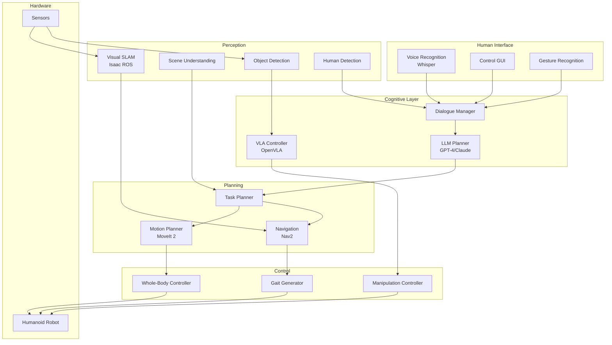

# Capstone: Autonomous Humanoid

## Bringing It All Together

This capstone project integrates all concepts from the course into a complete autonomous humanoid system. You'll build a robot that can understand voice commands, perceive its environment, plan tasks, and execute actions—operating as a helpful assistant in human spaces.

:::info Project Goal
Create an autonomous humanoid robot that can receive natural language commands, understand its environment, plan multi-step tasks, and execute them reliably while handling failures gracefully.
:::

## System Architecture



## Project Components

### 1. Core System Integration

```python
import rclpy
from rclpy.node import Node
from rclpy.executors import MultiThreadedExecutor
from rclpy.callback_groups import ReentrantCallbackGroup
import asyncio

class AutonomousHumanoidSystem:
    """Main system integrating all humanoid capabilities."""

    def __init__(self):
        rclpy.init()

        # Create callback groups for concurrent execution
        self.perception_group = ReentrantCallbackGroup()
        self.planning_group = ReentrantCallbackGroup()
        self.control_group = ReentrantCallbackGroup()

        # Initialize subsystems
        self.perception = PerceptionSystem()
        self.planning = PlanningSystem()
        self.control = ControlSystem()
        self.dialogue = DialogueSystem()

        # System state
        self.current_task = None
        self.robot_state = RobotState()

        # Multi-threaded executor
        self.executor = MultiThreadedExecutor(num_threads=8)

    def start(self):
        """Start all subsystems."""
        self.perception.start()
        self.planning.start()
        self.control.start()
        self.dialogue.start()

        # Add nodes to executor
        self.executor.add_node(self.perception.node)
        self.executor.add_node(self.planning.node)
        self.executor.add_node(self.control.node)
        self.executor.add_node(self.dialogue.node)

        print("Autonomous Humanoid System started")

    def spin(self):
        """Run the system."""
        try:
            self.executor.spin()
        except KeyboardInterrupt:
            self.shutdown()

    def shutdown(self):
        """Clean shutdown."""
        self.perception.stop()
        self.planning.stop()
        self.control.stop()
        self.dialogue.stop()
        rclpy.shutdown()


class PerceptionSystem:
    """Unified perception for the humanoid."""

    def __init__(self):
        self.node = rclpy.create_node('perception_system')

        # Visual SLAM
        self.vslam = VisualSLAM()

        # Object detection
        self.detector = ObjectDetector()

        # Scene understanding
        self.scene_graph = SceneGraphBuilder()

        # Human tracking
        self.human_tracker = HumanTracker()

    def get_scene_state(self) -> SceneState:
        """Get current scene understanding."""
        return SceneState(
            objects=self.detector.get_detections(),
            scene_graph=self.scene_graph.get_current(),
            robot_pose=self.vslam.get_pose(),
            humans=self.human_tracker.get_tracked()
        )


class PlanningSystem:
    """Task and motion planning."""

    def __init__(self):
        self.node = rclpy.create_node('planning_system')

        # LLM task planner
        self.task_planner = LLMTaskPlanner()

        # Motion planner (MoveIt 2)
        self.motion_planner = MotionPlanner()

        # Navigation planner (Nav2)
        self.nav_planner = NavigationPlanner()

        # Current plan
        self.current_plan = None

    async def plan_task(self, goal: str, scene: SceneState) -> TaskPlan:
        """Create a task plan from natural language goal."""
        # Get LLM plan
        self.current_plan = self.task_planner.plan(
            goal=goal,
            scene_context=scene.to_dict(),
            robot_state=self.get_robot_state()
        )

        return self.current_plan

    async def execute_plan(self, plan: TaskPlan) -> bool:
        """Execute a task plan step by step."""
        for step in plan.steps:
            success = await self.execute_step(step)

            if not success:
                # Attempt replanning
                new_plan = self.task_planner.replan(
                    original_plan=plan,
                    failed_step=step,
                    failure_reason=self.get_failure_reason(),
                    scene_context=self.get_current_scene()
                )

                if new_plan:
                    return await self.execute_plan(new_plan)
                else:
                    return False

        return True

    async def execute_step(self, step: TaskStep) -> bool:
        """Execute a single task step."""
        if step.action == 'navigate':
            return await self.nav_planner.navigate_to(step.parameters['location'])
        elif step.action == 'pick':
            return await self.execute_pick(step.parameters['object'])
        elif step.action == 'place':
            return await self.execute_place(
                step.parameters['object'],
                step.parameters['location']
            )
        # ... handle other actions

        return True


class ControlSystem:
    """Robot control and execution."""

    def __init__(self):
        self.node = rclpy.create_node('control_system')

        # Whole-body controller
        self.whole_body = WholeBodyController()

        # Gait generator
        self.gait = GaitGenerator()

        # Manipulation controller
        self.manipulation = ManipulationController()

        # Safety monitor
        self.safety = SafetyMonitor()

    def execute_trajectory(self, trajectory):
        """Execute a planned trajectory."""
        if not self.safety.check_trajectory(trajectory):
            return False

        return self.whole_body.execute(trajectory)


class DialogueSystem:
    """Voice and dialogue management."""

    def __init__(self):
        self.node = rclpy.create_node('dialogue_system')

        # Speech recognition
        self.asr = WhisperASR()

        # Intent understanding
        self.nlu = LLMIntentUnderstanding()

        # Conversation manager
        self.conversation = ConversationManager()

        # Text-to-speech
        self.tts = TextToSpeech()

    async def process_voice_input(self, audio) -> str:
        """Process voice input and return robot response."""
        # Transcribe
        text = self.asr.transcribe(audio)

        # Understand intent
        intent = self.nlu.understand(text)

        # Generate response and action
        response = await self.conversation.process(text, intent)

        # Speak response
        self.tts.speak(response.text)

        return response.action
```

### 2. State Machine for Task Execution

```python
from enum import Enum, auto
from dataclasses import dataclass
from typing import Callable, Dict, Any

class RobotState(Enum):
    """Robot operating states."""
    IDLE = auto()
    LISTENING = auto()
    PLANNING = auto()
    EXECUTING = auto()
    ERROR = auto()
    RECOVERING = auto()

@dataclass
class StateTransition:
    """Transition between states."""
    from_state: RobotState
    to_state: RobotState
    condition: Callable[[], bool]
    action: Callable[[], None]

class TaskStateMachine:
    """State machine for managing task execution."""

    def __init__(self, humanoid_system):
        self.system = humanoid_system
        self.current_state = RobotState.IDLE
        self.current_task = None

        # Define transitions
        self.transitions = [
            StateTransition(
                RobotState.IDLE,
                RobotState.LISTENING,
                lambda: self.voice_detected(),
                lambda: self.start_listening()
            ),
            StateTransition(
                RobotState.LISTENING,
                RobotState.PLANNING,
                lambda: self.command_received(),
                lambda: self.start_planning()
            ),
            StateTransition(
                RobotState.PLANNING,
                RobotState.EXECUTING,
                lambda: self.plan_ready(),
                lambda: self.start_execution()
            ),
            StateTransition(
                RobotState.EXECUTING,
                RobotState.IDLE,
                lambda: self.task_complete(),
                lambda: self.finish_task()
            ),
            StateTransition(
                RobotState.EXECUTING,
                RobotState.ERROR,
                lambda: self.error_occurred(),
                lambda: self.handle_error()
            ),
            StateTransition(
                RobotState.ERROR,
                RobotState.RECOVERING,
                lambda: self.can_recover(),
                lambda: self.start_recovery()
            ),
            StateTransition(
                RobotState.RECOVERING,
                RobotState.EXECUTING,
                lambda: self.recovery_complete(),
                lambda: self.resume_execution()
            ),
        ]

    def update(self):
        """Update state machine."""
        for transition in self.transitions:
            if (self.current_state == transition.from_state and
                transition.condition()):
                transition.action()
                self.current_state = transition.to_state
                print(f"State: {self.current_state.name}")
                break

    async def run(self):
        """Main state machine loop."""
        while True:
            self.update()
            await asyncio.sleep(0.1)
```

### 3. Error Handling and Recovery

```python
from dataclasses import dataclass
from typing import Optional, List
from enum import Enum

class ErrorType(Enum):
    """Types of errors that can occur."""
    PERCEPTION_FAILURE = "perception_failure"
    PLANNING_FAILURE = "planning_failure"
    EXECUTION_FAILURE = "execution_failure"
    HARDWARE_FAILURE = "hardware_failure"
    SAFETY_VIOLATION = "safety_violation"

@dataclass
class Error:
    """Error information."""
    type: ErrorType
    message: str
    step: Optional[TaskStep] = None
    recoverable: bool = True

class ErrorHandler:
    """Handle errors and coordinate recovery."""

    def __init__(self, humanoid_system):
        self.system = humanoid_system
        self.error_log: List[Error] = []

        # Recovery strategies
        self.recovery_strategies = {
            ErrorType.PERCEPTION_FAILURE: self.recover_perception,
            ErrorType.PLANNING_FAILURE: self.recover_planning,
            ErrorType.EXECUTION_FAILURE: self.recover_execution,
            ErrorType.HARDWARE_FAILURE: self.recover_hardware,
            ErrorType.SAFETY_VIOLATION: self.recover_safety,
        }

    async def handle_error(self, error: Error) -> bool:
        """
        Handle an error and attempt recovery.

        Args:
            error: Error information

        Returns:
            True if recovered, False otherwise
        """
        self.error_log.append(error)
        print(f"Error: {error.type.value} - {error.message}")

        if not error.recoverable:
            await self.safe_stop()
            return False

        # Get recovery strategy
        strategy = self.recovery_strategies.get(error.type)
        if strategy:
            return await strategy(error)

        return False

    async def recover_perception(self, error: Error) -> bool:
        """Recover from perception failure."""
        # Try different recovery actions
        actions = [
            self.move_head_for_better_view,
            self.switch_to_backup_sensors,
            self.request_scene_rescan
        ]

        for action in actions:
            if await action():
                return True

        return False

    async def recover_execution(self, error: Error) -> bool:
        """Recover from execution failure."""
        if error.step:
            # Get current scene
            scene = self.system.perception.get_scene_state()

            # Ask LLM for recovery plan
            recovery = self.system.planning.task_planner.replan(
                original_plan=self.system.planning.current_plan,
                failed_step=error.step,
                failure_reason=error.message,
                scene_context=scene.to_dict()
            )

            if recovery:
                return await self.system.planning.execute_plan(recovery)

        return False

    async def recover_safety(self, error: Error) -> bool:
        """Recover from safety violation."""
        # First, ensure safe state
        await self.safe_stop()

        # Wait for situation to clear
        await asyncio.sleep(2.0)

        # Check if safe to resume
        if self.system.control.safety.is_safe():
            return True

        # Request human assistance
        self.system.dialogue.tts.speak(
            "I've encountered a safety issue. Please help me."
        )

        return False

    async def safe_stop(self):
        """Bring robot to safe stop."""
        self.system.control.whole_body.stop()
        self.system.control.manipulation.release_all()
```

### 4. Demonstration Scenario

```python
async def demonstrate_fetch_task(system: AutonomousHumanoidSystem):
    """
    Demonstrate a complete fetch task.

    Scenario: User asks robot to "bring me the water bottle from the kitchen"
    """
    print("=== Autonomous Humanoid Demo ===\n")

    # 1. Voice Command
    print("1. Receiving voice command...")
    command = "Hey robot, can you bring me the water bottle from the kitchen?"
    print(f"   User: '{command}'")

    # 2. Intent Understanding
    print("\n2. Understanding intent...")
    intent = system.dialogue.nlu.understand(command)
    print(f"   Intent: {intent['intent']}")
    print(f"   Objects: {intent['objects']}")
    print(f"   Locations: {intent['locations']}")

    # 3. Scene Understanding
    print("\n3. Analyzing current scene...")
    scene = system.perception.get_scene_state()
    print(f"   Current room: {scene.scene_graph.room_type}")
    print(f"   Detected objects: {[o.label for o in scene.objects[:5]]}")

    # 4. Task Planning
    print("\n4. Planning task...")
    plan = await system.planning.plan_task(
        goal="Bring the water bottle from the kitchen to the user",
        scene=scene
    )

    print("   Plan steps:")
    for step in plan.steps:
        print(f"   {step.id}. {step.action}({step.parameters})")

    # 5. Execution
    print("\n5. Executing plan...")

    for step in plan.steps:
        print(f"   Executing: {step.action}...")

        # Navigate to kitchen
        if step.action == 'navigate' and step.parameters['location'] == 'kitchen':
            print("   - Planning path to kitchen")
            print("   - Navigating...")
            await asyncio.sleep(2)  # Simulate navigation
            print("   - Arrived at kitchen")

        # Find bottle
        elif step.action == 'look_for':
            print("   - Scanning for water bottle")
            print("   - Found water bottle on counter")

        # Pick up bottle
        elif step.action == 'pick':
            print("   - Approaching bottle")
            print("   - Grasping bottle")
            print("   - Lifting bottle")
            await asyncio.sleep(1)
            print("   - Bottle secured")

        # Return to user
        elif step.action == 'navigate' and 'user' in step.parameters.get('location', ''):
            print("   - Returning to user")
            await asyncio.sleep(2)
            print("   - Arrived at user location")

        # Hand over
        elif step.action == 'give':
            print("   - Extending arm")
            print("   - Waiting for user to take bottle")
            print("   - Released bottle")

    # 6. Completion
    print("\n6. Task complete!")
    system.dialogue.tts.speak("Here's your water bottle!")

    print("\n=== Demo Complete ===")


# Run demo
if __name__ == '__main__':
    system = AutonomousHumanoidSystem()
    system.start()

    asyncio.run(demonstrate_fetch_task(system))

    system.shutdown()
```

## Evaluation Metrics

### Performance Assessment

```python
@dataclass
class CapstoneMetrics:
    """Metrics for evaluating capstone project."""

    # Task completion
    tasks_attempted: int = 0
    tasks_completed: int = 0
    completion_rate: float = 0.0

    # Voice understanding
    transcription_accuracy: float = 0.0
    intent_accuracy: float = 0.0

    # Navigation
    navigation_success_rate: float = 0.0
    average_navigation_time: float = 0.0

    # Manipulation
    grasp_success_rate: float = 0.0
    placement_accuracy: float = 0.0

    # Safety
    safety_violations: int = 0
    successful_recoveries: int = 0

    # Latency
    voice_to_action_latency: float = 0.0
    planning_time: float = 0.0

class CapstoneEvaluator:
    """Evaluate capstone project performance."""

    def __init__(self):
        self.metrics = CapstoneMetrics()

    def evaluate(self, test_scenarios: List[TestScenario]) -> CapstoneMetrics:
        """
        Run evaluation on test scenarios.

        Args:
            test_scenarios: List of test scenarios to evaluate

        Returns:
            Computed metrics
        """
        for scenario in test_scenarios:
            result = self.run_scenario(scenario)
            self.update_metrics(result)

        self.compute_final_metrics()
        return self.metrics

    def generate_report(self) -> str:
        """Generate evaluation report."""
        report = f"""
=== Capstone Project Evaluation Report ===

Task Completion:
  - Attempted: {self.metrics.tasks_attempted}
  - Completed: {self.metrics.tasks_completed}
  - Rate: {self.metrics.completion_rate:.1%}

Voice Understanding:
  - Transcription: {self.metrics.transcription_accuracy:.1%}
  - Intent: {self.metrics.intent_accuracy:.1%}

Navigation:
  - Success Rate: {self.metrics.navigation_success_rate:.1%}
  - Avg Time: {self.metrics.average_navigation_time:.1f}s

Manipulation:
  - Grasp Success: {self.metrics.grasp_success_rate:.1%}
  - Placement Accuracy: {self.metrics.placement_accuracy:.1%}

Safety:
  - Violations: {self.metrics.safety_violations}
  - Recoveries: {self.metrics.successful_recoveries}

Latency:
  - Voice-to-Action: {self.metrics.voice_to_action_latency:.2f}s
  - Planning Time: {self.metrics.planning_time:.2f}s

===========================================
"""
        return report
```

## Project Milestones

### Implementation Checklist

| Milestone | Components | Assessment |
|-----------|------------|------------|
| **M1: Perception** | VSLAM, Object Detection, Scene Graph | Can build scene representation |
| **M2: Voice Interface** | Whisper ASR, Intent Parsing, TTS | Understands voice commands |
| **M3: Task Planning** | LLM Integration, Plan Generation | Creates valid task plans |
| **M4: Navigation** | Nav2, Path Planning, Obstacle Avoidance | Navigates safely |
| **M5: Manipulation** | MoveIt 2, Grasp Planning, Execution | Manipulates objects |
| **M6: Integration** | State Machine, Error Handling | End-to-end execution |
| **M7: Evaluation** | Test Scenarios, Metrics, Report | Quantified performance |

## Summary

This capstone project demonstrates the integration of all course concepts:

- **Voice understanding** converts human speech to robot commands
- **Scene understanding** provides environmental awareness
- **LLM planning** generates flexible task plans
- **Navigation and manipulation** execute physical actions
- **Error handling** ensures robust operation

The result is an autonomous humanoid that can assist humans with everyday tasks through natural language interaction.

## Submission Requirements

1. **Code Repository**: Complete ROS 2 workspace with all nodes
2. **Documentation**: System architecture, API documentation
3. **Demo Video**: 5-minute video showing task execution
4. **Evaluation Report**: Metrics on test scenarios
5. **Presentation**: 10-minute presentation of design and results

## Further Development

- Add more complex multi-step tasks
- Implement learning from demonstrations
- Add multi-human interaction support
- Integrate mobile manipulation
- Deploy on physical humanoid hardware

Good luck with your capstone project!
