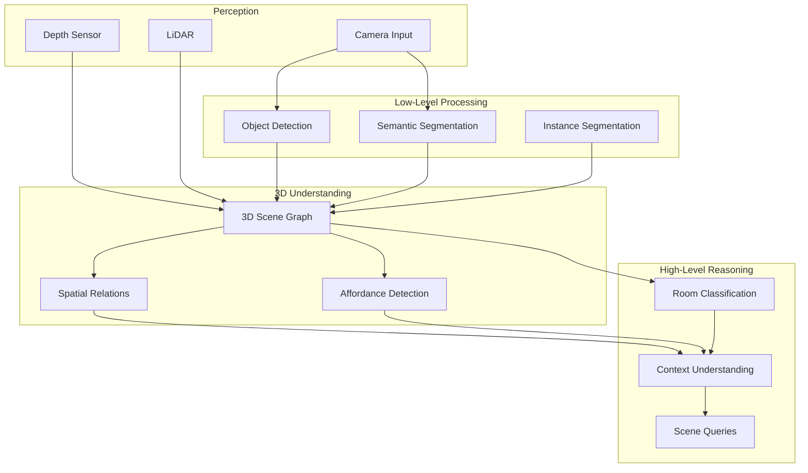

# Environment Understanding

## Beyond Object Detection

For humanoid robots to operate effectively in human environments, they need comprehensive **environment understanding**—not just detecting objects, but understanding spatial relationships, affordances, and semantic meaning. This enables robots to answer questions like "Where can I put this cup?" or "Is there space for me to walk through?"

:::info The Understanding Challenge
A humanoid in a kitchen must understand that the counter is a surface for placing objects, the fridge contains cold items, drawers can be opened, and the space between furniture is navigable—all from visual observation.
:::

## Environment Understanding Pipeline



## 3D Scene Graphs

### Scene Graph Construction

```python
from dataclasses import dataclass, field
from typing import List, Dict, Optional, Tuple
import numpy as np
from enum import Enum

class RelationType(Enum):
    """Types of spatial relationships."""
    ON = "on"
    INSIDE = "inside"
    NEXT_TO = "next_to"
    ABOVE = "above"
    BELOW = "below"
    IN_FRONT_OF = "in_front_of"
    BEHIND = "behind"

@dataclass
class SceneObject:
    """Object in the scene graph."""
    id: int
    label: str
    position: np.ndarray  # 3D position
    dimensions: np.ndarray  # Bounding box size
    orientation: np.ndarray  # Quaternion
    confidence: float
    affordances: List[str] = field(default_factory=list)
    attributes: Dict = field(default_factory=dict)

@dataclass
class SpatialRelation:
    """Relationship between two objects."""
    subject_id: int
    object_id: int
    relation: RelationType
    confidence: float

@dataclass
class SceneGraph:
    """3D scene graph representation."""
    objects: Dict[int, SceneObject]
    relations: List[SpatialRelation]
    room_type: Optional[str] = None
    timestamp: float = 0.0

class SceneGraphBuilder:
    """Build 3D scene graphs from perception data."""

    def __init__(self):
        self.relation_thresholds = {
            RelationType.ON: 0.1,  # Vertical distance threshold
            RelationType.NEXT_TO: 0.5,  # Horizontal distance threshold
            RelationType.INSIDE: 0.8,  # Containment threshold
        }

    def build(
        self,
        detections: List[Dict],
        depth_image: np.ndarray,
        camera_intrinsics: np.ndarray,
        camera_pose: np.ndarray
    ) -> SceneGraph:
        """
        Build scene graph from detections and depth.

        Args:
            detections: List of detected objects with masks
            depth_image: Depth image
            camera_intrinsics: Camera intrinsic matrix
            camera_pose: Camera pose in world frame

        Returns:
            SceneGraph object
        """
        objects = {}

        # Create scene objects
        for det in detections:
            obj_id = len(objects)

            # Get 3D position from depth
            position = self._get_3d_position(
                det['bbox'],
                det['mask'],
                depth_image,
                camera_intrinsics,
                camera_pose
            )

            # Estimate dimensions
            dimensions = self._estimate_dimensions(
                det['mask'],
                depth_image,
                camera_intrinsics
            )

            # Infer affordances based on object class
            affordances = self._infer_affordances(det['class'])

            objects[obj_id] = SceneObject(
                id=obj_id,
                label=det['class'],
                position=position,
                dimensions=dimensions,
                orientation=np.array([0, 0, 0, 1]),  # Default
                confidence=det['score'],
                affordances=affordances
            )

        # Compute spatial relations
        relations = self._compute_relations(objects)

        # Classify room type
        room_type = self._classify_room(objects)

        return SceneGraph(
            objects=objects,
            relations=relations,
            room_type=room_type
        )

    def _get_3d_position(
        self,
        bbox: Tuple,
        mask: np.ndarray,
        depth: np.ndarray,
        K: np.ndarray,
        pose: np.ndarray
    ) -> np.ndarray:
        """Get 3D centroid of object."""
        # Get depth values within mask
        masked_depth = depth * mask
        valid_depths = masked_depth[masked_depth > 0]

        if len(valid_depths) == 0:
            return np.zeros(3)

        # Get centroid pixel
        y_coords, x_coords = np.where(mask > 0)
        cx = np.mean(x_coords)
        cy = np.mean(y_coords)
        z = np.median(valid_depths)

        # Backproject to 3D
        fx, fy = K[0, 0], K[1, 1]
        px, py = K[0, 2], K[1, 2]

        x = (cx - px) * z / fx
        y = (cy - py) * z / fy

        # Transform to world frame
        point_cam = np.array([x, y, z, 1])
        point_world = pose @ point_cam

        return point_world[:3]

    def _estimate_dimensions(
        self,
        mask: np.ndarray,
        depth: np.ndarray,
        K: np.ndarray
    ) -> np.ndarray:
        """Estimate object dimensions from mask and depth."""
        # Get bounding box of mask
        y_coords, x_coords = np.where(mask > 0)

        if len(y_coords) == 0:
            return np.zeros(3)

        width_pixels = x_coords.max() - x_coords.min()
        height_pixels = y_coords.max() - y_coords.min()

        # Estimate depth
        masked_depth = depth * mask
        z = np.median(masked_depth[masked_depth > 0])

        if z == 0:
            return np.zeros(3)

        # Convert to metric
        fx, fy = K[0, 0], K[1, 1]
        width = width_pixels * z / fx
        height = height_pixels * z / fy
        depth_est = z * 0.1  # Rough estimate

        return np.array([width, height, depth_est])

    def _infer_affordances(self, object_class: str) -> List[str]:
        """Infer affordances from object class."""
        affordance_map = {
            'table': ['support', 'place_on'],
            'chair': ['sit', 'move'],
            'cup': ['grasp', 'pour_into', 'drink_from'],
            'bottle': ['grasp', 'pour_from', 'open'],
            'door': ['open', 'close', 'push', 'pull'],
            'drawer': ['open', 'close', 'put_in'],
            'fridge': ['open', 'close', 'store_in'],
            'counter': ['support', 'place_on', 'work_on'],
            'floor': ['walk_on', 'navigate'],
        }
        return affordance_map.get(object_class, ['interact'])

    def _compute_relations(
        self,
        objects: Dict[int, SceneObject]
    ) -> List[SpatialRelation]:
        """Compute spatial relations between objects."""
        relations = []

        obj_list = list(objects.values())

        for i, obj1 in enumerate(obj_list):
            for j, obj2 in enumerate(obj_list):
                if i >= j:
                    continue

                # Check various relations
                relation = self._determine_relation(obj1, obj2)
                if relation:
                    relations.append(relation)

        return relations

    def _determine_relation(
        self,
        obj1: SceneObject,
        obj2: SceneObject
    ) -> Optional[SpatialRelation]:
        """Determine spatial relation between two objects."""
        pos_diff = obj1.position - obj2.position
        horizontal_dist = np.sqrt(pos_diff[0]**2 + pos_diff[1]**2)
        vertical_diff = pos_diff[2]

        # Check ON relation
        if (abs(vertical_diff) < self.relation_thresholds[RelationType.ON] and
            horizontal_dist < max(obj2.dimensions[:2]) / 2):
            if vertical_diff > 0:
                return SpatialRelation(
                    subject_id=obj1.id,
                    object_id=obj2.id,
                    relation=RelationType.ON,
                    confidence=0.9
                )

        # Check NEXT_TO relation
        if (horizontal_dist < self.relation_thresholds[RelationType.NEXT_TO] and
            abs(vertical_diff) < 0.3):
            return SpatialRelation(
                subject_id=obj1.id,
                object_id=obj2.id,
                relation=RelationType.NEXT_TO,
                confidence=0.8
            )

        return None

    def _classify_room(self, objects: Dict[int, SceneObject]) -> str:
        """Classify room type based on objects present."""
        object_labels = [obj.label for obj in objects.values()]

        # Simple rule-based classification
        if 'fridge' in object_labels or 'stove' in object_labels:
            return 'kitchen'
        elif 'bed' in object_labels:
            return 'bedroom'
        elif 'toilet' in object_labels or 'sink' in object_labels:
            return 'bathroom'
        elif 'sofa' in object_labels or 'tv' in object_labels:
            return 'living_room'
        elif 'desk' in object_labels:
            return 'office'

        return 'unknown'
```

## Affordance Detection

### Learning Object Affordances

```python
import torch
import torch.nn as nn
from torchvision import models

class AffordanceDetector(nn.Module):
    """Detect object affordances from images."""

    def __init__(self, num_affordances: int = 10):
        super().__init__()

        # Backbone (ResNet)
        self.backbone = models.resnet50(pretrained=True)
        self.backbone.fc = nn.Identity()

        # Affordance prediction head
        self.affordance_head = nn.Sequential(
            nn.Linear(2048, 512),
            nn.ReLU(),
            nn.Dropout(0.3),
            nn.Linear(512, num_affordances),
            nn.Sigmoid()
        )

        # Affordance labels
        self.affordance_labels = [
            'graspable', 'pushable', 'openable',
            'containable', 'sittable', 'supportable',
            'pourable', 'cuttable', 'foldable', 'rollable'
        ]

    def forward(self, images: torch.Tensor) -> torch.Tensor:
        """
        Predict affordances for images.

        Args:
            images: Batch of images (B, 3, H, W)

        Returns:
            Affordance probabilities (B, num_affordances)
        """
        features = self.backbone(images)
        affordances = self.affordance_head(features)
        return affordances

    def predict(self, image: np.ndarray, threshold: float = 0.5) -> Dict[str, float]:
        """
        Predict affordances for a single image.

        Args:
            image: RGB image
            threshold: Confidence threshold

        Returns:
            Dictionary of affordance probabilities
        """
        # Preprocess
        transform = transforms.Compose([
            transforms.ToPILImage(),
            transforms.Resize((224, 224)),
            transforms.ToTensor(),
            transforms.Normalize(
                mean=[0.485, 0.456, 0.406],
                std=[0.229, 0.224, 0.225]
            )
        ])

        input_tensor = transform(image).unsqueeze(0)

        # Predict
        with torch.no_grad():
            probs = self.forward(input_tensor)[0].numpy()

        # Return affordances above threshold
        return {
            label: float(prob)
            for label, prob in zip(self.affordance_labels, probs)
            if prob > threshold
        }


class AffordanceHeatmapPredictor(nn.Module):
    """Predict pixel-wise affordance heatmaps."""

    def __init__(self, num_affordances: int = 10):
        super().__init__()

        # Encoder
        self.encoder = models.segmentation.deeplabv3_resnet50(pretrained=True)
        self.encoder.classifier[-1] = nn.Conv2d(256, num_affordances, 1)

    def forward(self, images: torch.Tensor) -> torch.Tensor:
        """
        Predict affordance heatmaps.

        Args:
            images: Batch of images (B, 3, H, W)

        Returns:
            Affordance heatmaps (B, num_affordances, H, W)
        """
        output = self.encoder(images)
        return torch.sigmoid(output['out'])

    def get_interaction_points(
        self,
        image: np.ndarray,
        affordance: str
    ) -> List[Tuple[int, int]]:
        """
        Get candidate interaction points for an affordance.

        Args:
            image: RGB image
            affordance: Desired affordance (e.g., 'graspable')

        Returns:
            List of (x, y) coordinates
        """
        # Get heatmap
        heatmap = self.forward(image)[affordance]

        # Find local maxima
        from scipy.ndimage import maximum_filter
        local_max = maximum_filter(heatmap, size=20)
        peaks = (heatmap == local_max) & (heatmap > 0.5)

        # Get coordinates
        y_coords, x_coords = np.where(peaks)
        return list(zip(x_coords, y_coords))
```

## Scene Queries

### Natural Language Scene Understanding

```python
class SceneQueryEngine:
    """Answer natural language queries about the scene."""

    def __init__(self, scene_graph: SceneGraph, llm_provider):
        self.scene_graph = scene_graph
        self.llm = llm_provider

    def query(self, question: str) -> str:
        """
        Answer a question about the scene.

        Args:
            question: Natural language question

        Returns:
            Answer string
        """
        # Convert scene graph to text description
        scene_description = self._scene_to_text()

        prompt = f"""Scene description:
{scene_description}

Question: {question}

Provide a concise answer based on the scene description."""

        response = self.llm.generate(
            messages=[{"role": "user", "content": prompt}],
            temperature=0.3
        )

        return response.content

    def find_object(self, object_description: str) -> List[SceneObject]:
        """
        Find objects matching a description.

        Args:
            object_description: Natural language description

        Returns:
            List of matching objects
        """
        matches = []

        for obj in self.scene_graph.objects.values():
            # Simple matching - could use embeddings for better matching
            if object_description.lower() in obj.label.lower():
                matches.append(obj)
            elif any(attr in object_description.lower()
                     for attr in obj.attributes.values()):
                matches.append(obj)

        return matches

    def find_placement_location(
        self,
        object_to_place: str,
        constraints: List[str] = None
    ) -> Optional[np.ndarray]:
        """
        Find a suitable location to place an object.

        Args:
            object_to_place: Object being placed
            constraints: Additional constraints

        Returns:
            3D position for placement or None
        """
        # Find surfaces
        surfaces = [
            obj for obj in self.scene_graph.objects.values()
            if 'support' in obj.affordances or 'place_on' in obj.affordances
        ]

        if not surfaces:
            return None

        # Score surfaces based on suitability
        best_surface = None
        best_score = -1

        for surface in surfaces:
            score = self._score_placement(surface, object_to_place, constraints)
            if score > best_score:
                best_score = score
                best_surface = surface

        if best_surface:
            # Return position on top of surface
            return best_surface.position + np.array([0, 0, best_surface.dimensions[2] / 2])

        return None

    def _scene_to_text(self) -> str:
        """Convert scene graph to text description."""
        lines = []

        # Room type
        if self.scene_graph.room_type:
            lines.append(f"Room type: {self.scene_graph.room_type}")

        # Objects
        lines.append("\nObjects in the scene:")
        for obj in self.scene_graph.objects.values():
            pos_str = f"({obj.position[0]:.1f}, {obj.position[1]:.1f}, {obj.position[2]:.1f})"
            lines.append(f"- {obj.label} at position {pos_str}")
            if obj.affordances:
                lines.append(f"  Affordances: {', '.join(obj.affordances)}")

        # Relations
        if self.scene_graph.relations:
            lines.append("\nSpatial relationships:")
            for rel in self.scene_graph.relations:
                subj = self.scene_graph.objects[rel.subject_id].label
                obj = self.scene_graph.objects[rel.object_id].label
                lines.append(f"- {subj} is {rel.relation.value} {obj}")

        return "\n".join(lines)

    def _score_placement(
        self,
        surface: SceneObject,
        object_to_place: str,
        constraints: List[str]
    ) -> float:
        """Score a surface for object placement."""
        score = 1.0

        # Check if surface is appropriate
        if surface.label in ['floor', 'ground']:
            score *= 0.5  # Prefer elevated surfaces

        # Check constraints
        if constraints:
            for constraint in constraints:
                if 'near' in constraint:
                    target = constraint.replace('near ', '')
                    # Check proximity to target
                    for obj in self.scene_graph.objects.values():
                        if target in obj.label:
                            dist = np.linalg.norm(surface.position - obj.position)
                            if dist < 1.0:
                                score *= 1.5

        return score
```

## Visual Question Answering for Scenes

### VQA Integration

```python
from transformers import BlipProcessor, BlipForQuestionAnswering

class SceneVQA:
    """Visual question answering for scene understanding."""

    def __init__(self):
        self.processor = BlipProcessor.from_pretrained(
            "Salesforce/blip-vqa-base"
        )
        self.model = BlipForQuestionAnswering.from_pretrained(
            "Salesforce/blip-vqa-base"
        )

    def answer(self, image: np.ndarray, question: str) -> str:
        """
        Answer a question about an image.

        Args:
            image: RGB image
            question: Question about the image

        Returns:
            Answer string
        """
        # Prepare inputs
        inputs = self.processor(
            images=image,
            text=question,
            return_tensors="pt"
        )

        # Generate answer
        outputs = self.model.generate(**inputs)
        answer = self.processor.decode(outputs[0], skip_special_tokens=True)

        return answer

    def batch_query(
        self,
        image: np.ndarray,
        questions: List[str]
    ) -> Dict[str, str]:
        """
        Answer multiple questions about an image.

        Args:
            image: RGB image
            questions: List of questions

        Returns:
            Dictionary mapping questions to answers
        """
        return {q: self.answer(image, q) for q in questions}
```

## ROS 2 Integration

### Environment Understanding Node

```python
import rclpy
from rclpy.node import Node
from sensor_msgs.msg import Image, PointCloud2
from std_msgs.msg import String
from visualization_msgs.msg import MarkerArray
from cv_bridge import CvBridge
import json

class EnvironmentUnderstandingNode(Node):
    """ROS 2 node for environment understanding."""

    def __init__(self):
        super().__init__('environment_understanding')

        self.bridge = CvBridge()

        # Scene graph builder
        self.scene_builder = SceneGraphBuilder()
        self.current_scene = None

        # Affordance detector
        self.affordance_detector = AffordanceDetector()

        # Query engine
        self.query_engine = None

        # Subscriptions
        self.image_sub = self.create_subscription(
            Image, '/camera/image', self.image_callback, 10
        )
        self.depth_sub = self.create_subscription(
            Image, '/camera/depth', self.depth_callback, 10
        )
        self.query_sub = self.create_subscription(
            String, '/scene/query', self.query_callback, 10
        )

        # Publishers
        self.scene_pub = self.create_publisher(
            String, '/scene/graph', 10
        )
        self.marker_pub = self.create_publisher(
            MarkerArray, '/scene/markers', 10
        )
        self.answer_pub = self.create_publisher(
            String, '/scene/answer', 10
        )

        # Timer for scene updates
        self.create_timer(1.0, self.update_scene)

        self.get_logger().info('Environment Understanding node initialized')

    def update_scene(self):
        """Periodically update scene graph."""
        if self.current_scene:
            # Publish scene as JSON
            scene_msg = String()
            scene_msg.data = json.dumps(self._scene_to_dict(self.current_scene))
            self.scene_pub.publish(scene_msg)

            # Publish visualization markers
            markers = self._scene_to_markers(self.current_scene)
            self.marker_pub.publish(markers)

    def query_callback(self, msg):
        """Handle scene queries."""
        if not self.current_scene:
            return

        if not self.query_engine:
            self.query_engine = SceneQueryEngine(self.current_scene, self.llm)

        answer = self.query_engine.query(msg.data)

        answer_msg = String()
        answer_msg.data = answer
        self.answer_pub.publish(answer_msg)

    def _scene_to_dict(self, scene: SceneGraph) -> Dict:
        """Convert scene graph to dictionary."""
        return {
            'room_type': scene.room_type,
            'objects': [
                {
                    'id': obj.id,
                    'label': obj.label,
                    'position': obj.position.tolist(),
                    'affordances': obj.affordances
                }
                for obj in scene.objects.values()
            ],
            'relations': [
                {
                    'subject': rel.subject_id,
                    'object': rel.object_id,
                    'relation': rel.relation.value
                }
                for rel in scene.relations
            ]
        }

    def _scene_to_markers(self, scene: SceneGraph) -> MarkerArray:
        """Create visualization markers for scene."""
        from visualization_msgs.msg import Marker

        markers = MarkerArray()

        for obj in scene.objects.values():
            marker = Marker()
            marker.header.frame_id = 'map'
            marker.id = obj.id
            marker.type = Marker.CUBE
            marker.action = Marker.ADD

            marker.pose.position.x = float(obj.position[0])
            marker.pose.position.y = float(obj.position[1])
            marker.pose.position.z = float(obj.position[2])

            marker.scale.x = float(obj.dimensions[0])
            marker.scale.y = float(obj.dimensions[1])
            marker.scale.z = float(obj.dimensions[2])

            marker.color.a = 0.5
            marker.color.r = 0.0
            marker.color.g = 1.0
            marker.color.b = 0.0

            markers.markers.append(marker)

        return markers
```

## Summary

Environment understanding enables humanoids to reason about their surroundings:

- **3D Scene Graphs** represent objects, attributes, and relationships
- **Affordance detection** identifies how objects can be used
- **Spatial reasoning** determines where to navigate and place objects
- **Natural language queries** allow intuitive interaction with scene knowledge

This comprehensive understanding enables humanoid robots to operate effectively in human environments, making intelligent decisions about navigation, manipulation, and interaction.

## Exercises

1. Build a scene graph from RGB-D camera data
2. Train an affordance detector on household objects
3. Implement spatial relation detection between objects
4. Create a scene query system with natural language
5. Integrate environment understanding with task planning

## Further Reading

- [3D Scene Graphs for Understanding](https://arxiv.org/abs/1906.09251)
- [Affordance Detection Survey](https://arxiv.org/abs/2112.12610)
- [Visual Question Answering](https://visualqa.org/)
