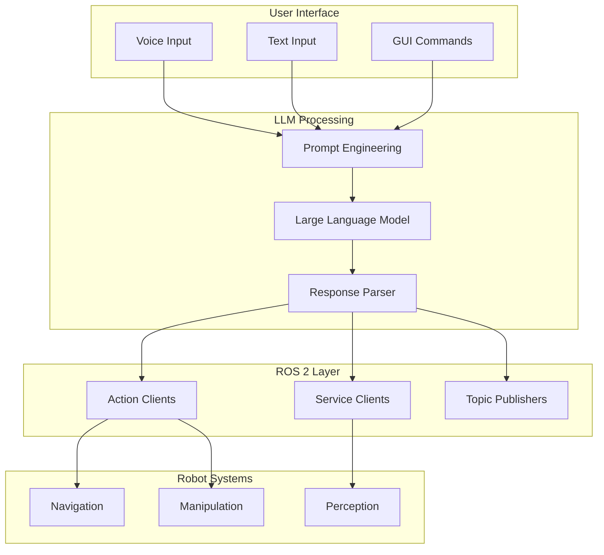

# LLM Integration with ROS

## LLMs as Robot Brains

Large Language Models (LLMs) provide humanoid robots with powerful cognitive capabilities: task planning, common-sense reasoning, and natural language interaction. Integrating LLMs with ROS 2 creates robots that can understand complex instructions and plan multi-step actions.

:::info The LLM Advantage
LLMs bring world knowledge and reasoning capabilities that are difficult to hand-code. A humanoid can leverage an LLM to understand "make me a sandwich" requires going to the kitchen, finding ingredients, and assembling them—without explicit programming for each step.
:::

## Integration Architecture



## LLM API Integration

### Multi-Provider Support

```python
from abc import ABC, abstractmethod
from dataclasses import dataclass
from typing import List, Optional, Dict
import os

@dataclass
class LLMResponse:
    """Response from LLM API."""
    content: str
    model: str
    usage: Dict[str, int]
    finish_reason: str

class LLMProvider(ABC):
    """Abstract base class for LLM providers."""

    @abstractmethod
    def generate(
        self,
        messages: List[Dict[str, str]],
        temperature: float = 0.7,
        max_tokens: int = 1024
    ) -> LLMResponse:
        pass

class OpenAIProvider(LLMProvider):
    """OpenAI GPT provider."""

    def __init__(self, api_key: str = None, model: str = "gpt-4"):
        from openai import OpenAI
        self.client = OpenAI(api_key=api_key or os.getenv("OPENAI_API_KEY"))
        self.model = model

    def generate(
        self,
        messages: List[Dict[str, str]],
        temperature: float = 0.7,
        max_tokens: int = 1024
    ) -> LLMResponse:
        response = self.client.chat.completions.create(
            model=self.model,
            messages=messages,
            temperature=temperature,
            max_tokens=max_tokens
        )

        return LLMResponse(
            content=response.choices[0].message.content,
            model=response.model,
            usage={
                "prompt_tokens": response.usage.prompt_tokens,
                "completion_tokens": response.usage.completion_tokens
            },
            finish_reason=response.choices[0].finish_reason
        )

class AnthropicProvider(LLMProvider):
    """Anthropic Claude provider."""

    def __init__(self, api_key: str = None, model: str = "claude-3-opus-20240229"):
        import anthropic
        self.client = anthropic.Anthropic(
            api_key=api_key or os.getenv("ANTHROPIC_API_KEY")
        )
        self.model = model

    def generate(
        self,
        messages: List[Dict[str, str]],
        temperature: float = 0.7,
        max_tokens: int = 1024
    ) -> LLMResponse:
        # Convert messages to Anthropic format
        system_msg = ""
        anthropic_messages = []

        for msg in messages:
            if msg["role"] == "system":
                system_msg = msg["content"]
            else:
                anthropic_messages.append({
                    "role": msg["role"],
                    "content": msg["content"]
                })

        response = self.client.messages.create(
            model=self.model,
            max_tokens=max_tokens,
            system=system_msg,
            messages=anthropic_messages
        )

        return LLMResponse(
            content=response.content[0].text,
            model=response.model,
            usage={
                "input_tokens": response.usage.input_tokens,
                "output_tokens": response.usage.output_tokens
            },
            finish_reason=response.stop_reason
        )

class LocalLLMProvider(LLMProvider):
    """Local LLM via Ollama or similar."""

    def __init__(self, model: str = "llama2", host: str = "http://localhost:11434"):
        import requests
        self.model = model
        self.host = host

    def generate(
        self,
        messages: List[Dict[str, str]],
        temperature: float = 0.7,
        max_tokens: int = 1024
    ) -> LLMResponse:
        import requests

        response = requests.post(
            f"{self.host}/api/chat",
            json={
                "model": self.model,
                "messages": messages,
                "options": {
                    "temperature": temperature,
                    "num_predict": max_tokens
                },
                "stream": False
            }
        )

        result = response.json()

        return LLMResponse(
            content=result["message"]["content"],
            model=self.model,
            usage={"total_tokens": result.get("eval_count", 0)},
            finish_reason="stop"
        )
```

## Task Planning with LLMs

### Hierarchical Task Decomposition

```python
from dataclasses import dataclass, field
from typing import List, Optional
import json

@dataclass
class TaskStep:
    """Single step in a task plan."""
    id: int
    action: str
    parameters: Dict
    preconditions: List[str] = field(default_factory=list)
    expected_effects: List[str] = field(default_factory=list)

@dataclass
class TaskPlan:
    """Complete task plan from LLM."""
    goal: str
    steps: List[TaskStep]
    estimated_duration: Optional[float] = None
    failure_modes: List[str] = field(default_factory=list)

class LLMTaskPlanner:
    """LLM-based task planning for humanoid robots."""

    def __init__(self, llm_provider: LLMProvider):
        self.llm = llm_provider

        self.system_prompt = """You are a task planner for a humanoid robot.
Given a high-level goal and the current scene, create a step-by-step plan.

Available robot actions:
- navigate(location): Move to a location
- pick(object): Pick up an object
- place(object, location): Place object at location
- open(object): Open a door, drawer, etc.
- close(object): Close a door, drawer, etc.
- pour(source, target): Pour from source into target
- press(button): Press a button or switch
- wave(): Wave greeting
- speak(text): Say something to user

Respond with a JSON plan:
{
    "goal": "description of the goal",
    "steps": [
        {
            "id": 1,
            "action": "action_name",
            "parameters": {"param1": "value1"},
            "preconditions": ["condition1"],
            "expected_effects": ["effect1"]
        }
    ],
    "failure_modes": ["potential failure 1"]
}"""

    def plan(
        self,
        goal: str,
        scene_context: Dict,
        robot_state: Dict
    ) -> TaskPlan:
        """
        Create a task plan for the given goal.

        Args:
            goal: Natural language goal description
            scene_context: Current scene objects and locations
            robot_state: Current robot state

        Returns:
            TaskPlan object
        """
        user_prompt = f"""Goal: {goal}

Current scene:
- Objects: {scene_context.get('objects', [])}
- Locations: {scene_context.get('locations', [])}
- People: {scene_context.get('people', [])}

Robot state:
- Position: {robot_state.get('position', 'unknown')}
- Holding: {robot_state.get('holding', 'nothing')}
- Battery: {robot_state.get('battery', '100%')}

Create a plan to achieve this goal."""

        response = self.llm.generate(
            messages=[
                {"role": "system", "content": self.system_prompt},
                {"role": "user", "content": user_prompt}
            ],
            temperature=0.3
        )

        # Parse JSON response
        plan_dict = json.loads(response.content)

        steps = [
            TaskStep(
                id=step["id"],
                action=step["action"],
                parameters=step["parameters"],
                preconditions=step.get("preconditions", []),
                expected_effects=step.get("expected_effects", [])
            )
            for step in plan_dict["steps"]
        ]

        return TaskPlan(
            goal=plan_dict["goal"],
            steps=steps,
            failure_modes=plan_dict.get("failure_modes", [])
        )

    def replan(
        self,
        original_plan: TaskPlan,
        failed_step: TaskStep,
        failure_reason: str,
        scene_context: Dict
    ) -> TaskPlan:
        """
        Create new plan after failure.

        Args:
            original_plan: The failed plan
            failed_step: Step that failed
            failure_reason: Why it failed
            scene_context: Current scene

        Returns:
            New TaskPlan
        """
        user_prompt = f"""Original goal: {original_plan.goal}

Original plan steps:
{json.dumps([{"id": s.id, "action": s.action, "params": s.parameters} for s in original_plan.steps], indent=2)}

Failed at step {failed_step.id}: {failed_step.action}
Failure reason: {failure_reason}

Current scene: {scene_context}

Create a new plan to achieve the original goal, accounting for this failure."""

        response = self.llm.generate(
            messages=[
                {"role": "system", "content": self.system_prompt},
                {"role": "user", "content": user_prompt}
            ],
            temperature=0.3
        )

        plan_dict = json.loads(response.content)

        steps = [
            TaskStep(
                id=step["id"],
                action=step["action"],
                parameters=step["parameters"],
                preconditions=step.get("preconditions", []),
                expected_effects=step.get("expected_effects", [])
            )
            for step in plan_dict["steps"]
        ]

        return TaskPlan(
            goal=plan_dict["goal"],
            steps=steps,
            failure_modes=plan_dict.get("failure_modes", [])
        )
```

## ROS 2 Integration

### LLM Planning Service

```python
import rclpy
from rclpy.node import Node
from std_msgs.msg import String
from geometry_msgs.msg import PoseStamped
from humanoid_interfaces.srv import PlanTask, ExecuteStep
from humanoid_interfaces.msg import TaskPlanMsg, TaskStepMsg
import json

class LLMPlannerNode(Node):
    """ROS 2 node for LLM-based task planning."""

    def __init__(self):
        super().__init__('llm_planner_node')

        # Initialize LLM
        self.declare_parameter('llm_provider', 'openai')
        self.declare_parameter('llm_model', 'gpt-4')

        provider_name = self.get_parameter('llm_provider').value
        model = self.get_parameter('llm_model').value

        if provider_name == 'openai':
            self.llm = OpenAIProvider(model=model)
        elif provider_name == 'anthropic':
            self.llm = AnthropicProvider(model=model)
        else:
            self.llm = LocalLLMProvider(model=model)

        self.planner = LLMTaskPlanner(self.llm)

        # Scene context (updated by perception)
        self.scene_context = {"objects": [], "locations": [], "people": []}
        self.robot_state = {"position": "unknown", "holding": "nothing"}

        # Subscriptions
        self.scene_sub = self.create_subscription(
            String,
            '/perception/scene',
            self.scene_callback,
            10
        )

        # Services
        self.plan_service = self.create_service(
            PlanTask,
            '/llm_planner/plan',
            self.plan_callback
        )

        # Publishers
        self.plan_pub = self.create_publisher(
            TaskPlanMsg,
            '/llm_planner/current_plan',
            10
        )

        self.get_logger().info('LLM Planner Node initialized')

    def scene_callback(self, msg):
        """Update scene context from perception."""
        self.scene_context = json.loads(msg.data)

    def plan_callback(self, request, response):
        """Handle planning request."""
        self.get_logger().info(f'Planning for goal: {request.goal}')

        try:
            plan = self.planner.plan(
                goal=request.goal,
                scene_context=self.scene_context,
                robot_state=self.robot_state
            )

            # Convert to ROS message
            plan_msg = TaskPlanMsg()
            plan_msg.goal = plan.goal

            for step in plan.steps:
                step_msg = TaskStepMsg()
                step_msg.id = step.id
                step_msg.action = step.action
                step_msg.parameters = json.dumps(step.parameters)
                step_msg.preconditions = step.preconditions
                step_msg.expected_effects = step.expected_effects
                plan_msg.steps.append(step_msg)

            plan_msg.failure_modes = plan.failure_modes

            # Publish plan
            self.plan_pub.publish(plan_msg)

            response.success = True
            response.plan = plan_msg

        except Exception as e:
            self.get_logger().error(f'Planning failed: {e}')
            response.success = False
            response.error_message = str(e)

        return response
```

### Action Execution Bridge

```python
import rclpy
from rclpy.node import Node
from rclpy.action import ActionClient
from nav2_msgs.action import NavigateToPose
from humanoid_interfaces.action import PickObject, PlaceObject
from humanoid_interfaces.msg import TaskStepMsg
import json

class LLMActionBridge(Node):
    """Bridge LLM task steps to ROS 2 actions."""

    def __init__(self):
        super().__init__('llm_action_bridge')

        # Action clients
        self.nav_client = ActionClient(self, NavigateToPose, 'navigate_to_pose')
        self.pick_client = ActionClient(self, PickObject, 'pick_object')
        self.place_client = ActionClient(self, PlaceObject, 'place_object')

        # Step subscription
        self.step_sub = self.create_subscription(
            TaskStepMsg,
            '/llm_planner/execute_step',
            self.execute_step,
            10
        )

        # Action mapping
        self.action_handlers = {
            'navigate': self.handle_navigate,
            'pick': self.handle_pick,
            'place': self.handle_place,
            'speak': self.handle_speak,
            'wave': self.handle_wave
        }

        self.get_logger().info('LLM Action Bridge initialized')

    def execute_step(self, msg):
        """Execute a task step."""
        action = msg.action
        params = json.loads(msg.parameters)

        if action in self.action_handlers:
            self.get_logger().info(f'Executing: {action} with {params}')
            self.action_handlers[action](params)
        else:
            self.get_logger().warning(f'Unknown action: {action}')

    async def handle_navigate(self, params):
        """Handle navigation action."""
        location = params.get('location')

        # Convert location name to pose
        pose = self.location_to_pose(location)

        goal = NavigateToPose.Goal()
        goal.pose = pose

        self.nav_client.wait_for_server()
        result = await self.nav_client.send_goal_async(goal)

        return result

    async def handle_pick(self, params):
        """Handle pick action."""
        obj = params.get('object')

        goal = PickObject.Goal()
        goal.object_name = obj

        self.pick_client.wait_for_server()
        result = await self.pick_client.send_goal_async(goal)

        return result

    async def handle_place(self, params):
        """Handle place action."""
        obj = params.get('object')
        location = params.get('location')

        goal = PlaceObject.Goal()
        goal.object_name = obj
        goal.location = location

        self.place_client.wait_for_server()
        result = await self.place_client.send_goal_async(goal)

        return result

    def handle_speak(self, params):
        """Handle speak action."""
        text = params.get('text', '')
        # Publish to TTS node
        self.get_logger().info(f'Speaking: {text}')

    def handle_wave(self, params):
        """Handle wave action."""
        # Trigger wave animation
        self.get_logger().info('Waving')

    def location_to_pose(self, location: str) -> PoseStamped:
        """Convert location name to pose."""
        # Would use a location database
        poses = {
            'kitchen': (3.0, 2.0, 0.0),
            'living_room': (0.0, 0.0, 0.0),
            'bedroom': (-2.0, 3.0, 1.57)
        }

        pose = PoseStamped()
        pose.header.frame_id = 'map'

        coords = poses.get(location, (0.0, 0.0, 0.0))
        pose.pose.position.x = coords[0]
        pose.pose.position.y = coords[1]

        return pose
```

## Tool Calling and Function Execution

### LLM with Tool Use

```python
from typing import Callable, Dict, Any
import json

class LLMToolExecutor:
    """Execute LLM-generated function calls."""

    def __init__(self, llm_provider: LLMProvider):
        self.llm = llm_provider
        self.tools = {}
        self.tool_schemas = []

    def register_tool(
        self,
        name: str,
        description: str,
        parameters: Dict,
        function: Callable
    ):
        """Register a tool for LLM to use."""
        self.tools[name] = function
        self.tool_schemas.append({
            "type": "function",
            "function": {
                "name": name,
                "description": description,
                "parameters": parameters
            }
        })

    def execute_with_tools(self, user_message: str) -> str:
        """
        Execute user request, allowing LLM to call tools.

        Args:
            user_message: User's request

        Returns:
            Final response after tool execution
        """
        messages = [
            {
                "role": "system",
                "content": "You are a helpful humanoid robot assistant. Use the available tools to help the user."
            },
            {"role": "user", "content": user_message}
        ]

        # Initial LLM call with tools
        response = self.llm.generate_with_tools(
            messages=messages,
            tools=self.tool_schemas
        )

        # Check for tool calls
        while response.tool_calls:
            # Execute each tool call
            for tool_call in response.tool_calls:
                function_name = tool_call.function.name
                arguments = json.loads(tool_call.function.arguments)

                # Execute the tool
                if function_name in self.tools:
                    result = self.tools[function_name](**arguments)
                else:
                    result = f"Error: Unknown tool {function_name}"

                # Add tool result to messages
                messages.append({
                    "role": "assistant",
                    "tool_calls": [tool_call]
                })
                messages.append({
                    "role": "tool",
                    "tool_call_id": tool_call.id,
                    "content": str(result)
                })

            # Get next response
            response = self.llm.generate_with_tools(
                messages=messages,
                tools=self.tool_schemas
            )

        return response.content


# Example usage
def create_humanoid_tools(robot_node) -> LLMToolExecutor:
    """Create tool executor with humanoid robot tools."""
    executor = LLMToolExecutor(OpenAIProvider())

    # Navigation tool
    executor.register_tool(
        name="navigate_to",
        description="Move the robot to a specified location",
        parameters={
            "type": "object",
            "properties": {
                "location": {
                    "type": "string",
                    "description": "The location to navigate to (e.g., 'kitchen', 'living room')"
                }
            },
            "required": ["location"]
        },
        function=lambda location: robot_node.navigate_to(location)
    )

    # Pick object tool
    executor.register_tool(
        name="pick_object",
        description="Pick up an object with the robot's gripper",
        parameters={
            "type": "object",
            "properties": {
                "object_name": {
                    "type": "string",
                    "description": "Name of the object to pick up"
                }
            },
            "required": ["object_name"]
        },
        function=lambda object_name: robot_node.pick_object(object_name)
    )

    # Look at tool
    executor.register_tool(
        name="look_at",
        description="Turn the robot's head to look at something",
        parameters={
            "type": "object",
            "properties": {
                "target": {
                    "type": "string",
                    "description": "What to look at (object name or direction)"
                }
            },
            "required": ["target"]
        },
        function=lambda target: robot_node.look_at(target)
    )

    # Query scene tool
    executor.register_tool(
        name="get_visible_objects",
        description="Get a list of objects currently visible to the robot",
        parameters={"type": "object", "properties": {}},
        function=lambda: robot_node.get_visible_objects()
    )

    return executor
```

## Common-Sense Reasoning

### Scene Understanding with LLM

```python
class LLMSceneReasoner:
    """Use LLM for common-sense reasoning about scenes."""

    def __init__(self, llm_provider: LLMProvider):
        self.llm = llm_provider

    def infer_object_locations(
        self,
        target_object: str,
        visible_objects: List[str],
        known_locations: List[str]
    ) -> List[Dict]:
        """
        Infer where an object might be located.

        Args:
            target_object: Object to find
            visible_objects: Currently visible objects
            known_locations: Known locations in the environment

        Returns:
            List of possible locations with confidence
        """
        prompt = f"""Given that the robot is looking for: {target_object}

Currently visible objects: {visible_objects}
Known locations in the environment: {known_locations}

Based on common sense, where might the {target_object} be located?
Respond with a JSON list of possible locations and confidence scores:
[{{"location": "...", "confidence": 0.0-1.0, "reasoning": "..."}}]"""

        response = self.llm.generate(
            messages=[{"role": "user", "content": prompt}],
            temperature=0.3
        )

        return json.loads(response.content)

    def understand_implicit_goals(
        self,
        user_statement: str,
        context: Dict
    ) -> Dict:
        """
        Understand implicit goals from user statements.

        Args:
            user_statement: What the user said
            context: Current context

        Returns:
            Interpreted goals and actions
        """
        prompt = f"""The user said: "{user_statement}"

Current context:
- Time: {context.get('time', 'unknown')}
- Location: {context.get('location', 'unknown')}
- Recent activities: {context.get('recent_activities', [])}

What is the user implicitly asking the robot to do?
Consider common-sense implications.

Respond with JSON:
{{
    "explicit_request": "what they literally said",
    "implicit_goals": ["inferred goal 1", "inferred goal 2"],
    "suggested_actions": ["action 1", "action 2"],
    "clarification_needed": true/false,
    "clarification_question": "optional question to ask"
}}"""

        response = self.llm.generate(
            messages=[{"role": "user", "content": prompt}],
            temperature=0.5
        )

        return json.loads(response.content)

    def predict_action_consequences(
        self,
        action: str,
        scene_state: Dict
    ) -> Dict:
        """
        Predict consequences of an action.

        Args:
            action: Proposed action
            scene_state: Current scene state

        Returns:
            Predicted consequences
        """
        prompt = f"""The robot is about to: {action}

Current scene state:
{json.dumps(scene_state, indent=2)}

Predict the consequences of this action:
1. What will change in the scene?
2. Are there any potential problems or risks?
3. What should the robot verify after the action?

Respond with JSON:
{{
    "expected_changes": ["change 1", "change 2"],
    "potential_risks": ["risk 1"],
    "verification_checks": ["check 1", "check 2"]
}}"""

        response = self.llm.generate(
            messages=[{"role": "user", "content": prompt}],
            temperature=0.3
        )

        return json.loads(response.content)
```

## Summary

LLM integration with ROS 2 enables cognitive capabilities for humanoid robots:

- **Task planning** decomposes high-level goals into executable steps
- **Tool calling** allows LLMs to interact with robot capabilities
- **Common-sense reasoning** helps understand implicit goals and predict consequences
- **Multi-provider support** ensures flexibility in LLM selection

The combination of LLM reasoning with ROS 2's robotic capabilities creates humanoids that can understand and execute complex natural language instructions.

## Exercises

1. Set up an LLM planning node with multiple providers
2. Implement a tool executor for your robot's capabilities
3. Create a replanning system that handles failures gracefully
4. Build a common-sense reasoner for finding hidden objects
5. Integrate voice input with LLM planning for end-to-end control

## Further Reading

- [SayCan: Grounding Language in Robot Capabilities](https://say-can.github.io/)
- [Code as Policies](https://code-as-policies.github.io/)
- [LangChain for Robotics](https://python.langchain.com/)
