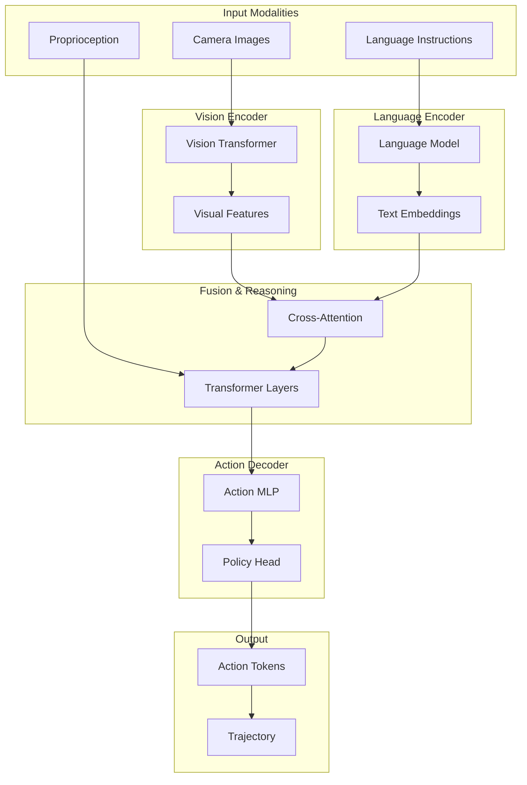

# Vision-Language-Action (VLA) Framework

## Introduction to VLA

**Vision-Language-Action (VLA)** models represent a paradigm shift in robot control. Instead of hand-crafted policies or reward-engineered reinforcement learning, VLA models learn to map visual observations and natural language instructions directly to robot actions—enabling intuitive human-robot interaction.

:::info The VLA Revolution
VLA models combine the visual understanding of vision transformers, the semantic reasoning of large language models, and action generation capabilities to create robots that can follow natural language commands like "pick up the red cup and place it next to the plate."
:::

## VLA Architecture



## Key VLA Models

### Model Comparison

| Model | Architecture | Training Data | Action Space | Highlights |
|-------|-------------|---------------|--------------|------------|
| **RT-2** | PaLM-E + ViT | Web + Robot | Discrete tokens | Language-conditioned |
| **OpenVLA** | Llama 2 + SigLIP | Open X-Embodiment | Continuous | Open-source |
| **Octo** | Transformer | Open X-Embodiment | Continuous | Modular |
| **π0** | Flow Matching | Robot demos | Continuous | Flow-based policy |

## Implementing VLA for Humanoids

### OpenVLA Integration

```python
import torch
from transformers import AutoModelForVision2Seq, AutoProcessor
from PIL import Image
import numpy as np

class HumanoidVLAController:
    """VLA-based controller for humanoid robots."""

    def __init__(self, model_name: str = "openvla/openvla-7b"):
        # Load pre-trained VLA model
        self.processor = AutoProcessor.from_pretrained(
            model_name,
            trust_remote_code=True
        )
        self.model = AutoModelForVision2Seq.from_pretrained(
            model_name,
            torch_dtype=torch.bfloat16,
            low_cpu_mem_usage=True,
            trust_remote_code=True
        ).cuda()

        # Humanoid action dimensions
        self.action_dim = 7  # Example: 3 position + 4 quaternion

    def get_action(
        self,
        image: np.ndarray,
        instruction: str,
        unnorm_key: str = "humanoid_manipulation"
    ) -> np.ndarray:
        """
        Get action from VLA model given image and instruction.

        Args:
            image: RGB image from robot camera (H, W, 3)
            instruction: Natural language instruction
            unnorm_key: Key for action denormalization

        Returns:
            Action array for robot execution
        """
        # Prepare image
        pil_image = Image.fromarray(image)

        # Create prompt
        prompt = f"In: What action should the robot take to {instruction}?\nOut:"

        # Process inputs
        inputs = self.processor(
            prompt,
            pil_image,
            return_tensors="pt"
        ).to("cuda", dtype=torch.bfloat16)

        # Generate action tokens
        action = self.model.predict_action(
            **inputs,
            unnorm_key=unnorm_key,
            do_sample=False
        )

        return action.cpu().numpy()

    def execute_trajectory(
        self,
        images: list,
        instruction: str,
        robot_interface
    ):
        """Execute multi-step trajectory from VLA predictions."""
        for image in images:
            # Get action prediction
            action = self.get_action(image, instruction)

            # Decompose action
            position = action[:3]
            orientation = action[3:7]

            # Send to robot
            robot_interface.move_to_pose(position, orientation)

            # Wait for execution
            robot_interface.wait_for_completion()
```

### Custom VLA Training

```python
import torch
import torch.nn as nn
from transformers import CLIPVisionModel, AutoModel
from torch.utils.data import DataLoader

class HumanoidVLAModel(nn.Module):
    """Custom VLA model for humanoid manipulation."""

    def __init__(
        self,
        vision_model: str = "openai/clip-vit-base-patch32",
        language_model: str = "bert-base-uncased",
        action_dim: int = 7,
        hidden_dim: int = 512
    ):
        super().__init__()

        # Vision encoder
        self.vision_encoder = CLIPVisionModel.from_pretrained(vision_model)
        self.vision_proj = nn.Linear(
            self.vision_encoder.config.hidden_size,
            hidden_dim
        )

        # Language encoder
        self.language_encoder = AutoModel.from_pretrained(language_model)
        self.language_proj = nn.Linear(
            self.language_encoder.config.hidden_size,
            hidden_dim
        )

        # Cross-modal fusion
        self.cross_attention = nn.MultiheadAttention(
            embed_dim=hidden_dim,
            num_heads=8,
            batch_first=True
        )

        # Transformer for temporal reasoning
        encoder_layer = nn.TransformerEncoderLayer(
            d_model=hidden_dim,
            nhead=8,
            batch_first=True
        )
        self.transformer = nn.TransformerEncoder(encoder_layer, num_layers=6)

        # Action prediction head
        self.action_head = nn.Sequential(
            nn.Linear(hidden_dim, hidden_dim),
            nn.ReLU(),
            nn.Linear(hidden_dim, hidden_dim),
            nn.ReLU(),
            nn.Linear(hidden_dim, action_dim)
        )

    def forward(
        self,
        images: torch.Tensor,
        input_ids: torch.Tensor,
        attention_mask: torch.Tensor
    ) -> torch.Tensor:
        """
        Forward pass through VLA model.

        Args:
            images: Batch of images (B, C, H, W)
            input_ids: Tokenized instructions (B, L)
            attention_mask: Attention mask (B, L)

        Returns:
            Predicted actions (B, action_dim)
        """
        # Encode vision
        vision_outputs = self.vision_encoder(images)
        vision_features = self.vision_proj(vision_outputs.last_hidden_state)

        # Encode language
        language_outputs = self.language_encoder(
            input_ids=input_ids,
            attention_mask=attention_mask
        )
        language_features = self.language_proj(language_outputs.last_hidden_state)

        # Cross-modal attention (vision attends to language)
        fused_features, _ = self.cross_attention(
            query=vision_features,
            key=language_features,
            value=language_features
        )

        # Temporal reasoning
        context = self.transformer(fused_features)

        # Global pooling
        pooled = context.mean(dim=1)

        # Predict action
        action = self.action_head(pooled)

        return action


class VLATrainer:
    """Training pipeline for VLA models."""

    def __init__(
        self,
        model: HumanoidVLAModel,
        learning_rate: float = 1e-4,
        weight_decay: float = 0.01
    ):
        self.model = model.cuda()
        self.optimizer = torch.optim.AdamW(
            model.parameters(),
            lr=learning_rate,
            weight_decay=weight_decay
        )
        self.criterion = nn.MSELoss()

    def train_epoch(self, dataloader: DataLoader) -> float:
        """Train for one epoch."""
        self.model.train()
        total_loss = 0

        for batch in dataloader:
            images = batch["images"].cuda()
            input_ids = batch["input_ids"].cuda()
            attention_mask = batch["attention_mask"].cuda()
            target_actions = batch["actions"].cuda()

            # Forward pass
            predicted_actions = self.model(images, input_ids, attention_mask)

            # Compute loss
            loss = self.criterion(predicted_actions, target_actions)

            # Backward pass
            self.optimizer.zero_grad()
            loss.backward()
            self.optimizer.step()

            total_loss += loss.item()

        return total_loss / len(dataloader)
```

## Action Representation

### Continuous vs Discrete Actions

```python
from enum import Enum
from dataclasses import dataclass
import numpy as np

class ActionRepresentation(Enum):
    CONTINUOUS = "continuous"
    DISCRETE_BINS = "discrete_bins"
    TOKENIZED = "tokenized"

@dataclass
class HumanoidAction:
    """Humanoid robot action representation."""
    # End-effector actions
    left_hand_position: np.ndarray   # (3,)
    left_hand_orientation: np.ndarray # (4,) quaternion
    right_hand_position: np.ndarray  # (3,)
    right_hand_orientation: np.ndarray # (4,)

    # Gripper actions
    left_gripper: float   # 0 (closed) to 1 (open)
    right_gripper: float

    # Base motion (optional)
    base_velocity: np.ndarray  # (3,) linear velocity
    base_angular: float        # Angular velocity

class ActionTokenizer:
    """Convert continuous actions to discrete tokens for LLM-based VLA."""

    def __init__(self, num_bins: int = 256, action_dim: int = 7):
        self.num_bins = num_bins
        self.action_dim = action_dim

        # Action bounds for normalization
        self.action_low = np.array([-1.0] * action_dim)
        self.action_high = np.array([1.0] * action_dim)

    def tokenize(self, action: np.ndarray) -> np.ndarray:
        """Convert continuous action to discrete tokens."""
        # Normalize to [0, 1]
        normalized = (action - self.action_low) / (self.action_high - self.action_low)
        normalized = np.clip(normalized, 0, 1)

        # Convert to bins
        tokens = (normalized * (self.num_bins - 1)).astype(np.int32)

        return tokens

    def detokenize(self, tokens: np.ndarray) -> np.ndarray:
        """Convert discrete tokens back to continuous action."""
        # Convert from bins to [0, 1]
        normalized = tokens.astype(np.float32) / (self.num_bins - 1)

        # Denormalize
        action = normalized * (self.action_high - self.action_low) + self.action_low

        return action

    def tokens_to_string(self, tokens: np.ndarray) -> str:
        """Convert action tokens to string for LLM input/output."""
        return " ".join([f"<act_{i}_{t}>" for i, t in enumerate(tokens)])

    def string_to_tokens(self, action_string: str) -> np.ndarray:
        """Parse action tokens from LLM output string."""
        import re
        pattern = r"<act_(\d+)_(\d+)>"
        matches = re.findall(pattern, action_string)

        tokens = np.zeros(self.action_dim, dtype=np.int32)
        for dim, value in matches:
            tokens[int(dim)] = int(value)

        return tokens
```

## ROS 2 Integration

### VLA Action Server

```python
import rclpy
from rclpy.node import Node
from rclpy.action import ActionServer
from sensor_msgs.msg import Image
from std_msgs.msg import String
from geometry_msgs.msg import Pose
from cv_bridge import CvBridge
import numpy as np

# Custom action definition would be in a separate .action file
from humanoid_interfaces.action import ExecuteVLATask

class VLAActionServer(Node):
    """ROS 2 action server for VLA-based task execution."""

    def __init__(self):
        super().__init__('vla_action_server')

        # Initialize VLA model
        self.vla_controller = HumanoidVLAController()
        self.bridge = CvBridge()

        # Image subscription
        self.image_sub = self.create_subscription(
            Image,
            '/head_camera/image_raw',
            self.image_callback,
            10
        )
        self.latest_image = None

        # Action server
        self._action_server = ActionServer(
            self,
            ExecuteVLATask,
            'execute_vla_task',
            self.execute_callback
        )

        # Robot command publisher
        self.cmd_pub = self.create_publisher(
            Pose,
            '/arm_controller/target_pose',
            10
        )

        self.get_logger().info('VLA Action Server initialized')

    def image_callback(self, msg):
        """Store latest image."""
        self.latest_image = self.bridge.imgmsg_to_cv2(msg, 'rgb8')

    async def execute_callback(self, goal_handle):
        """Execute VLA task."""
        self.get_logger().info(f'Executing: {goal_handle.request.instruction}')

        instruction = goal_handle.request.instruction
        max_steps = goal_handle.request.max_steps

        feedback_msg = ExecuteVLATask.Feedback()
        result = ExecuteVLATask.Result()

        for step in range(max_steps):
            if self.latest_image is None:
                continue

            # Get action from VLA
            action = self.vla_controller.get_action(
                self.latest_image,
                instruction
            )

            # Convert to ROS message
            pose_msg = Pose()
            pose_msg.position.x = float(action[0])
            pose_msg.position.y = float(action[1])
            pose_msg.position.z = float(action[2])
            pose_msg.orientation.x = float(action[3])
            pose_msg.orientation.y = float(action[4])
            pose_msg.orientation.z = float(action[5])
            pose_msg.orientation.w = float(action[6])

            # Publish command
            self.cmd_pub.publish(pose_msg)

            # Send feedback
            feedback_msg.current_step = step
            feedback_msg.progress = (step + 1) / max_steps
            goal_handle.publish_feedback(feedback_msg)

            # Check for task completion (would use success detection)
            if self._check_task_complete(instruction):
                break

            await asyncio.sleep(0.1)  # Control rate

        goal_handle.succeed()
        result.success = True
        result.message = f"Completed task: {instruction}"

        return result

    def _check_task_complete(self, instruction: str) -> bool:
        """Check if task is complete (placeholder)."""
        return False


def main():
    rclpy.init()
    node = VLAActionServer()
    rclpy.spin(node)
    rclpy.shutdown()
```

## Data Collection for VLA Training

### Demonstration Collection Pipeline

```python
from dataclasses import dataclass
from typing import List, Optional
import h5py
import numpy as np

@dataclass
class Demonstration:
    """Single demonstration trajectory."""
    task_description: str
    images: np.ndarray       # (T, H, W, C)
    actions: np.ndarray      # (T, action_dim)
    proprioception: np.ndarray  # (T, proprio_dim)
    success: bool

class DemonstrationCollector:
    """Collect demonstrations for VLA training."""

    def __init__(self, output_path: str):
        self.output_path = output_path
        self.demonstrations = []
        self.current_demo = None

    def start_demonstration(self, task_description: str):
        """Start recording a new demonstration."""
        self.current_demo = {
            "task_description": task_description,
            "images": [],
            "actions": [],
            "proprioception": [],
            "timestamps": []
        }

    def record_step(
        self,
        image: np.ndarray,
        action: np.ndarray,
        proprioception: np.ndarray,
        timestamp: float
    ):
        """Record a single timestep."""
        if self.current_demo is None:
            raise RuntimeError("No demonstration started")

        self.current_demo["images"].append(image)
        self.current_demo["actions"].append(action)
        self.current_demo["proprioception"].append(proprioception)
        self.current_demo["timestamps"].append(timestamp)

    def end_demonstration(self, success: bool):
        """End current demonstration."""
        demo = Demonstration(
            task_description=self.current_demo["task_description"],
            images=np.stack(self.current_demo["images"]),
            actions=np.stack(self.current_demo["actions"]),
            proprioception=np.stack(self.current_demo["proprioception"]),
            success=success
        )
        self.demonstrations.append(demo)
        self.current_demo = None

        return len(self.demonstrations) - 1

    def save_dataset(self):
        """Save demonstrations to HDF5."""
        with h5py.File(self.output_path, 'w') as f:
            for i, demo in enumerate(self.demonstrations):
                grp = f.create_group(f"demo_{i}")
                grp.attrs["task_description"] = demo.task_description
                grp.attrs["success"] = demo.success
                grp.create_dataset("images", data=demo.images, compression="gzip")
                grp.create_dataset("actions", data=demo.actions)
                grp.create_dataset("proprioception", data=demo.proprioception)

        print(f"Saved {len(self.demonstrations)} demonstrations to {self.output_path}")
```

## Evaluation Metrics

### VLA Performance Assessment

```python
class VLAEvaluator:
    """Evaluate VLA model performance."""

    def __init__(self, model, test_dataset):
        self.model = model
        self.test_dataset = test_dataset

    def evaluate(self) -> dict:
        """Run comprehensive evaluation."""
        results = {
            "action_mse": [],
            "task_success_rate": 0,
            "instruction_following": [],
            "generalization_score": 0
        }

        successful_tasks = 0
        total_tasks = 0

        for sample in self.test_dataset:
            # Get model prediction
            predicted_action = self.model.get_action(
                sample["image"],
                sample["instruction"]
            )

            # Action accuracy
            mse = np.mean((predicted_action - sample["target_action"]) ** 2)
            results["action_mse"].append(mse)

            # Simulate execution (or use real robot)
            success = self._execute_and_evaluate(
                predicted_action,
                sample["instruction"],
                sample["success_criteria"]
            )

            if success:
                successful_tasks += 1
            total_tasks += 1

        results["action_mse"] = np.mean(results["action_mse"])
        results["task_success_rate"] = successful_tasks / total_tasks

        return results

    def _execute_and_evaluate(
        self,
        action: np.ndarray,
        instruction: str,
        success_criteria: dict
    ) -> bool:
        """Execute action and check success."""
        # Implementation depends on simulation/real robot
        return True

    def evaluate_generalization(
        self,
        novel_objects: List[str],
        novel_instructions: List[str]
    ) -> float:
        """Evaluate generalization to novel scenarios."""
        generalization_scores = []

        for obj in novel_objects:
            for instr in novel_instructions:
                # Create test scenario
                test_instr = instr.format(object=obj)

                # Run evaluation
                success = self._test_novel_scenario(test_instr)
                generalization_scores.append(float(success))

        return np.mean(generalization_scores)
```

## Summary

Vision-Language-Action models enable intuitive robot control through natural language:

- **Unified architecture** combines vision, language, and action in a single model
- **Language conditioning** allows flexible task specification
- **End-to-end learning** simplifies the control pipeline
- **Transfer learning** from web-scale data improves generalization

VLA models represent a significant step toward robots that can understand and execute natural language commands in real-world environments.

## Exercises

1. Set up OpenVLA and run inference on sample images
2. Implement a custom VLA model for a specific manipulation task
3. Collect demonstrations and train a VLA model
4. Create a ROS 2 action server for VLA-based control
5. Evaluate VLA performance on novel objects and instructions

## Further Reading

- [RT-2: Vision-Language-Action Models](https://arxiv.org/abs/2307.15818)
- [OpenVLA Paper](https://openvla.github.io/)
- [Octo: An Open-Source Generalist Robot Policy](https://arxiv.org/abs/2405.12213)
