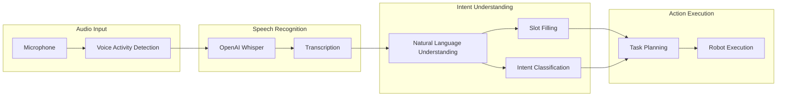

# Voice → Intent → Action

## Introduction to Voice-Controlled Robots

Voice control enables natural human-robot interaction, allowing users to command humanoid robots using spoken language. The pipeline transforms audio into robot actions through three stages: **speech recognition**, **intent understanding**, and **action execution**.

:::info The Voice Interface Advantage
Voice control frees users' hands and allows interaction from a distance, making it ideal for humanoid robots operating alongside humans in homes, offices, and industrial settings.
:::

## Voice Control Pipeline



## OpenAI Whisper for Speech Recognition

### Whisper Overview

OpenAI Whisper is a state-of-the-art speech recognition model trained on 680,000 hours of multilingual audio data. It excels at:

- **Robustness**: Handles accents, background noise, and technical vocabulary
- **Multilingual**: Supports 99 languages
- **Long-form**: Processes extended audio with high accuracy

### Whisper Integration

```python
import whisper
import numpy as np
import torch
from dataclasses import dataclass
from typing import Optional

@dataclass
class TranscriptionResult:
    """Result of speech transcription."""
    text: str
    language: str
    confidence: float
    segments: list  # Word-level timing

class WhisperASR:
    """OpenAI Whisper-based automatic speech recognition."""

    def __init__(
        self,
        model_size: str = "medium",
        device: str = "cuda"
    ):
        """
        Initialize Whisper ASR.

        Args:
            model_size: "tiny", "base", "small", "medium", "large"
            device: "cuda" or "cpu"
        """
        self.device = device
        self.model = whisper.load_model(model_size, device=device)

        # Audio parameters
        self.sample_rate = 16000

    def transcribe(
        self,
        audio: np.ndarray,
        language: Optional[str] = None,
        task: str = "transcribe"
    ) -> TranscriptionResult:
        """
        Transcribe audio to text.

        Args:
            audio: Audio waveform (float32, mono, 16kHz)
            language: Language code (e.g., "en") or None for auto-detect
            task: "transcribe" or "translate"

        Returns:
            TranscriptionResult with text and metadata
        """
        # Ensure correct format
        if audio.dtype != np.float32:
            audio = audio.astype(np.float32)

        # Normalize audio
        if audio.max() > 1.0:
            audio = audio / 32768.0

        # Run transcription
        result = self.model.transcribe(
            audio,
            language=language,
            task=task,
            fp16=(self.device == "cuda"),
            word_timestamps=True
        )

        return TranscriptionResult(
            text=result["text"].strip(),
            language=result["language"],
            confidence=self._compute_confidence(result),
            segments=result.get("segments", [])
        )

    def _compute_confidence(self, result: dict) -> float:
        """Compute average confidence from segments."""
        if not result.get("segments"):
            return 0.0

        probs = [seg.get("no_speech_prob", 0) for seg in result["segments"]]
        return 1.0 - np.mean(probs)

    def transcribe_stream(self, audio_stream, chunk_duration: float = 5.0):
        """
        Transcribe streaming audio.

        Args:
            audio_stream: Generator yielding audio chunks
            chunk_duration: Duration of each chunk in seconds
        """
        buffer = np.array([], dtype=np.float32)
        chunk_samples = int(chunk_duration * self.sample_rate)

        for chunk in audio_stream:
            buffer = np.concatenate([buffer, chunk])

            while len(buffer) >= chunk_samples:
                # Process chunk
                audio_chunk = buffer[:chunk_samples]
                result = self.transcribe(audio_chunk)

                yield result

                # Slide buffer (with overlap for continuity)
                overlap = int(0.5 * self.sample_rate)
                buffer = buffer[chunk_samples - overlap:]
```

### Real-time Voice Activity Detection

```python
import webrtcvad
import collections
import numpy as np

class VoiceActivityDetector:
    """Detect speech segments in audio stream."""

    def __init__(
        self,
        sample_rate: int = 16000,
        frame_duration_ms: int = 30,
        aggressiveness: int = 2
    ):
        """
        Initialize VAD.

        Args:
            sample_rate: Audio sample rate (8000, 16000, 32000, or 48000)
            frame_duration_ms: Frame duration (10, 20, or 30 ms)
            aggressiveness: VAD aggressiveness (0-3, higher = more aggressive)
        """
        self.sample_rate = sample_rate
        self.frame_duration_ms = frame_duration_ms
        self.frame_size = int(sample_rate * frame_duration_ms / 1000)

        self.vad = webrtcvad.Vad(aggressiveness)

        # Ring buffer for speech detection
        self.ring_buffer = collections.deque(maxlen=30)  # 900ms at 30ms frames
        self.triggered = False

    def is_speech(self, audio_frame: bytes) -> bool:
        """Check if audio frame contains speech."""
        return self.vad.is_speech(audio_frame, self.sample_rate)

    def process_audio(self, audio: np.ndarray):
        """
        Process audio and yield speech segments.

        Args:
            audio: Audio waveform (int16)

        Yields:
            Speech segments as numpy arrays
        """
        # Convert to bytes
        audio_bytes = audio.tobytes()

        speech_frames = []
        num_frames = len(audio) // self.frame_size

        for i in range(num_frames):
            start = i * self.frame_size
            end = start + self.frame_size
            frame = audio_bytes[start * 2:end * 2]  # 2 bytes per sample

            is_speech = self.is_speech(frame)
            self.ring_buffer.append((frame, is_speech))

            if not self.triggered:
                # Check if enough speech to trigger
                num_voiced = sum(1 for _, speech in self.ring_buffer if speech)
                if num_voiced > 0.9 * len(self.ring_buffer):
                    self.triggered = True
                    # Include buffered frames
                    for f, _ in self.ring_buffer:
                        speech_frames.append(f)
                    self.ring_buffer.clear()
            else:
                speech_frames.append(frame)

                # Check if enough silence to stop
                num_unvoiced = sum(1 for _, speech in self.ring_buffer if not speech)
                if num_unvoiced > 0.9 * len(self.ring_buffer):
                    self.triggered = False

                    # Yield collected speech segment
                    if speech_frames:
                        segment = b''.join(speech_frames)
                        segment_array = np.frombuffer(segment, dtype=np.int16)
                        yield segment_array.astype(np.float32) / 32768.0

                    speech_frames = []
                    self.ring_buffer.clear()
```

## Intent Understanding

### Slot-Filling NLU

```python
from dataclasses import dataclass, field
from typing import Dict, List, Optional
import re

@dataclass
class Intent:
    """Parsed intent from natural language."""
    name: str
    confidence: float
    slots: Dict[str, str] = field(default_factory=dict)

class HumanoidIntentParser:
    """Parse intents and slots from transcribed speech."""

    def __init__(self):
        # Define intent patterns
        self.intent_patterns = {
            "pick_and_place": [
                r"pick up (?:the )?(?P<object>\w+)(?: and )?(?:place|put) (?:it )?(?:on|in|next to) (?:the )?(?P<location>\w+)",
                r"move (?:the )?(?P<object>\w+) to (?:the )?(?P<location>\w+)",
                r"grab (?:the )?(?P<object>\w+) and bring (?:it )?to (?:the )?(?P<location>\w+)"
            ],
            "navigate": [
                r"go to (?:the )?(?P<location>\w+)",
                r"walk to (?:the )?(?P<location>\w+)",
                r"move to (?:the )?(?P<location>\w+)"
            ],
            "point": [
                r"point (?:at|to) (?:the )?(?P<object>\w+)",
                r"show me (?:the )?(?P<object>\w+)"
            ],
            "wave": [
                r"wave(?: at (?P<person>\w+))?",
                r"say (?:hello|hi|goodbye)"
            ],
            "follow": [
                r"follow (?P<person>\w+)",
                r"come with me"
            ],
            "stop": [
                r"stop",
                r"halt",
                r"freeze",
                r"don't move"
            ]
        }

        # Compile patterns
        self.compiled_patterns = {
            intent: [re.compile(p, re.IGNORECASE) for p in patterns]
            for intent, patterns in self.intent_patterns.items()
        }

    def parse(self, text: str) -> Optional[Intent]:
        """
        Parse intent and slots from text.

        Args:
            text: Transcribed speech text

        Returns:
            Intent object or None if no match
        """
        text = text.strip().lower()

        for intent_name, patterns in self.compiled_patterns.items():
            for pattern in patterns:
                match = pattern.search(text)
                if match:
                    # Extract named groups as slots
                    slots = {k: v for k, v in match.groupdict().items() if v}

                    return Intent(
                        name=intent_name,
                        confidence=0.9,  # Pattern match confidence
                        slots=slots
                    )

        return None

    def parse_with_llm(self, text: str, llm_client) -> Intent:
        """
        Use LLM for more flexible intent parsing.

        Args:
            text: Transcribed speech text
            llm_client: LLM API client

        Returns:
            Parsed Intent
        """
        prompt = f"""Parse the following robot command into intent and slots.

Command: "{text}"

Available intents:
- pick_and_place: Pick up an object and place it somewhere (slots: object, location)
- navigate: Move to a location (slots: location)
- point: Point at an object (slots: object)
- wave: Wave greeting (slots: person)
- follow: Follow a person (slots: person)
- stop: Stop all motion (no slots)

Respond in JSON format:
{{"intent": "intent_name", "slots": {{"slot_name": "value"}}}}
"""

        response = llm_client.generate(prompt)

        # Parse JSON response
        import json
        result = json.loads(response)

        return Intent(
            name=result["intent"],
            confidence=0.8,
            slots=result.get("slots", {})
        )
```

### LLM-Enhanced Understanding

```python
from openai import OpenAI
from typing import List

class LLMIntentUnderstanding:
    """Use LLM for advanced intent understanding."""

    def __init__(self, api_key: str):
        self.client = OpenAI(api_key=api_key)

        # System prompt for intent parsing
        self.system_prompt = """You are a robot command interpreter for a humanoid robot.
Your task is to understand natural language commands and extract:
1. The primary intent (what the robot should do)
2. Objects involved (what to interact with)
3. Locations (where to go or place things)
4. Constraints (how to perform the action)

Always respond in JSON format with:
{
    "intent": "action_name",
    "objects": ["object1", "object2"],
    "locations": ["location1"],
    "constraints": {"key": "value"},
    "clarification_needed": false,
    "clarification_question": null
}

If the command is ambiguous, set clarification_needed to true and provide a question."""

    def understand(self, command: str, context: dict = None) -> dict:
        """
        Understand a voice command with context.

        Args:
            command: Natural language command
            context: Current scene context (objects, locations, etc.)

        Returns:
            Parsed command structure
        """
        messages = [
            {"role": "system", "content": self.system_prompt}
        ]

        # Add context if available
        if context:
            context_str = f"Current scene: {context}"
            messages.append({"role": "user", "content": context_str})

        messages.append({"role": "user", "content": f"Command: {command}"})

        response = self.client.chat.completions.create(
            model="gpt-4",
            messages=messages,
            temperature=0.1,
            response_format={"type": "json_object"}
        )

        import json
        return json.loads(response.choices[0].message.content)

    def resolve_references(
        self,
        command: str,
        detected_objects: List[dict],
        conversation_history: List[str]
    ) -> dict:
        """
        Resolve references like "it", "that", "the other one".

        Args:
            command: Current command
            detected_objects: Objects visible to robot
            conversation_history: Previous commands and responses

        Returns:
            Command with resolved references
        """
        prompt = f"""Resolve the references in this command:

Command: "{command}"

Visible objects: {detected_objects}

Recent conversation:
{chr(10).join(conversation_history[-5:])}

Return the command with all references replaced with specific object names."""

        response = self.client.chat.completions.create(
            model="gpt-4",
            messages=[{"role": "user", "content": prompt}],
            temperature=0.1
        )

        return {"resolved_command": response.choices[0].message.content}
```

## ROS 2 Voice Interface

### Complete Voice Control Node

```python
import rclpy
from rclpy.node import Node
from std_msgs.msg import String
from audio_common_msgs.msg import AudioData
from humanoid_interfaces.msg import VoiceCommand
from humanoid_interfaces.srv import ExecuteIntent
import numpy as np
import threading
import queue

class VoiceControlNode(Node):
    """ROS 2 node for voice-controlled humanoid interaction."""

    def __init__(self):
        super().__init__('voice_control_node')

        # Initialize components
        self.whisper = WhisperASR(model_size="medium")
        self.vad = VoiceActivityDetector()
        self.intent_parser = HumanoidIntentParser()

        # Audio buffer
        self.audio_queue = queue.Queue()
        self.sample_rate = 16000

        # Subscriptions
        self.audio_sub = self.create_subscription(
            AudioData,
            '/microphone/audio',
            self.audio_callback,
            10
        )

        # Publishers
        self.transcription_pub = self.create_publisher(
            String,
            '/voice/transcription',
            10
        )

        self.command_pub = self.create_publisher(
            VoiceCommand,
            '/voice/command',
            10
        )

        # Service client
        self.execute_client = self.create_client(
            ExecuteIntent,
            '/execute_intent'
        )

        # Processing thread
        self.processing_thread = threading.Thread(target=self._process_audio)
        self.processing_thread.daemon = True
        self.processing_thread.start()

        # Wake word detection (optional)
        self.wake_word = "hey robot"
        self.listening = False

        self.get_logger().info('Voice Control Node initialized')

    def audio_callback(self, msg):
        """Receive audio data."""
        audio = np.frombuffer(msg.data, dtype=np.int16)
        self.audio_queue.put(audio)

    def _process_audio(self):
        """Background thread for audio processing."""
        audio_buffer = np.array([], dtype=np.int16)

        while rclpy.ok():
            try:
                # Get audio from queue
                audio_chunk = self.audio_queue.get(timeout=0.1)
                audio_buffer = np.concatenate([audio_buffer, audio_chunk])

                # Process when we have enough audio
                if len(audio_buffer) >= self.sample_rate * 2:  # 2 seconds
                    # Run VAD
                    for speech_segment in self.vad.process_audio(audio_buffer):
                        self._process_speech(speech_segment)

                    # Keep last 0.5 seconds for overlap
                    audio_buffer = audio_buffer[-self.sample_rate // 2:]

            except queue.Empty:
                continue

    def _process_speech(self, audio: np.ndarray):
        """Process detected speech segment."""
        # Transcribe
        result = self.whisper.transcribe(audio)

        if not result.text:
            return

        self.get_logger().info(f'Transcribed: "{result.text}"')

        # Publish transcription
        trans_msg = String()
        trans_msg.data = result.text
        self.transcription_pub.publish(trans_msg)

        # Check for wake word if not already listening
        if not self.listening:
            if self.wake_word.lower() in result.text.lower():
                self.listening = True
                self.get_logger().info('Wake word detected, listening...')
                return

        if not self.listening:
            return

        # Parse intent
        intent = self.intent_parser.parse(result.text)

        if intent:
            self.get_logger().info(f'Intent: {intent.name}, Slots: {intent.slots}')

            # Publish command
            cmd_msg = VoiceCommand()
            cmd_msg.transcription = result.text
            cmd_msg.intent = intent.name
            cmd_msg.confidence = intent.confidence

            # Convert slots to key-value pairs
            for key, value in intent.slots.items():
                cmd_msg.slot_names.append(key)
                cmd_msg.slot_values.append(value)

            self.command_pub.publish(cmd_msg)

            # Execute intent
            self._execute_intent(intent)

            # Stop listening after command (can be configured)
            if intent.name == "stop":
                self.listening = False

    def _execute_intent(self, intent: Intent):
        """Call service to execute the intent."""
        if not self.execute_client.wait_for_service(timeout_sec=1.0):
            self.get_logger().error('Execute service not available')
            return

        request = ExecuteIntent.Request()
        request.intent = intent.name
        request.slots = str(intent.slots)

        future = self.execute_client.call_async(request)

        # Handle response in callback
        future.add_done_callback(self._execute_callback)

    def _execute_callback(self, future):
        """Handle execution response."""
        try:
            response = future.result()
            if response.success:
                self.get_logger().info(f'Execution successful: {response.message}')
            else:
                self.get_logger().warning(f'Execution failed: {response.message}')
        except Exception as e:
            self.get_logger().error(f'Execution error: {e}')


def main():
    rclpy.init()
    node = VoiceControlNode()
    rclpy.spin(node)
    rclpy.shutdown()
```

## Multi-turn Dialogue

### Conversation Manager

```python
from dataclasses import dataclass, field
from typing import List, Optional
from datetime import datetime

@dataclass
class DialogueTurn:
    """Single turn in a dialogue."""
    speaker: str  # "user" or "robot"
    text: str
    timestamp: datetime
    intent: Optional[Intent] = None

@dataclass
class DialogueSession:
    """Multi-turn dialogue session."""
    session_id: str
    turns: List[DialogueTurn] = field(default_factory=list)
    context: dict = field(default_factory=dict)

class ConversationManager:
    """Manage multi-turn conversations with the robot."""

    def __init__(self, llm_client):
        self.llm_client = llm_client
        self.sessions = {}

    def get_or_create_session(self, session_id: str) -> DialogueSession:
        """Get existing session or create new one."""
        if session_id not in self.sessions:
            self.sessions[session_id] = DialogueSession(session_id=session_id)
        return self.sessions[session_id]

    def process_utterance(
        self,
        session_id: str,
        text: str,
        scene_context: dict
    ) -> dict:
        """
        Process user utterance in conversation context.

        Args:
            session_id: Session identifier
            text: User's utterance
            scene_context: Current scene information

        Returns:
            Response with intent and robot reply
        """
        session = self.get_or_create_session(session_id)

        # Add user turn
        session.turns.append(DialogueTurn(
            speaker="user",
            text=text,
            timestamp=datetime.now()
        ))

        # Update context
        session.context.update(scene_context)

        # Build conversation history for LLM
        history = self._build_history(session)

        # Get LLM response
        response = self._get_llm_response(text, history, session.context)

        # Add robot turn
        session.turns.append(DialogueTurn(
            speaker="robot",
            text=response["robot_reply"],
            timestamp=datetime.now(),
            intent=Intent(**response["intent"]) if response.get("intent") else None
        ))

        return response

    def _build_history(self, session: DialogueSession) -> str:
        """Build conversation history string."""
        history = []
        for turn in session.turns[-10:]:  # Last 10 turns
            history.append(f"{turn.speaker}: {turn.text}")
        return "\n".join(history)

    def _get_llm_response(
        self,
        text: str,
        history: str,
        context: dict
    ) -> dict:
        """Get LLM response for conversation."""
        prompt = f"""You are a helpful humanoid robot assistant engaged in conversation.

Scene context: {context}

Conversation history:
{history}

Current user message: {text}

Respond with:
1. A natural language reply to the user
2. An intent to execute (if applicable)

Format as JSON:
{{
    "robot_reply": "your response",
    "intent": {{"name": "intent_name", "slots": {{}}}} or null,
    "needs_clarification": false
}}"""

        response = self.llm_client.chat.completions.create(
            model="gpt-4",
            messages=[{"role": "user", "content": prompt}],
            temperature=0.7
        )

        import json
        return json.loads(response.choices[0].message.content)
```

## Summary

The Voice → Intent → Action pipeline enables natural robot control:

- **OpenAI Whisper** provides robust speech recognition
- **Intent parsing** extracts structured commands from natural language
- **LLM enhancement** handles complex and ambiguous commands
- **Multi-turn dialogue** enables conversational interaction

This pipeline transforms spoken language into robot actions, creating an intuitive interface for human-robot collaboration.

## Exercises

1. Set up Whisper and test transcription with different accents
2. Implement a custom intent parser for your robot's capabilities
3. Create a ROS 2 node for voice-activated robot control
4. Add multi-turn dialogue support with context tracking
5. Handle edge cases: noisy environments, unclear commands

## Further Reading

- [OpenAI Whisper Paper](https://arxiv.org/abs/2212.04356)
- [WebRTC VAD Documentation](https://webrtc.org/)
- [Rasa NLU for Intent Recognition](https://rasa.com/)
