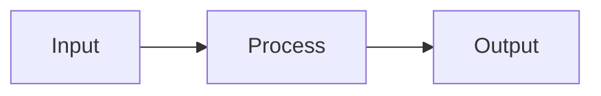

# Content Structure Contract: Chapter Template

**Feature**: 001-humanoid-robotics-textbook
**Date**: 2025-12-11
**Type**: Content Template

## Purpose

This contract defines the standard structure for each chapter/topic document in the textbook. All topics MUST follow this template for consistency.

---

## Chapter Template Structure

```markdown
---
id: <topic-id>
title: <Topic Title>
sidebar_position: <N>
description: <1-2 sentence description for SEO>
keywords:
  - humanoid robotics
  - <primary-keyword>
  - <secondary-keyword>
---

# <Topic Title>

> **Learning Objectives**: By the end of this chapter, you will understand:
> - [Objective 1]
> - [Objective 2]
> - [Objective 3]

## Introduction

[2-3 paragraphs introducing the topic and its relevance to humanoid robotics]

## Concept Overview

[Core concepts explained in accessible terms]

### Key Term 1

[Definition and explanation]

### Key Term 2

[Definition and explanation]

## Technical Details

[Deeper technical content with diagrams]

```mermaid
[Appropriate diagram: flowchart, sequence, architecture]
```

## Practical Application

[How this concept applies to humanoid robots]

### Example Scenario

[Concrete example demonstrating the concept]

## Integration Notes

[How this topic connects to other modules/topics]

- **Prerequisite knowledge**: [What readers should know first]
- **Builds toward**: [What this enables in later chapters]

## Summary

[Bullet-point summary of key takeaways]

- Key takeaway 1
- Key takeaway 2
- Key takeaway 3

## References

[APA-formatted citations for this chapter]

- Author, A. (Year). *Title of work*. Publisher. https://doi.org/xxx
```

---

## Section Requirements

### Required Sections (all chapters)

| Section | Purpose | Min Length |
|---------|---------|------------|
| Frontmatter | Metadata for Docusaurus | N/A |
| Learning Objectives | Set expectations | 3 items |
| Introduction | Context and motivation | 2 paragraphs |
| Concept Overview | Core ideas | 3 paragraphs |
| Summary | Key takeaways | 3 items |
| References | Citations | 1+ items |

### Conditional Sections (if applicable)

| Section | When to Include |
|---------|-----------------|
| Technical Details | When code/config involved |
| Practical Application | When hands-on examples exist |
| Integration Notes | When cross-module dependencies |
| Diagrams | When visual aid helps understanding |

---

## Skeleton Phase Content

For Iteration 1 (skeleton), chapters should contain:

```markdown
---
id: <topic-id>
title: <Topic Title>
sidebar_position: <N>
description: <description>
keywords: [humanoid robotics, <keyword>]
---

# <Topic Title>

> **Status**: Skeleton - Content to be developed in Iteration 2

## Overview

[1-2 sentence placeholder describing what this chapter will cover]

## Topics to Cover

- [ ] [Planned subtopic 1]
- [ ] [Planned subtopic 2]
- [ ] [Planned subtopic 3]

## Planned Content

This chapter will include:
- Conceptual explanation of [topic]
- [Diagram type] showing [aspect]
- Integration with [related module/topic]

## References (Planned)

- [Authoritative source 1]
- [Authoritative source 2]
```

---

## Naming Conventions

### File Names
- Format: `<topic-id>.md`
- All lowercase
- Hyphens between words
- No special characters

**Examples**:
- `ros2-overview.md`
- `nodes-topics-services.md`
- `slam-navigation-mapping.md`

### Topic IDs
- Same as filename without extension
- Must be unique across entire textbook

### Titles
- Title case
- Can include special characters
- Should be descriptive but concise

**Examples**:
- "What is ROS 2?"
- "Nodes, Topics, Services, Actions"
- "SLAM, Navigation, and Mapping"

---

## Diagram Requirements

### Mermaid Diagrams

All diagrams MUST be in Mermaid format for version control:

```markdown

```

### Diagram Types by Content

| Content Type | Recommended Diagram |
|--------------|---------------------|
| Architecture | flowchart TD |
| Process flow | flowchart LR |
| Communication | sequenceDiagram |
| State machine | stateDiagram-v2 |
| Data model | classDiagram |
| Timeline | gantt |

---

## Validation Rules

1. **Frontmatter**: All required fields present
2. **Headings**: H1 matches title, proper hierarchy (no skipped levels)
3. **Links**: All internal links valid
4. **Mermaid**: All diagrams render without errors
5. **Citations**: APA 7th Edition format
6. **Length**: Skeleton chapters minimum 50 words, full chapters minimum 500 words
7. **Keywords**: Minimum 2 keywords per chapter
